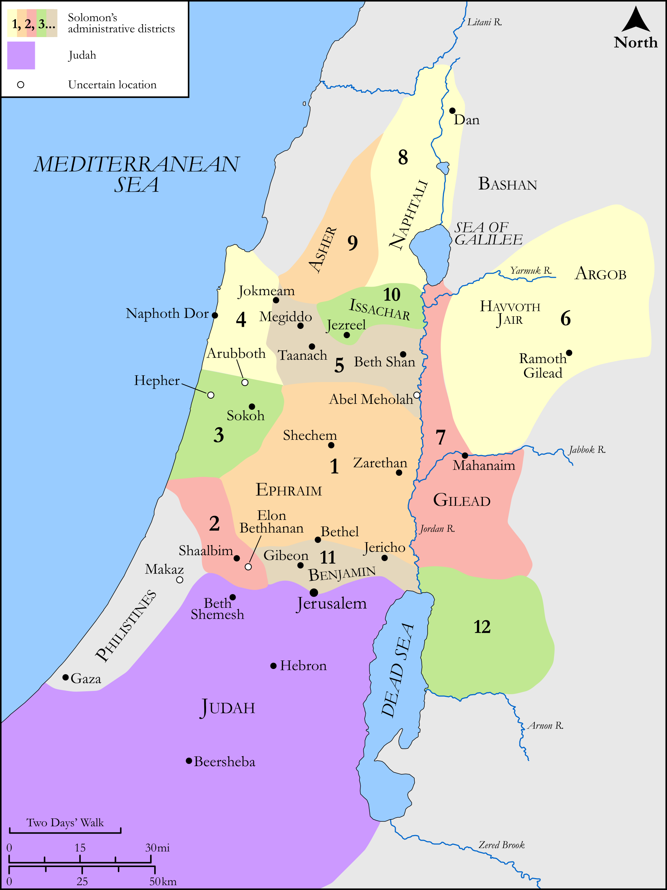

# Biblica Open Bible Maps

## License Information

Biblica Open Bible Maps, © 2023–2025 Biblica, Inc. This work is licensed under Creative Commons Attribution-ShareAlike 4.0 International (<a href="https://creativecommons.org/licenses/by-sa/4.0/">https://creativecommons.org/licenses/by-sa/4.0/</a>). More Information: <a href="https://docs.google.com/document/d/1Pp44yZ0Zdnd59vJHTrt2rPYq0SppfX5rZbPBt6mz37U/edit?tab=t.0#heading=h.oev9aj1ksvk2">https://docs.google.com/document/d/1Pp44yZ0Zdnd59vJHTrt2rPYq0SppfX5rZbPBt6mz37U/edit?tab=t.0#heading=h.oev9aj1ksvk2</a>

--------------------------------

## Historical: The Districts of Israel (id: OT117)

### Image Content

[link](images/OT117.png)

Original: [Historical: The Districts of Israel](https://drive.google.com/open?id=1pB4Y_TXI1ytDsyBwMYjFjzwf7smOB4b6&usp=drive_copy)

* **Associated Passages:** 1 Kings 4:1-20

* **Associated ACAI Concepts:** Solomon (ID: `person:Solomon`); Israel (ID: `person:Israel`); Ahilud (ID: `person:Ahilud`); Gilead (ID: `place:Gilead`); Bashan (ID: `place:Bashan`); Zadok (ID: `person:Zadok.2`); House (ID: `realia:House`); Adoram (ID: `person:Adoram`); Ben-geber (ID: `person:Ben-geber`); Shaalbim (ID: `place:Shaalbim`); Abda (ID: `person:Abda`); Basemath (ID: `person:Basemath.2`); Ahishar (ID: `person:Ahishar`); Paruah (ID: `person:Paruah`); Baana (ID: `person:Baana.2`); Zabud (ID: `person:Zabud`); Hur (ID: `person:Hur`); Shimei (ID: `person:Shimei.6`); Abel-meholah (ID: `place:Abel-meholah`); Argob (ID: `place:Argob`); Baana (ID: `person:Baana`); Seraiah (ID: `person:Seraiah`); Ahimaaz (ID: `person:Ahimaaz.3`); Hesed (ID: `person:Hesed`); Socoh (ID: `place:Socoh.3`); Arubboth (ID: `place:Arubboth`); Taphath (ID: `person:Taphath`); Ben-abinadab (ID: `person:Ben-abinadab`); Abinadab (ID: `person:Abinadab.4`); Elon-beth-hanan (ID: `place:Elonbeth-hanan`); Ahijah (ID: `person:Ahijah`); Ben-hur (ID: `person:Ben-hur`); Uri (ID: `person:Uri.2`); Ahinadab (ID: `person:Ahinadab`); Hepher (ID: `place:Hepher`); Geber (ID: `person:Geber`); Zarethan (ID: `place:Zarethan`); Azariah (ID: `person:Azariah.3`); Dor (ID: `place:Dor`); Deker (ID: `person:Deker`); Ela (ID: `person:Ela`); Iddo (ID: `person:Iddo.3`); Jehoshaphat (ID: `person:Jehoshaphat.2`); Ben-deker (ID: `person:Ben-deker`); Elihoreph (ID: `person:Elihoreph`); Ben-hesed (ID: `person:Ben-hesed`); Azariah (ID: `person:Azariah.2`); Jehoshaphat (ID: `person:Jehoshaphat`); Makaz (ID: `place:Makaz`); Jokneam (ID: `place:Jokneam`); Tribe of Asher (ID: `group:Asher`); Manasseh (ID: `person:Manasseh`); Sihon (ID: `person:Sihon`); Baalath-beer (ID: `place:Baalath-beer`); Jezreel (ID: `place:Jezreel.2`); Havvoth-jair (ID: `place:Havvoth-jair`); Tribe of Issachar (ID: `group:Issachar`); Hushai (ID: `person:Hushai`); Tribe of Judah (ID: `group:Judah`); Benjamin (ID: `person:Benjamin`); Naphtali (ID: `person:Naphtali`); Issachar (ID: `person:Issachar`); Megiddo (ID: `place:Megiddo`); Nathan (ID: `person:Nathan.2`); Beth-shan (ID: `place:Beth-shan`); Mahanaim (ID: `place:Mahanaim`); Beth-shemesh (ID: `place:Beth-shemesh`); Taanach (ID: `place:Taanach`); Asher (ID: `person:Asher`); Judah (ID: `person:Judah.4`); Tribe of Ephraim (ID: `group:Ephraim`); Tribe of Benjamin (ID: `group:Benjamin`); Jehoiada (ID: `person:Jehoiada`); Abiathar (ID: `person:Abiathar`); Kindness (ID: `keyterm:Kindness`); Amorites (ID: `group:Amorites`); Og (ID: `person:Og`); Tribe of Manasseh (ID: `group:Manasseh`); Ephraim (ID: `person:Ephraim`); Jair (ID: `person:Jair.2`); Ramoth-gilead (ID: `place:Ramoth-gilead`); Tribe of Naphtali (ID: `group:Naphtali`); Benaiah (ID: `person:Benaiah`)
