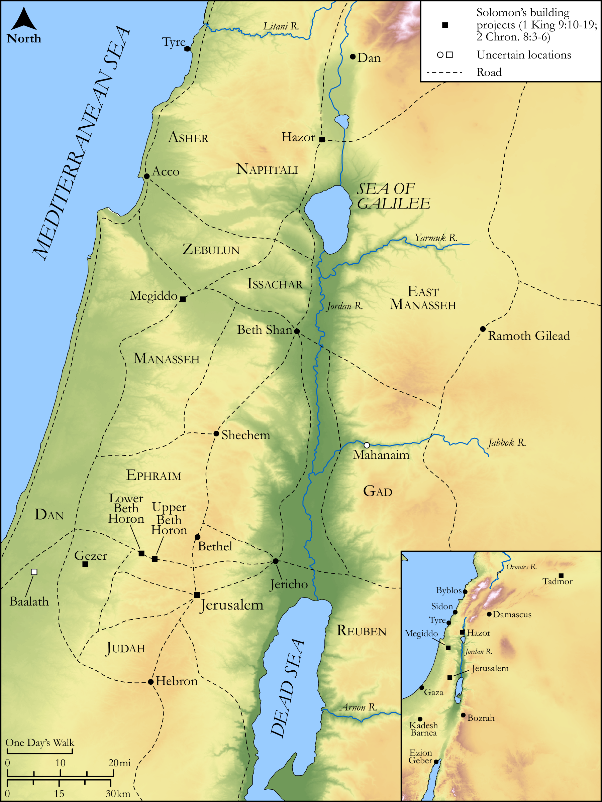

# Biblica Open Bible Maps

## License Information

Biblica Open Bible Maps, © 2023–2025 Biblica, Inc. This work is licensed under Creative Commons Attribution-ShareAlike 4.0 International (<a href="https://creativecommons.org/licenses/by-sa/4.0/">https://creativecommons.org/licenses/by-sa/4.0/</a>). More Information: <a href="https://docs.google.com/document/d/1Pp44yZ0Zdnd59vJHTrt2rPYq0SppfX5rZbPBt6mz37U/edit?tab=t.0#heading=h.oev9aj1ksvk2">https://docs.google.com/document/d/1Pp44yZ0Zdnd59vJHTrt2rPYq0SppfX5rZbPBt6mz37U/edit?tab=t.0#heading=h.oev9aj1ksvk2</a>

--------------------------------

## Historical: Solomon’s Building Projects (id: OT122)

### Image Content

[link](images/OT122.png)

Original: [Historical: Solomon’s Building Projects](https://drive.google.com/open?id=1-J9ptQdDiV45nFySePn_NyWFXyqZNhJC&usp=drive_copy)

* **Associated Passages:** 1 Kings 9:1-28; 2 Chronicles 8:1-18

* **Associated ACAI Concepts:** Solomon (ID: `person:Solomon`); LORD (ID: `deity:Lord`); Israel (ID: `person:Israel`); Hiram (ID: `person:Hiram`); David (ID: `person:David`); House (ID: `realia:House`); Jerusalem (ID: `place:Jerusalem`); Pharaoh (ID: `person:Pharaoh.7`); Gezer (ID: `place:Gezer`); Force to Serve (ID: `keyterm:EnticedToServe`); Chariot (ID: `realia:Chariot`); Baalath (ID: `place:Baalath.2`); Hivites (ID: `group:Hivites`); Ophir (ID: `place:Ophir`); Egypt (ID: `place:Egypt`); Ezion-geber (ID: `place:Ezion-geber`); Amorites (ID: `group:Amorites`); Tribe of Levi (ID: `group:Levi`); Tyre (ID: `place:Tyre`); Offering (ID: `keyterm:Offering`); Hittites (ID: `group:Hittite`); Edom (ID: `place:Edom`); Lebanon (ID: `place:Lebanon`); Levi (ID: `person:Levi.3`); Millo (ID: `place:Millo`); Jebusites (ID: `group:Jebusites`); Elath (ID: `place:Elath`); Perizzites (ID: `group:Perizzites`); Lower Beth-horon (ID: `place:Beth-horonLower`); Heth (ID: `person:Heth`); Holy (ID: `keyterm:Holy`); Talent (ID: `realia:Talent`); Ship (ID: `realia:Ship`); Hamath (ID: `place:Hamath`); Tadmor (ID: `place:Tadmor`); Upper Beth-horon (ID: `place:Beth-horonUpper`); Straightness (ID: `keyterm:Straightness`); Set Apart for Destruction (ID: `keyterm:Proscribe.2`); Hazor (ID: `place:Hazor`); Cabul (ID: `place:Cabul.2`); To Beg for Mercy (ID: `keyterm:BegForMercy`); Feast of Weeks (ID: `keyterm:FeastOfWeeks`); Sabbath (ID: `keyterm:Sabbath`); Covenant Box (ID: `keyterm:CovenantBox`); Proverb (ID: `keyterm:Saying`); Zobah (ID: `place:Zobah`); Appointed Feast (ID: `keyterm:AppointedFeast`); Gibeon (ID: `place:Gibeon`); Megiddo (ID: `place:Megiddo`); Canaanites (ID: `group:Canaan`); Moses (ID: `person:Moses`); Plea for Mercy (ID: `keyterm:Supplication`); Decree (ID: `keyterm:Decree`); Work (ID: `keyterm:Work`); Feast of Tabernacles (ID: `keyterm:FeastOfTabernacles`); Galilee (ID: `place:Galilee`); Red Sea (ID: `place:RedSea`); Canaan (ID: `place:Canaan`); New Moon Festival (ID: `keyterm:NewMoonFestival`); Stone Altar (ID: `realia:StoneAltar`); Temple Altar (ID: `realia:TempleAltar`); Altar (ID: `realia:Altar`); Tabernacle Altar (ID: `realia:TabernacleAltar`); Ark of the Covenant (ID: `realia:ArkOfTheCovenant`); Cypress (ID: `flora:Cypress`); Cattails (ID: `flora:Cattails`); Phoenician Juniper (ID: `flora:JuniperTree`); Fir (ID: `flora:Fir`); Unleavened Bread (ID: `realia:UnleavenedBread`); Grecian Juniper (ID: `flora:Juniper`); Fortification (ID: `realia:Fortification`); Foundation (ID: `realia:Foundation`); Cedar (ID: `flora:Cedar`)
