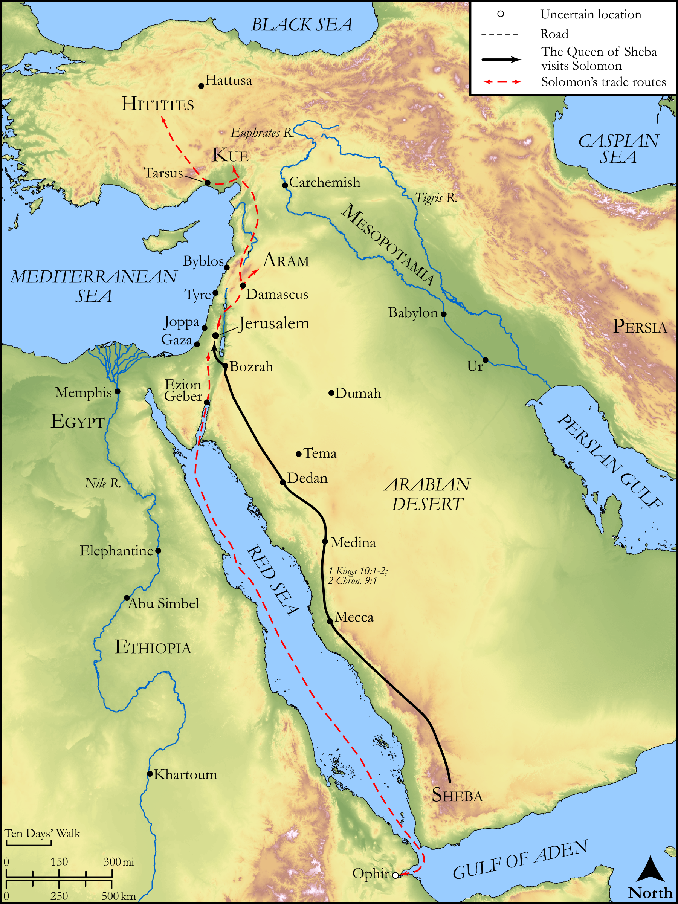

# Biblica Open Bible Maps

## License Information

Biblica Open Bible Maps, © 2023–2025 Biblica, Inc. This work is licensed under Creative Commons Attribution-ShareAlike 4.0 International (<a href="https://creativecommons.org/licenses/by-sa/4.0/">https://creativecommons.org/licenses/by-sa/4.0/</a>). More Information: <a href="https://docs.google.com/document/d/1Pp44yZ0Zdnd59vJHTrt2rPYq0SppfX5rZbPBt6mz37U/edit?tab=t.0#heading=h.oev9aj1ksvk2">https://docs.google.com/document/d/1Pp44yZ0Zdnd59vJHTrt2rPYq0SppfX5rZbPBt6mz37U/edit?tab=t.0#heading=h.oev9aj1ksvk2</a>

--------------------------------

## Historical: Solomon’s Foreign Trade (id: OT123)

### Image Content

[link](images/OT123.png)

Original: [Historical: Solomon’s Foreign Trade](https://drive.google.com/open?id=1uf-b51xZgitK2O6p_2kES3qkOfQKd5Pc&usp=drive_copy)

* **Associated Passages:** 1 Kings 10:1-29; 2 Chronicles 1:1-18

* **Associated ACAI Concepts:** Solomon (ID: `person:Solomon`); LORD (ID: `deity:Lord`); Ability (ID: `keyterm:Ability`); Jerusalem (ID: `place:Jerusalem`); Money (ID: `realia:Money`); Queen of Sheba (ID: `person:QueenOfSheba`); Egypt (ID: `place:Egypt`); David (ID: `person:David`); House (ID: `realia:House`); Horse (ID: `fauna:Horse`); Israel (ID: `person:Israel`); Offering (ID: `keyterm:Offering`); Chariot (ID: `realia:Chariot`); Kue (ID: `place:Kue`); House of the Forest of Lebanon (ID: `place:HouseOfTheForestOfLebanon`); Sheba (ID: `place:Sheba.2`); Shephelah (ID: `place:Shephelah`); Hiram (ID: `person:Hiram`); Hittites (ID: `group:Hittite`); Gibeon (ID: `place:Gibeon`); Glory (ID: `keyterm:Glory`); Heth (ID: `person:Heth`); Tent of Meeting (ID: `realia:TentOfMeeting`); Balsam Tree (ID: `flora:BalsamTree`); Sycomore Fig (ID: `flora:SycomoreFig`); Tarshish (ID: `place:Tarshish`); Ophir (ID: `place:Ophir`); Throne (ID: `realia:Throne`); Sandalwood (ID: `flora:Sandalwood`); Talent (ID: `realia:Talent`); Covenant Box (ID: `keyterm:CovenantBox`); Arabia (ID: `place:Arabia`); Hur (ID: `person:Hur.2`); Uri (ID: `person:Uri`); Love (ID: `keyterm:Love`); Well-Established (ID: `keyterm:BeFirm`); Truth (ID: `keyterm:Truth`); Moses (ID: `person:Moses`); To Lead (ID: `keyterm:Lead`); Bless (ID: `keyterm:Bless`); Kindness (ID: `keyterm:Kindness`); Bezalel (ID: `person:Bezalel`); Kiriath-jearim (ID: `place:Kiriath-jearim`); Believe In (ID: `keyterm:BelieveIn`); Stone Altar (ID: `realia:StoneAltar`); Temple Altar (ID: `realia:TempleAltar`); Fig (ID: `flora:Fig`); Altar (ID: `realia:Altar`); High Place (ID: `realia:HighPlace`); Ship (ID: `realia:Ship`); Stone Pine (ID: `flora:Pine`); Tabernacle Altar (ID: `realia:TabernacleAltar`); Lion (ID: `fauna:Lion`); Cedar (ID: `flora:Cedar`); Monkey (ID: `fauna:Monkey`); Large Shield (ID: `realia:LargeShield`); Small Shield (ID: `realia:SmallShield`); Baboon (ID: `fauna:Baboon`); Ark of the Covenant (ID: `realia:ArkOfTheCovenant`); Mule (ID: `fauna:Mule`); Mina (ID: `realia:Mina`); Tent (ID: `realia:Tent`); Lute (ID: `realia:Lute`); Camel (ID: `fauna:Camel`); Weapons (ID: `realia:Weapons`); Cloak (ID: `realia:Cloak`); Lyre (ID: `realia:Lyre`)
