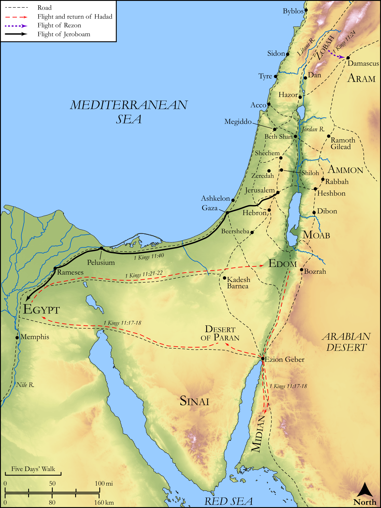

# Biblica Open Bible Maps

## License Information

Biblica Open Bible Maps, © 2023–2025 Biblica, Inc. This work is licensed under Creative Commons Attribution-ShareAlike 4.0 International (<a href="https://creativecommons.org/licenses/by-sa/4.0/">https://creativecommons.org/licenses/by-sa/4.0/</a>). More Information: <a href="https://docs.google.com/document/d/1Pp44yZ0Zdnd59vJHTrt2rPYq0SppfX5rZbPBt6mz37U/edit?tab=t.0#heading=h.oev9aj1ksvk2">https://docs.google.com/document/d/1Pp44yZ0Zdnd59vJHTrt2rPYq0SppfX5rZbPBt6mz37U/edit?tab=t.0#heading=h.oev9aj1ksvk2</a>

--------------------------------

## Historical: Solomon’s Wars and Death (id: OT124)

### Image Content

[link](images/OT124.png)

Original: [Historical: Solomon’s Wars and Death](https://drive.google.com/open?id=1Zw0woXm4D-7kKIRwrMnXCN2tKl4chfeu&usp=drive_copy)

* **Associated Passages:** 1 Kings 11:1-43

* **Associated ACAI Concepts:** Solomon (ID: `person:Solomon`); David (ID: `person:David`); LORD (ID: `deity:Lord`); Israel (ID: `person:Israel`); Pharaoh (ID: `person:Pharaoh.7`); Hadad (ID: `person:Hadad.3`); Jerusalem (ID: `place:Jerusalem`); Jeroboam (ID: `person:Jeroboam`); Edom (ID: `place:Edom`); Egypt (ID: `place:Egypt`); Ammonites (ID: `group:Ammon`); Ammon (ID: `place:Ammon`); Joab (ID: `person:Joab`); Edomites (ID: `group:Edom`); Sidon (ID: `place:Sidon`); Sidonians (ID: `group:Sidon`); Molech (ID: `deity:Molech`); Moab (ID: `place:Moab`); Ahijah (ID: `person:Ahijah.2`); Ashtoreth (ID: `deity:Ashtoreth`); Tahpenes (ID: `person:Tahpenes`); Detested Thing (ID: `keyterm:DetestedThing`); Love (ID: `keyterm:Love`); Chemosh (ID: `deity:Chemosh`); The Way (ID: `keyterm:TheWay`); Eliada (ID: `person:Eliada.2`); Zeredah (ID: `place:Zeredah.2`); Shilonites (ID: `group:Shiloh`); Tribe of Ephraim (ID: `group:Ephraim`); Shishak (ID: `person:Shishak`); Genubath (ID: `person:Genubath`); Nebat (ID: `person:Nebat`); Zeruah (ID: `person:Zeruah`); Rezon (ID: `person:Rezon`); House (ID: `realia:House`); Cloak (ID: `realia:Cloak`); Hadadezer (ID: `person:Hadadezer`); Damascus (ID: `place:Damascus`); Rehoboam (ID: `person:Rehoboam`); Favor (ID: `keyterm:Favor`); Hittites (ID: `group:Hittite`); Midian (ID: `place:Midian`); Ephraim (ID: `person:Ephraim`); Joseph (ID: `person:Joseph.10`); Zobah (ID: `place:Zobah`); Well-Established (ID: `keyterm:BeFirm`); Covenant (ID: `keyterm:Covenant`); Millo (ID: `place:Millo`); Shiloh (ID: `place:Shiloh`); Heth (ID: `person:Heth`); Appoint (ID: `keyterm:Appoint`); Paran (ID: `place:Paran`); Ability (ID: `keyterm:Ability`); Lamp (ID: `realia:Lamp`); High Place (ID: `realia:HighPlace`); Stone Pine (ID: `flora:Pine`)
