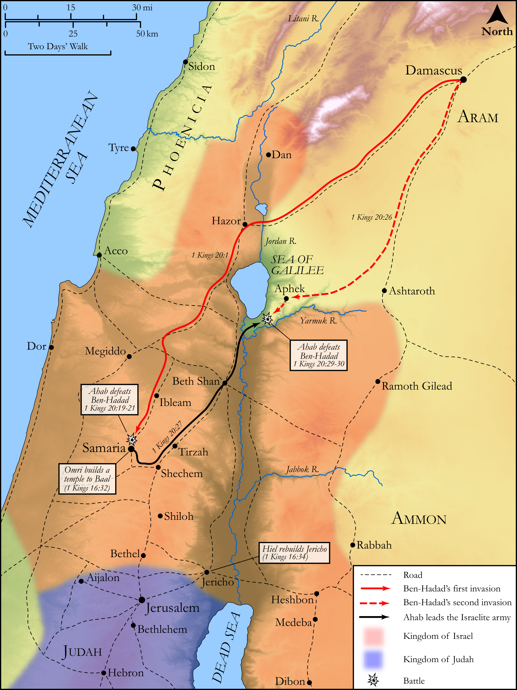

# Biblica Open Bible Maps

## License Information

Biblica Open Bible Maps, © 2023–2025 Biblica, Inc. This work is licensed under Creative Commons Attribution-ShareAlike 4.0 International (<a href="https://creativecommons.org/licenses/by-sa/4.0/">https://creativecommons.org/licenses/by-sa/4.0/</a>). More Information: <a href="https://docs.google.com/document/d/1Pp44yZ0Zdnd59vJHTrt2rPYq0SppfX5rZbPBt6mz37U/edit?tab=t.0#heading=h.oev9aj1ksvk2">https://docs.google.com/document/d/1Pp44yZ0Zdnd59vJHTrt2rPYq0SppfX5rZbPBt6mz37U/edit?tab=t.0#heading=h.oev9aj1ksvk2</a>

--------------------------------

## Historical: Ahab and Ben-Hadad (id: OT128)

### Image Content

[link](images/OT128.png)

Original: [Historical: Ahab and Ben\-Hadad](https://drive.google.com/open?id=1VTe4FrBP8jrWFk8X0mANQ59-r_gI1Ip4&usp=drive_copy)

* **Associated Passages:** 1 Kings 16:1-34

* **Associated ACAI Concepts:** Israel (ID: `person:Israel`); Omri (ID: `person:Omri`); Baasha (ID: `person:Baasha`); LORD (ID: `deity:Lord`); Zimri (ID: `person:Zimri.2`); Tirzah (ID: `place:Tirzah`); Jeroboam (ID: `person:Jeroboam`); Judah (ID: `person:Judah.4`); Tribe of Judah (ID: `group:Judah`); Asa (ID: `person:Asa`); To Sin (ID: `keyterm:Sin`); Elah (ID: `person:Elah.2`); Ahab (ID: `person:Ahab`); Samaria (ID: `place:Samaria`); Word of the Lord (ID: `keyterm:WordOfTheLord`); Jehu (ID: `person:Jehu`); Nebat (ID: `person:Nebat`); Ginath (ID: `person:Ginath`); Tibni (ID: `person:Tibni`); Hanani (ID: `person:Hanani`); House (ID: `realia:House`); Baal (ID: `deity:Baal`); Gibbethon (ID: `place:Gibbethon`); Arza (ID: `person:Arza`); Hiel (ID: `person:Hiel`); Segub (ID: `person:Segub`); Ethbaal (ID: `person:Ethbaal`); Jezebel (ID: `person:Jezebel`); Shemer (ID: `person:Shemer`); Abiram (ID: `person:Abiram.2`); Joshua (ID: `person:Joshua.2`); Sidon (ID: `place:Sidon`); Jericho (ID: `place:Jericho`); Asherah (ID: `deity:Asherah`); Sidonians (ID: `group:Sidon`); Philistines (ID: `group:Philistine`); Nun (ID: `person:Nun`); Force to Serve (ID: `keyterm:EnticedToServe`); Philistia (ID: `place:Philistine`); Bethel (ID: `place:Bethel`); Talent (ID: `realia:Talent`); Stone Altar (ID: `realia:StoneAltar`); Temple Altar (ID: `realia:TempleAltar`); Altar (ID: `realia:Altar`); Sacred Pole (ID: `realia:SacredPole`); Chariot (ID: `realia:Chariot`); Dog (ID: `fauna:Dog`); Money (ID: `realia:Money`); Tabernacle Altar (ID: `realia:TabernacleAltar`)
