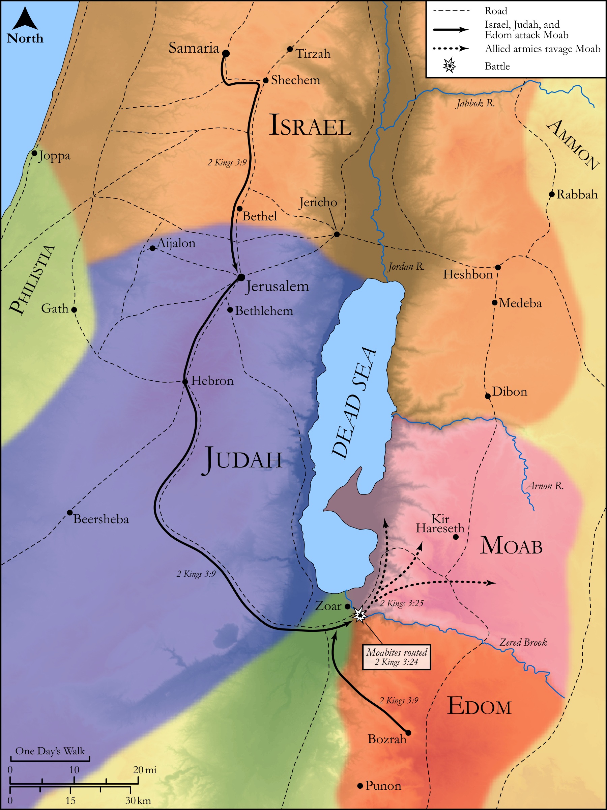

# Biblica Open Bible Maps

## License Information

Biblica Open Bible Maps, © 2023–2025 Biblica, Inc. This work is licensed under Creative Commons Attribution-ShareAlike 4.0 International (<a href="https://creativecommons.org/licenses/by-sa/4.0/">https://creativecommons.org/licenses/by-sa/4.0/</a>). More Information: <a href="https://docs.google.com/document/d/1Pp44yZ0Zdnd59vJHTrt2rPYq0SppfX5rZbPBt6mz37U/edit?tab=t.0#heading=h.oev9aj1ksvk2">https://docs.google.com/document/d/1Pp44yZ0Zdnd59vJHTrt2rPYq0SppfX5rZbPBt6mz37U/edit?tab=t.0#heading=h.oev9aj1ksvk2</a>

--------------------------------

## Historical: Joram, Elisha, and the Revolt of Moab (id: OT130)

### Image Content

[link](images/OT130.png)

Original: [Historical: Joram, Elisha, and the Revolt of Moab](https://drive.google.com/open?id=1cuggcqDgALtyDEa6h1Uog_xl5glRJ2ce&usp=drive_copy)

* **Associated Passages:** 2 Kings 3:1-27

* **Associated ACAI Concepts:** Israel (ID: `person:Israel`); Moab (ID: `place:Moab`); LORD (ID: `deity:Lord`); Edom (ID: `place:Edom`); Jehoshaphat (ID: `person:Jehoshaphat.3`); Judah (ID: `person:Judah.4`); Tribe of Judah (ID: `group:Judah`); Elisha (ID: `person:Elisha`); Ahab (ID: `person:Ahab`); Joram (ID: `person:Joram.3`); Offering (ID: `keyterm:Offering`); Rebel (ID: `keyterm:Rebel`); Samaria (ID: `place:Samaria`); Shaphat (ID: `person:Shaphat.2`); Mesha (ID: `person:Mesha.2`); Cattle (ID: `fauna:Bull`); Elijah (ID: `person:Elijah`); Israelites (ID: `group:Israel`); Jeroboam (ID: `person:Jeroboam`); Kir (ID: `place:Kir`); Baal (ID: `deity:Baal`); Word of the Lord (ID: `keyterm:WordOfTheLord`); Nebat (ID: `person:Nebat`); To Sin (ID: `keyterm:Sin`); Sheep (ID: `fauna:Lamb`); Sling (ID: `realia:Sling`); Wool (ID: `realia:Wool`); Sword (ID: `realia:Sword`); Sacred Pillar (ID: `realia:SacredPillar`); Horse (ID: `fauna:Horse`)
