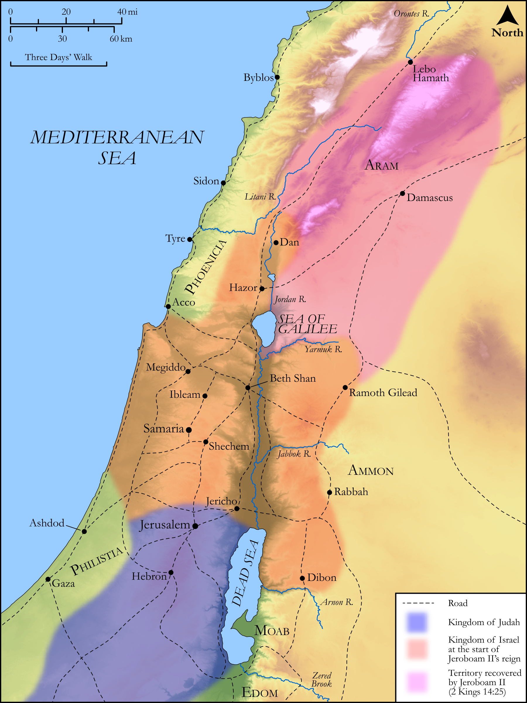

# Biblica Open Bible Maps

## License Information

Biblica Open Bible Maps, © 2023–2025 Biblica, Inc. This work is licensed under Creative Commons Attribution-ShareAlike 4.0 International (<a href="https://creativecommons.org/licenses/by-sa/4.0/">https://creativecommons.org/licenses/by-sa/4.0/</a>). More Information: <a href="https://docs.google.com/document/d/1Pp44yZ0Zdnd59vJHTrt2rPYq0SppfX5rZbPBt6mz37U/edit?tab=t.0#heading=h.oev9aj1ksvk2">https://docs.google.com/document/d/1Pp44yZ0Zdnd59vJHTrt2rPYq0SppfX5rZbPBt6mz37U/edit?tab=t.0#heading=h.oev9aj1ksvk2</a>

--------------------------------

## Historical: The Reign of Jeroboam II (id: OT136)

### Image Content

[link](images/OT136.png)

Original: [Historical: The Reign of Jeroboam II](https://drive.google.com/open?id=13smyrvM8voX_dCtMpHc95mrgeLYiUvrZ&usp=drive_copy)

* **Associated Passages:** 2 Kings 14:1-29

* **Associated ACAI Concepts:** Israel (ID: `person:Israel`); Judah (ID: `person:Judah.4`); Tribe of Judah (ID: `group:Judah`); Amaziah (ID: `person:Amaziah`); Joash (ID: `person:Joash.4`); LORD (ID: `deity:Lord`); Jeroboam (ID: `person:Jeroboam.2`); Joash (ID: `person:Joash.3`); Jerusalem (ID: `place:Jerusalem`); Jehoahaz (ID: `person:Jehoahaz.2`); Samaria (ID: `place:Samaria`); Hamath (ID: `place:Hamath`); Edom (ID: `place:Edom`); David (ID: `person:David`); Beth-shemesh (ID: `place:Beth-shemesh`); Corner Gate (ID: `place:CornerGate`); Damascus (ID: `place:Damascus`); Valley of Salt (ID: `place:SaltValley`); Gath-hepher (ID: `place:Gath-hepher`); Jonah (ID: `person:Jonah.2`); Amittai (ID: `person:Amittai`); Dead Sea (ID: `place:SaltSea`); Ephraim Gate (ID: `place:EphraimGate`); Jehoaddan (ID: `person:Jehoaddan`); Lachish (ID: `place:Lachish`); Zechariah (ID: `person:Zechariah.3`); House (ID: `realia:House`); Edomites (ID: `group:Edom`); Uzziah (ID: `person:Uzziah`); Instruction (ID: `keyterm:Instruction`); Lebanon (ID: `place:Lebanon`); Rebel (ID: `keyterm:Rebel`); Jeroboam (ID: `person:Jeroboam`); Jehu (ID: `person:Jehu.2`); Sela (ID: `place:Sela`); Word of the Lord (ID: `keyterm:WordOfTheLord`); Moses (ID: `person:Moses`); Elath (ID: `place:Elath`); Nebat (ID: `person:Nebat`); To Sin (ID: `keyterm:Sin`); Ahaziah (ID: `person:Ahaziah.2`); An Angel (ID: `deity:Angel`); Thistle (ID: `flora:Thistle`); Cubit (ID: `realia:Cubit`); Scroll (ID: `realia:Scroll`); High Place (ID: `realia:HighPlace`); Horse (ID: `fauna:Horse`); Money (ID: `realia:Money`); Stone Pine (ID: `flora:Pine`); Cedar (ID: `flora:Cedar`)
