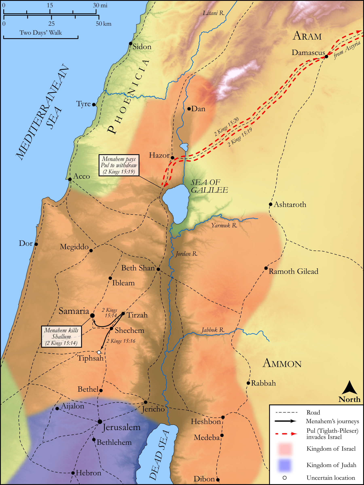

# Biblica Open Bible Maps

## License Information

Biblica Open Bible Maps, © 2023–2025 Biblica, Inc. This work is licensed under Creative Commons Attribution-ShareAlike 4.0 International (<a href="https://creativecommons.org/licenses/by-sa/4.0/">https://creativecommons.org/licenses/by-sa/4.0/</a>). More Information: <a href="https://docs.google.com/document/d/1Pp44yZ0Zdnd59vJHTrt2rPYq0SppfX5rZbPBt6mz37U/edit?tab=t.0#heading=h.oev9aj1ksvk2">https://docs.google.com/document/d/1Pp44yZ0Zdnd59vJHTrt2rPYq0SppfX5rZbPBt6mz37U/edit?tab=t.0#heading=h.oev9aj1ksvk2</a>

--------------------------------

## Historical: Menahem's Coup and Reign (id: OT137)

### Image Content

[link](images/OT137.png)

Original: [Historical: Menahem's Coup and Reign](https://drive.google.com/open?id=13TyEPl5-ofroORzaQORh9PcUkqY__Gdk&usp=drive_copy)

* **Associated Passages:** 2 Kings 15:1-38

* **Associated ACAI Concepts:** Israel (ID: `person:Israel`); Uzziah (ID: `person:Uzziah`); LORD (ID: `deity:Lord`); Judah (ID: `person:Judah.4`); Tribe of Judah (ID: `group:Judah`); Menahem (ID: `person:Menahem`); Pekah (ID: `person:Pekah`); Samaria (ID: `place:Samaria`); Jotham (ID: `person:Jotham.2`); Remaliah (ID: `person:Remaliah`); Shallum (ID: `person:Shallum.2`); Jeroboam (ID: `person:Jeroboam`); To Sin (ID: `keyterm:Sin`); Nebat (ID: `person:Nebat`); Jabesh (ID: `person:Jabesh`); Pekahiah (ID: `person:Pekahiah`); Assyria (ID: `place:Assyria`); Gadi (ID: `person:Gadi`); Zechariah (ID: `person:Zechariah.3`); Tiglath-pileser (ID: `person:Tiglath-pileser`); House (ID: `realia:House`); Jerusalem (ID: `place:Jerusalem`); Gilead (ID: `place:Gilead`); Tirzah (ID: `place:Tirzah`); David (ID: `person:David`); Jeroboam (ID: `person:Jeroboam.2`); Amaziah (ID: `person:Amaziah`); Jerusha (ID: `person:Jerusha`); Arieh (ID: `person:Arieh`); Abel-beth-maacah (ID: `place:Abel-beth-maacah`); Elah (ID: `person:Elah.3`); Tiphsah (ID: `place:Tiphsah.2`); Janoah (ID: `place:Janoah`); Jecoliah (ID: `person:Jecoliah`); Zadok (ID: `person:Zadok.3`); Argob (ID: `person:Argob`); Ijon (ID: `place:Ijon`); High Place (ID: `realia:HighPlace`); Money (ID: `realia:Money`); Stone Pine (ID: `flora:Pine`); Gileadites (ID: `group:Gilead`); Ahaz (ID: `person:Ahaz`); Infectious Skin Disease (ID: `keyterm:InfectiousSkinDisease`); Hoshea (ID: `person:Hoshea`); Naphtali (ID: `person:Naphtali`); Ibleam (ID: `place:Ibleam`); Jehu (ID: `person:Jehu.2`); Hazor (ID: `place:Hazor`); Word of the Lord (ID: `keyterm:WordOfTheLord`); Rezin (ID: `person:Rezin`); Tribe of Naphtali (ID: `group:Naphtali`); Galilee (ID: `place:Galilee`); Kedesh (ID: `place:Kedesh`); Talent (ID: `realia:Talent`); Shekel (ID: `realia:Shekel`)
