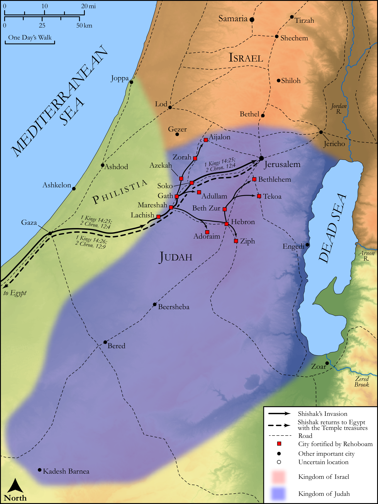

# Biblica Open Bible Maps

## License Information

Biblica Open Bible Maps, © 2023–2025 Biblica, Inc. This work is licensed under Creative Commons Attribution-ShareAlike 4.0 International (<a href="https://creativecommons.org/licenses/by-sa/4.0/">https://creativecommons.org/licenses/by-sa/4.0/</a>). More Information: <a href="https://docs.google.com/document/d/1Pp44yZ0Zdnd59vJHTrt2rPYq0SppfX5rZbPBt6mz37U/edit?tab=t.0#heading=h.oev9aj1ksvk2">https://docs.google.com/document/d/1Pp44yZ0Zdnd59vJHTrt2rPYq0SppfX5rZbPBt6mz37U/edit?tab=t.0#heading=h.oev9aj1ksvk2</a>

--------------------------------

## Historical: Shishak’s Invasion (id: OT141)

### Image Content

[link](images/OT141.png)

Original: [Historical: Shishak’s Invasion](https://drive.google.com/open?id=13dWkS9LO5G1MQbfe4AEZKKQhtEo1yEji&usp=drive_copy)

* **Associated Passages:** 1 Kings 14:1-31; 2 Chronicles 12:1-16

* **Associated ACAI Concepts:** LORD (ID: `deity:Lord`); Jeroboam (ID: `person:Jeroboam`); Israel (ID: `person:Israel`); Rehoboam (ID: `person:Rehoboam`); Jerusalem (ID: `place:Jerusalem`); Judah (ID: `person:Judah.4`); Tribe of Judah (ID: `group:Judah`); Ahijah (ID: `person:Ahijah.2`); Shishak (ID: `person:Shishak`); House (ID: `realia:House`); Egypt (ID: `place:Egypt`); Naamah (ID: `person:Naamah`); Shemaiah (ID: `person:Shemaiah`); David (ID: `person:David`); Solomon (ID: `person:Solomon`); Ammonites (ID: `group:Ammon`); Ammon (ID: `place:Ammon`); Small Shield (ID: `realia:SmallShield`); Abijah (ID: `person:Abijah.4`); Asherah (ID: `deity:Asherah`); Word of the Lord (ID: `keyterm:WordOfTheLord`); To Sin (ID: `keyterm:Sin`); Shiloh (ID: `place:Shiloh`); Abijah (ID: `person:Abijah.3`); Iddo (ID: `person:Iddo.5`); Sukkiim (ID: `group:Sukkiim`); Tirzah (ID: `place:Tirzah`); Be Zealous (ID: `keyterm:Zealous`); Ethiopians (ID: `group:Ethiopia`); Euphrates River (ID: `place:Euphrates`); Dispossess (ID: `keyterm:Dispossess`); Instruction (ID: `keyterm:Instruction`); Nadab (ID: `person:Nadab.2`); Libya (ID: `place:Libya`); Ethiopia (ID: `place:Ethiopia`); Work (ID: `keyterm:Work`); Be Unfaithful (ID: `keyterm:Unfaithful`); Sacred Pole (ID: `realia:SacredPole`); Fortification (ID: `realia:Fortification`); Molten Image (ID: `realia:MoltenImage`); Doorstep (ID: `realia:Doorstep`); Reed (ID: `flora:Reed`); Sacred Pillar (ID: `realia:SacredPillar`); Chariot (ID: `realia:Chariot`); Dog (ID: `fauna:Dog`); High Place (ID: `realia:HighPlace`); Stone Pine (ID: `flora:Pine`)
