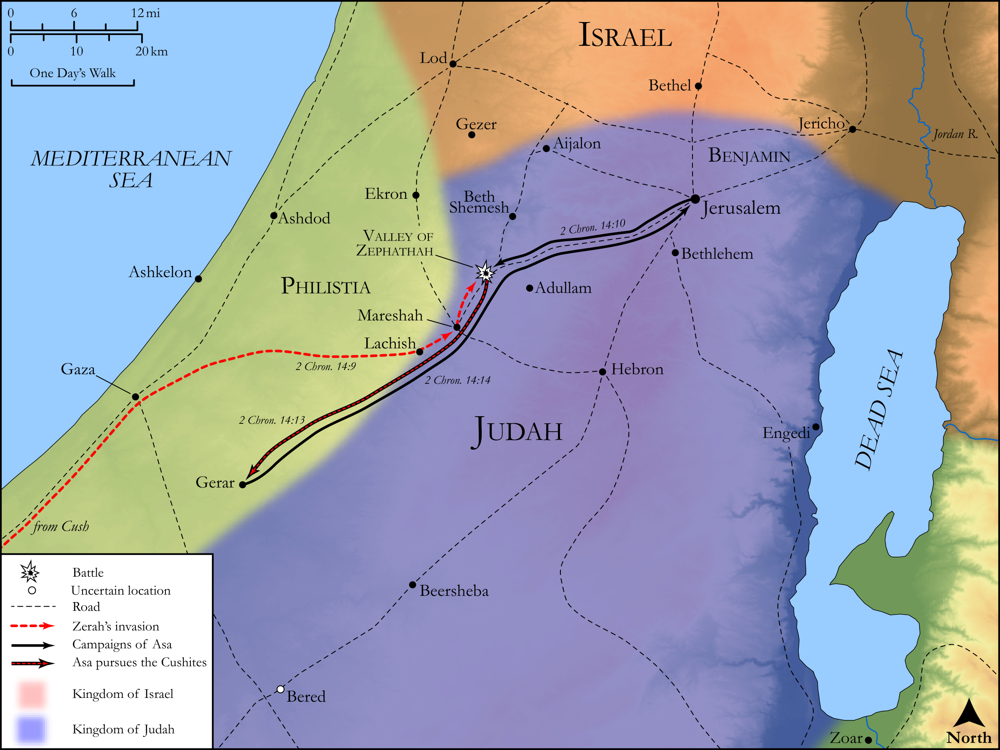

# Biblica Open Bible Maps

## License Information

Biblica Open Bible Maps, © 2023–2025 Biblica, Inc. This work is licensed under Creative Commons Attribution-ShareAlike 4.0 International (<a href="https://creativecommons.org/licenses/by-sa/4.0/">https://creativecommons.org/licenses/by-sa/4.0/</a>). More Information: <a href="https://docs.google.com/document/d/1Pp44yZ0Zdnd59vJHTrt2rPYq0SppfX5rZbPBt6mz37U/edit?tab=t.0#heading=h.oev9aj1ksvk2">https://docs.google.com/document/d/1Pp44yZ0Zdnd59vJHTrt2rPYq0SppfX5rZbPBt6mz37U/edit?tab=t.0#heading=h.oev9aj1ksvk2</a>

--------------------------------

## Historical: Zerah’s Invasion (id: OT143)

### Image Content

[link](images/OT143.png)

Original: [Historical: Zerah’s Invasion](https://drive.google.com/open?id=1klRo4S-Ii54xogx213843qvF_z_olp9R&usp=drive_copy)

* **Associated Passages:** 2 Chronicles 14:1-14

* **Associated ACAI Concepts:** LORD (ID: `deity:Lord`); Asa (ID: `person:Asa`); Judah (ID: `person:Judah.4`); Tribe of Judah (ID: `group:Judah`); Ethiopians (ID: `group:Ethiopia`); Ethiopia (ID: `place:Ethiopia`); Mareshah (ID: `place:Mareshah`); Gerar (ID: `place:Gerar`); High Place (ID: `realia:HighPlace`); Stone Pine (ID: `flora:Pine`); Valley of Zephathah (ID: `place:ZephathahValley`); Zerah (ID: `person:Zerah.5`); Benjamin (ID: `person:Benjamin`); Asherah (ID: `deity:Asherah`); Instruction (ID: `keyterm:Instruction`); Tribe of Benjamin (ID: `group:Benjamin`); David (ID: `person:David`); Strength (ID: `keyterm:Strength`); Abijah (ID: `person:Abijah.4`); Large Shield (ID: `realia:LargeShield`); Spear (ID: `realia:Spear`); Stone Altar (ID: `realia:StoneAltar`); Temple Altar (ID: `realia:TempleAltar`); Small Shield (ID: `realia:SmallShield`); Altar (ID: `realia:Altar`); Sacred Pole (ID: `realia:SacredPole`); Sacred Pillar (ID: `realia:SacredPillar`); Chariot (ID: `realia:Chariot`); Bow (ID: `realia:Bow`); Tabernacle Altar (ID: `realia:TabernacleAltar`); Tower (ID: `realia:Tower`); Fortification (ID: `realia:Fortification`)
