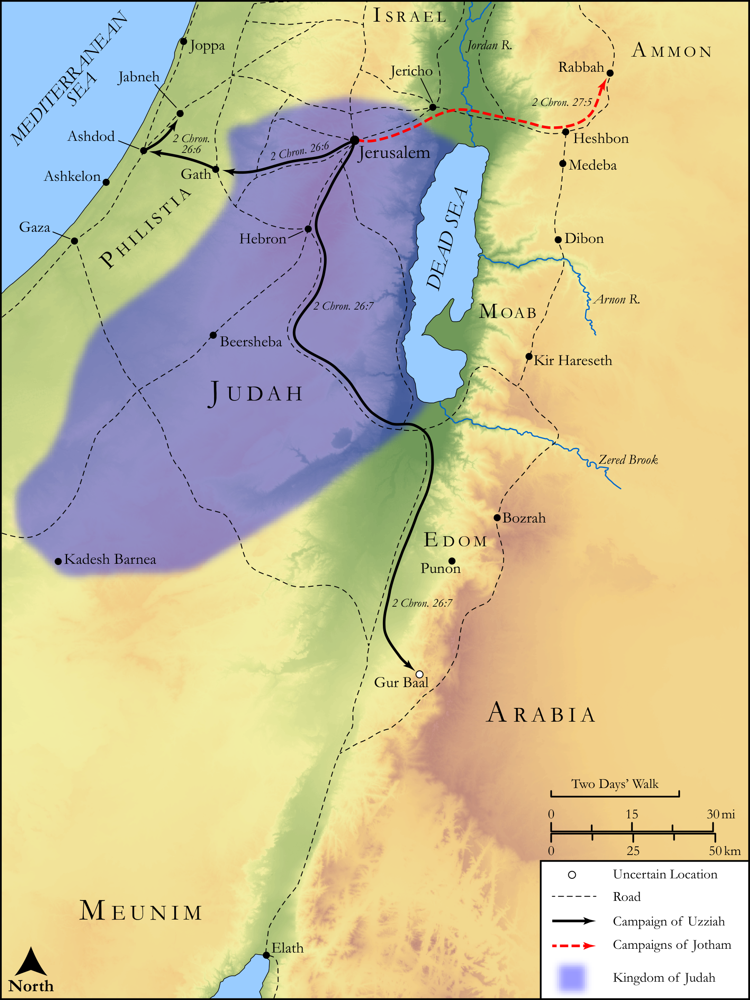

# Biblica Open Bible Maps

## License Information

Biblica Open Bible Maps, © 2023–2025 Biblica, Inc. This work is licensed under Creative Commons Attribution-ShareAlike 4.0 International (<a href="https://creativecommons.org/licenses/by-sa/4.0/">https://creativecommons.org/licenses/by-sa/4.0/</a>). More Information: <a href="https://docs.google.com/document/d/1Pp44yZ0Zdnd59vJHTrt2rPYq0SppfX5rZbPBt6mz37U/edit?tab=t.0#heading=h.oev9aj1ksvk2">https://docs.google.com/document/d/1Pp44yZ0Zdnd59vJHTrt2rPYq0SppfX5rZbPBt6mz37U/edit?tab=t.0#heading=h.oev9aj1ksvk2</a>

--------------------------------

## Historical: The Reigns of Uzziah and Jotham (id: OT148)

### Image Content

[link](images/OT148.png)

Original: [Historical: The Reigns of Uzziah and Jotham](https://drive.google.com/open?id=10-fcgfpRI5U_jMmZAwLSwJOW426qK5y_&usp=drive_copy)

* **Associated Passages:** 2 Chronicles 26:1-27:9

* **Associated ACAI Concepts:** Uzziah (ID: `person:Uzziah`); LORD (ID: `deity:Lord`); Jotham (ID: `person:Jotham.2`); Jerusalem (ID: `place:Jerusalem`); Infectious Skin Disease (ID: `keyterm:InfectiousSkinDisease`); Judah (ID: `person:Judah.4`); Tribe of Judah (ID: `group:Judah`); Tower (ID: `realia:Tower`); Azariah (ID: `person:Azariah.9`); House (ID: `realia:House`); Philistines (ID: `group:Philistine`); Ammonites (ID: `group:Ammon`); Ammon (ID: `place:Ammon`); Philistia (ID: `place:Philistine`); Amaziah (ID: `person:Amaziah`); Be Unfaithful (ID: `keyterm:Unfaithful`); Jabneel (ID: `place:Jabneel`); Corner Gate (ID: `place:CornerGate`); Hananiah (ID: `person:Hananiah.4`); Jerusha (ID: `person:Jerusha`); Maaseiah (ID: `person:Maaseiah.3`); Meunites (ID: `group:Meunites`); Zechariah (ID: `person:Zechariah.13`); Valley Gate (ID: `place:ValleyGate`); Ashdod (ID: `place:Ashdod`); Jeiel (ID: `person:Jeiel.6`); Gath (ID: `place:Gath`); Angle (ID: `place:Angle`); Jecoliah (ID: `person:Jecoliah`); Zadok (ID: `person:Zadok.3`); Gur-baal (ID: `place:Gurbaal`); Stone Altar (ID: `realia:StoneAltar`); Temple Altar (ID: `realia:TempleAltar`); Altar (ID: `realia:Altar`); Tabernacle Altar (ID: `realia:TabernacleAltar`); Aaron (ID: `person:Aaron`); Egypt (ID: `place:Egypt`); Ahaz (ID: `person:Ahaz`); Israel (ID: `person:Israel`); Amoz (ID: `person:Amoz`); Arabia (ID: `place:Arabia`); Offering (ID: `keyterm:Offering`); Love (ID: `keyterm:Love`); Arabians (ID: `group:Arabia`); David (ID: `person:David`); Shephelah (ID: `place:Shephelah`); Strength (ID: `keyterm:Strength`); Elath (ID: `place:Elath`); Perceive (ID: `keyterm:Perceive`); Isaiah (ID: `person:Isaiah`); Ophel (ID: `place:Ophel`); Glory (ID: `keyterm:Glory`); Arrow (ID: `keyterm:Arrow`); Holy (ID: `keyterm:Holy`); Sling (ID: `realia:Sling`); Breastplate (ID: `realia:Breastplate`); Wheat (ID: `flora:Wheat`); Spear (ID: `realia:Spear`); Talent (ID: `realia:Talent`); Small Shield (ID: `realia:SmallShield`); Kor (ID: `realia:Kor`); Arrow (ID: `realia:Arrow`); Pit (ID: `realia:Pit`); Bow (ID: `realia:Bow`); Money (ID: `realia:Money`); Helmet (ID: `realia:Helmet`); Barley (ID: `flora:Barley`)
