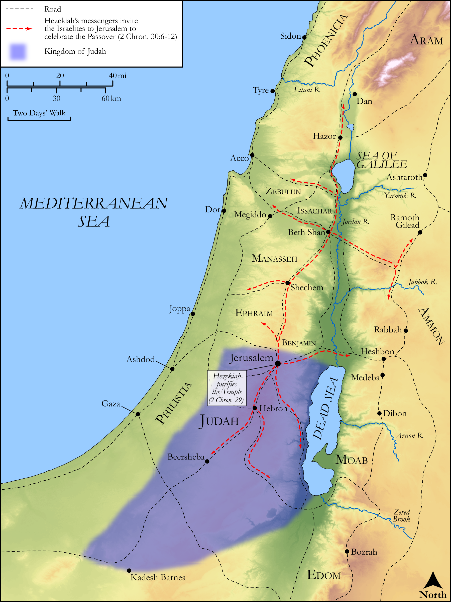

# Biblica Open Bible Maps

## License Information

Biblica Open Bible Maps, © 2023–2025 Biblica, Inc. This work is licensed under Creative Commons Attribution-ShareAlike 4.0 International (<a href="https://creativecommons.org/licenses/by-sa/4.0/">https://creativecommons.org/licenses/by-sa/4.0/</a>). More Information: <a href="https://docs.google.com/document/d/1Pp44yZ0Zdnd59vJHTrt2rPYq0SppfX5rZbPBt6mz37U/edit?tab=t.0#heading=h.oev9aj1ksvk2">https://docs.google.com/document/d/1Pp44yZ0Zdnd59vJHTrt2rPYq0SppfX5rZbPBt6mz37U/edit?tab=t.0#heading=h.oev9aj1ksvk2</a>

--------------------------------

## Historical: Hezekiah Purifies the Temple (id: OT150)

### Image Content

[link](images/OT150.png)

Original: [Historical: Hezekiah Purifies the Temple](https://drive.google.com/open?id=1_GMtqI2qXQ50ohdji9uJKhY6J2MnWbSa&usp=drive_copy)

* **Associated Passages:** 2 Chronicles 29:1-32:33

* **Associated ACAI Concepts:** LORD (ID: `deity:Lord`); Hezekiah (ID: `person:Hezekiah`); Jerusalem (ID: `place:Jerusalem`); Tribe of Levi (ID: `group:Levi`); Levi (ID: `person:Levi.3`); Offering (ID: `keyterm:Offering`); Tribe of Judah (ID: `group:Judah`); Judah (ID: `person:Judah.4`); Israel (ID: `person:Israel`); Holy (ID: `keyterm:Holy`); Assyria (ID: `place:Assyria`); David (ID: `person:David`); Passover (ID: `keyterm:Passover`); Pure (ID: `keyterm:Pure`); Manasseh (ID: `person:Manasseh`); Sennacherib (ID: `person:Sennacherib`); Tribe of Manasseh (ID: `group:Manasseh`); House (ID: `realia:House`); Tabernacle Altar (ID: `realia:TabernacleAltar`); Temple Altar (ID: `realia:TempleAltar`); Stone Altar (ID: `realia:StoneAltar`); Altar (ID: `realia:Altar`); Cattle (ID: `fauna:Bull`); Flock (ID: `fauna:Flock`); Goat (ID: `fauna:Goat`); Work (ID: `keyterm:Work`); Tribe of Ephraim (ID: `group:Ephraim`); Ephraim (ID: `person:Ephraim`); Instruction (ID: `keyterm:Instruction`); Tribe of Zebulun (ID: `group:Zebulun`)
