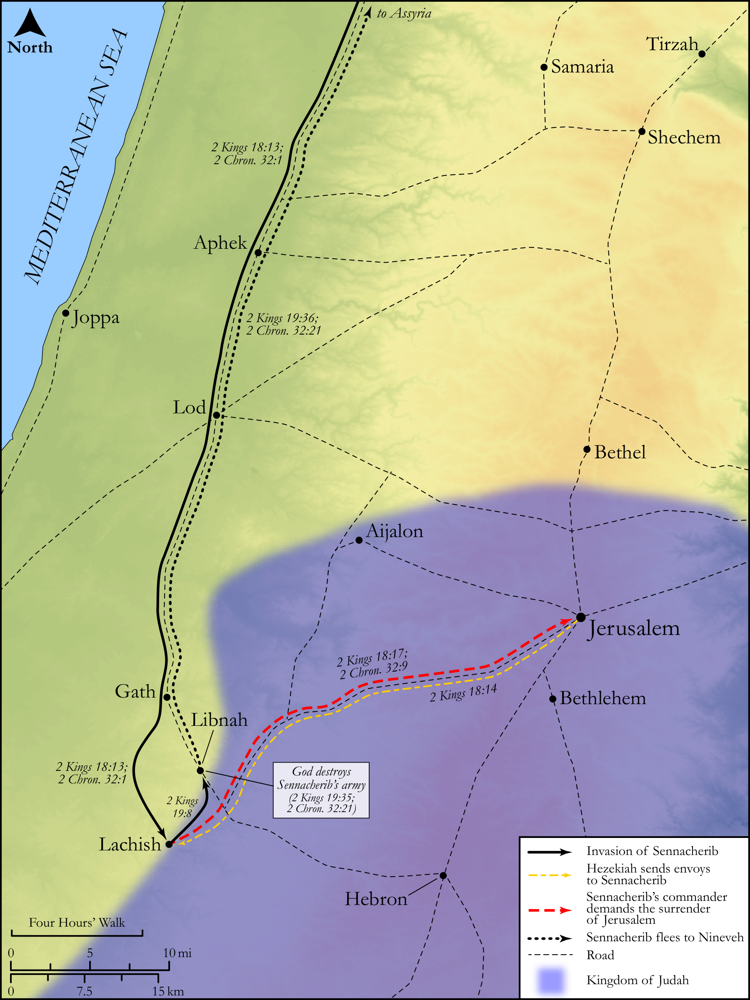

# Biblica Open Bible Maps

## License Information

Biblica Open Bible Maps, © 2023–2025 Biblica, Inc. This work is licensed under Creative Commons Attribution-ShareAlike 4.0 International (<a href="https://creativecommons.org/licenses/by-sa/4.0/">https://creativecommons.org/licenses/by-sa/4.0/</a>). More Information: <a href="https://docs.google.com/document/d/1Pp44yZ0Zdnd59vJHTrt2rPYq0SppfX5rZbPBt6mz37U/edit?tab=t.0#heading=h.oev9aj1ksvk2">https://docs.google.com/document/d/1Pp44yZ0Zdnd59vJHTrt2rPYq0SppfX5rZbPBt6mz37U/edit?tab=t.0#heading=h.oev9aj1ksvk2</a>

--------------------------------

## Historical: Hezekiah and Sennacherib (id: OT151)

### Image Content

[link](images/OT151.png)

Original: [Historical: Hezekiah and Sennacherib](https://drive.google.com/open?id=1arkeLaIERE3NAETjF7quzPW7oXXaNIvi&usp=drive_copy)

* **Associated Passages:** 2 Kings 18:1-19:37; 2 Chronicles 32:1-33

* **Associated ACAI Concepts:** LORD (ID: `deity:Lord`); Hezekiah (ID: `person:Hezekiah`); Assyria (ID: `place:Assyria`); Jerusalem (ID: `place:Jerusalem`); Tribe of Judah (ID: `group:Judah`); Judah (ID: `person:Judah.4`); Israel (ID: `person:Israel`); Sennacherib (ID: `person:Sennacherib`); Trust (ID: `keyterm:LeanOn`); Rabshakeh (ID: `person:Rabshakeh`); Isaiah (ID: `person:Isaiah`); An Angel (ID: `deity:Angel`); David (ID: `person:David`); Eliakim (ID: `person:Eliakim.3`); Amoz (ID: `person:Amoz`); Shebna (ID: `person:Shebna`); Lachish (ID: `place:Lachish`); House (ID: `realia:House`); Joah (ID: `person:Joah`); Hilkiah (ID: `person:Hilkiah`); Hoshea (ID: `person:Hoshea`); Moses (ID: `person:Moses`); Egypt (ID: `place:Egypt`); Fear (ID: `keyterm:Fear`); Samaria (ID: `place:Samaria`); Vine (ID: `flora:Vine`); Asaph (ID: `person:Asaph`); Ivvah (ID: `place:Ivvah`); Hena (ID: `place:Hena`); Gozan (ID: `place:Gozan`)
