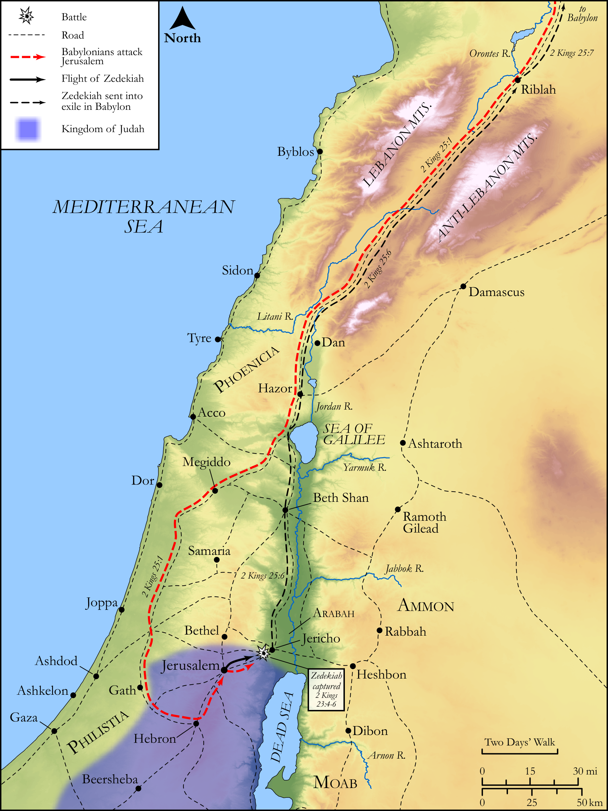

# Biblica Open Bible Maps

## License Information

Biblica Open Bible Maps, © 2023–2025 Biblica, Inc. This work is licensed under Creative Commons Attribution-ShareAlike 4.0 International (<a href="https://creativecommons.org/licenses/by-sa/4.0/">https://creativecommons.org/licenses/by-sa/4.0/</a>). More Information: <a href="https://docs.google.com/document/d/1Pp44yZ0Zdnd59vJHTrt2rPYq0SppfX5rZbPBt6mz37U/edit?tab=t.0#heading=h.oev9aj1ksvk2">https://docs.google.com/document/d/1Pp44yZ0Zdnd59vJHTrt2rPYq0SppfX5rZbPBt6mz37U/edit?tab=t.0#heading=h.oev9aj1ksvk2</a>

--------------------------------

## Historical: Zedekiah and Nebuchadnezzar (id: OT154)

### Image Content

[link](images/OT154.png)

Original: [Historical: Zedekiah and Nebuchadnezzar](https://drive.google.com/open?id=1P6bITWC5pzY6RIvBcz0nbqWqT65N6H0I&usp=drive_copy)

* **Associated Passages:** 2 Kings 25:1-30

* **Associated ACAI Concepts:** Babylon (ID: `place:Babylon`); Chaldea (ID: `place:Chaldea`); Chaldeans (ID: `group:Chaldea`); Gedaliah (ID: `person:Gedaliah.2`); Jerusalem (ID: `place:Jerusalem`); Nebuzaradan (ID: `person:Nebuzaradan`); Riblah (ID: `place:Riblah.2`); House (ID: `realia:House`); Nebuchadnezzar (ID: `person:Nebuchadnezzar`); LORD (ID: `deity:Lord`); Judah (ID: `person:Judah.4`); Tribe of Judah (ID: `group:Judah`); Zedekiah (ID: `person:Zedekiah.3`); Nethaniah (ID: `person:Nethaniah`); Ishmael (ID: `person:Ishmael.2`); Mizpah (ID: `place:Mizpah`); Fear (ID: `keyterm:Fear`); Appoint (ID: `keyterm:Appoint`); Shovel (ID: `realia:Shovel`); Zephaniah (ID: `person:Zephaniah.2`); Elishama (ID: `person:Elishama.3`); Seraiah (ID: `person:Seraiah.3`); Netophathites (ID: `group:Netophah`); Johanan (ID: `person:Johanan.5`); Evil-merodach (ID: `person:Evil-merodach`); Kareah (ID: `person:Kareah`); Under Siege (ID: `keyterm:StateOfBeingUnderSiege`); Seraiah (ID: `person:Seraiah.2`); Tanhumeth (ID: `person:Tanhumeth`); Jezaniah (ID: `person:Jezaniah`); Prison (ID: `realia:Prison`); Hamath (ID: `place:Hamath`); Egypt (ID: `place:Egypt`); Shaphan (ID: `person:Shaphan`); Jehoiachin (ID: `person:Jehoiachin`); Netophah (ID: `place:Netophah`); Jericho (ID: `place:Jericho`); Solomon (ID: `person:Solomon`); Force to Serve (ID: `keyterm:EnticedToServe`); Arabah (ID: `place:Arabah`); Maacathites (ID: `group:Maacah`); Maacah (ID: `place:Maacah`); Swear (ID: `keyterm:Swear`); Ahikam (ID: `person:Ahikam`); Jews (ID: `group:Jews`); Siege-Works (ID: `realia:Siege-works`); Doorstep (ID: `realia:Doorstep`); Cooking Pot (ID: `realia:CookingPot`); Cubit (ID: `realia:Cubit`); Pomegranate (ID: `flora:Pomegranate`); Money (ID: `realia:Money`); Wick Trimmer (ID: `realia:WickTrimmer`)
