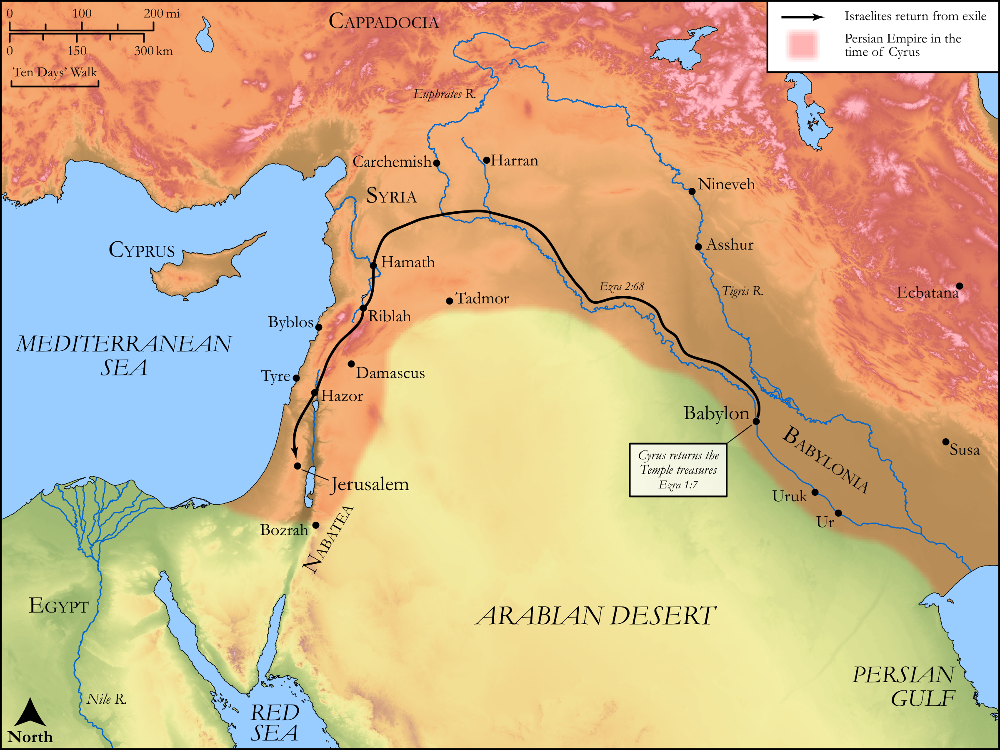

# Biblica Open Bible Maps

## License Information

Biblica Open Bible Maps, © 2023–2025 Biblica, Inc. This work is licensed under Creative Commons Attribution-ShareAlike 4.0 International (<a href="https://creativecommons.org/licenses/by-sa/4.0/">https://creativecommons.org/licenses/by-sa/4.0/</a>). More Information: <a href="https://docs.google.com/document/d/1Pp44yZ0Zdnd59vJHTrt2rPYq0SppfX5rZbPBt6mz37U/edit?tab=t.0#heading=h.oev9aj1ksvk2">https://docs.google.com/document/d/1Pp44yZ0Zdnd59vJHTrt2rPYq0SppfX5rZbPBt6mz37U/edit?tab=t.0#heading=h.oev9aj1ksvk2</a>

--------------------------------

## Historical: The Return from Babylon (id: OT161)

### Image Content

[link](images/OT161.png)

Original: [Historical: The Return from Babylon](https://drive.google.com/open?id=1q0E6UIZyApFq_olK9H0CLNy7vGkS4hK8&usp=drive_copy)

* **Associated Passages:** Ezra 2:1-3:13

* **Associated ACAI Concepts:** LORD (ID: `deity:Lord`); Israel (ID: `person:Israel`); Tribe of Levi (ID: `group:Levi`); Levi (ID: `person:Levi.3`); Offering (ID: `keyterm:Offering`); Jerusalem (ID: `place:Jerusalem`); House (ID: `realia:House`); Zerubbabel (ID: `person:Zerubbabel.2`); Joshua (ID: `person:Joshua.5`); Jeshua (ID: `person:Jeshua.4`); Hodaviah (ID: `person:Hodaviah.4`); Kadmiel (ID: `person:Kadmiel`); Elam (ID: `person:Elam`); Shealtiel (ID: `person:Shealtiel.2`); Jehozadak (ID: `person:Jehozadak`); Asaph (ID: `person:Asaph.2`); Solomon (ID: `person:Solomon`); Immer (ID: `place:Immer`); Mordecai (ID: `person:Mordecai`); Giddel (ID: `person:Giddel.2`); Nekoda (ID: `person:Nekoda`); Tel-melah (ID: `place:Tel-melah`); Besai (ID: `person:Besai`); Gahar (ID: `person:Gahar`); Senaah (ID: `place:Senaah`); Ater (ID: `person:Ater`); Azgad (ID: `person:Azgad`); Bebai (ID: `person:Bebai`); Delaiah (ID: `person:Delaiah.3`); Hakkoz (ID: `person:Hakkoz.2`)
