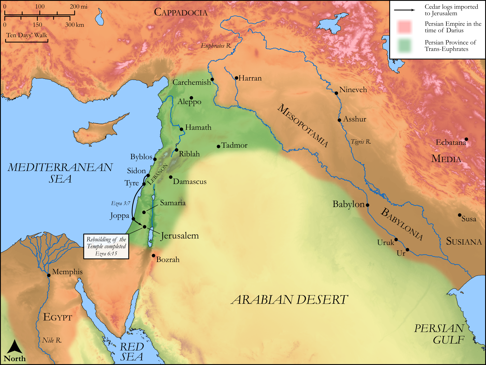

# Biblica Open Bible Maps

## License Information

Biblica Open Bible Maps, © 2023–2025 Biblica, Inc. This work is licensed under Creative Commons Attribution-ShareAlike 4.0 International (<a href="https://creativecommons.org/licenses/by-sa/4.0/">https://creativecommons.org/licenses/by-sa/4.0/</a>). More Information: <a href="https://docs.google.com/document/d/1Pp44yZ0Zdnd59vJHTrt2rPYq0SppfX5rZbPBt6mz37U/edit?tab=t.0#heading=h.oev9aj1ksvk2">https://docs.google.com/document/d/1Pp44yZ0Zdnd59vJHTrt2rPYq0SppfX5rZbPBt6mz37U/edit?tab=t.0#heading=h.oev9aj1ksvk2</a>

--------------------------------

## Historical: The Reconstruction of the Temple (id: OT162)

### Image Content

[link](images/OT162.png)

Original: [Historical: The Reconstruction of the Temple](https://drive.google.com/open?id=11GaIIWrNTEnSICQXMP-mtsmK1OfXXzSg&usp=drive_copy)

* **Associated Passages:** Ezra 3:1-6:22

* **Associated ACAI Concepts:** Jerusalem (ID: `place:Jerusalem`); House (ID: `realia:House`); Israel (ID: `person:Israel`); LORD (ID: `deity:Lord`); Darius (ID: `person:Darius.2`); Euphrates River (ID: `place:Euphrates`); Cyrus (ID: `person:Cyrus`); Zerubbabel (ID: `person:Zerubbabel.2`); Persia (ID: `place:Persia`); Tribe of Levi (ID: `group:Levi`); Offering (ID: `keyterm:Offering`); Levi (ID: `person:Levi.3`); Babylon (ID: `place:Babylon`); Jews (ID: `group:Jews`); Judah (ID: `person:Judah.4`); Shethar-bozenai (ID: `person:Shethar-bozenai`); Shimshai (ID: `person:Shimshai`); Tattenai (ID: `person:Tattenai`); Rehum (ID: `person:Rehum.2`); Artaxerxes (ID: `person:Artaxerxes.2`); Joshua (ID: `person:Joshua.5`); Shealtiel (ID: `person:Shealtiel.2`); Jehozadak (ID: `person:Jehozadak`); Nebuchadnezzar (ID: `person:Nebuchadnezzar`); Tribe of Judah (ID: `group:Judah`); Scroll (ID: `realia:Scroll`); Zechariah (ID: `person:Zechariah.17`); Iddo (ID: `person:Iddo.6`); Haggai (ID: `person:Haggai`); Passover (ID: `keyterm:Passover`)
