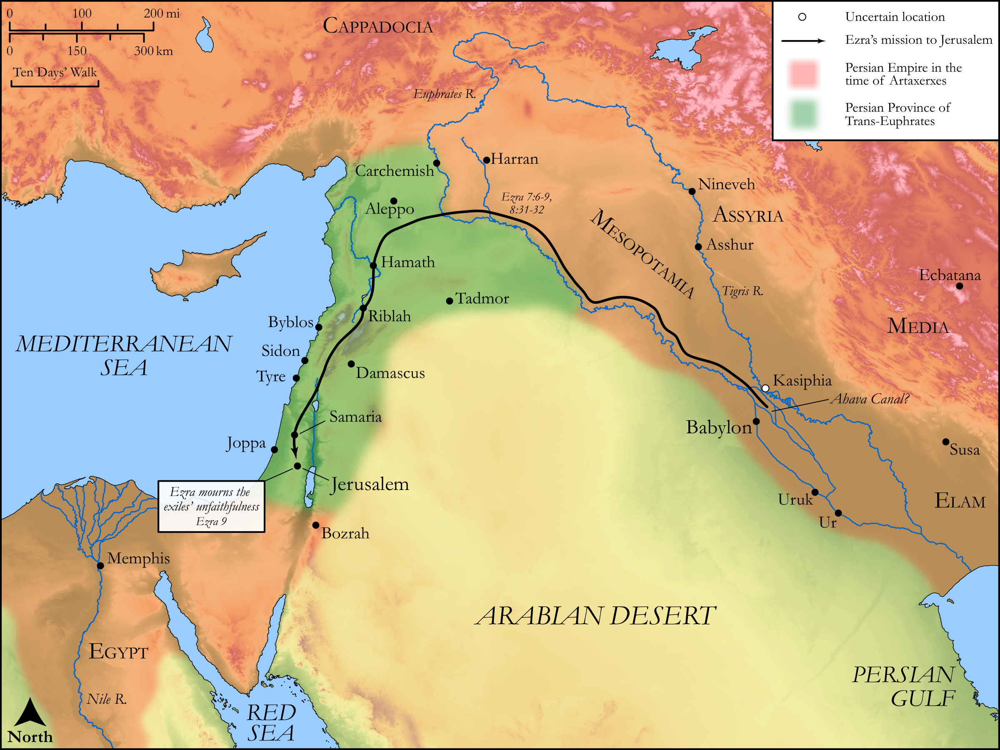

# Biblica Open Bible Maps

## License Information

Biblica Open Bible Maps, © 2023–2025 Biblica, Inc. This work is licensed under Creative Commons Attribution-ShareAlike 4.0 International (<a href="https://creativecommons.org/licenses/by-sa/4.0/">https://creativecommons.org/licenses/by-sa/4.0/</a>). More Information: <a href="https://docs.google.com/document/d/1Pp44yZ0Zdnd59vJHTrt2rPYq0SppfX5rZbPBt6mz37U/edit?tab=t.0#heading=h.oev9aj1ksvk2">https://docs.google.com/document/d/1Pp44yZ0Zdnd59vJHTrt2rPYq0SppfX5rZbPBt6mz37U/edit?tab=t.0#heading=h.oev9aj1ksvk2</a>

--------------------------------

## Historical: Ezra’s Mission to Jerusalem (id: OT163)

### Image Content

[link](images/OT163.png)

Original: [Historical: Ezra’s Mission to Jerusalem](https://drive.google.com/open?id=1Z0ogfe0fHiWb2sq_6uvTqzzWlJSVria0&usp=drive_copy)

* **Associated Passages:** Ezra 7:1-10:44

* **Associated ACAI Concepts:** LORD (ID: `deity:Lord`); Israel (ID: `person:Israel`); Jerusalem (ID: `place:Jerusalem`); Ezra (ID: `person:Ezra`); Tribe of Levi (ID: `group:Levi`); Levi (ID: `person:Levi.3`); Artaxerxes (ID: `person:Artaxerxes`); Be Unfaithful (ID: `keyterm:Unfaithful`); Offering (ID: `keyterm:Offering`); House (ID: `realia:House`); Money (ID: `realia:Money`); Babylon (ID: `place:Babylon`); Ahava (ID: `place:Ahava`); Elam (ID: `person:Elam`); Judah (ID: `person:Judah.4`); Passion (ID: `keyterm:Ardour`); Euphrates River (ID: `place:Euphrates`); Instruction (ID: `keyterm:Instruction`); Hashabiah (ID: `person:Hashabiah.7`); Sherebiah (ID: `person:Sherebiah`); Bebai (ID: `person:Bebai`); Harim (ID: `person:Harim`); Decree (ID: `keyterm:Decree`); Pahath-moab (ID: `person:Pahath-moab`); Persia (ID: `place:Persia`); Counsel (ID: `keyterm:Counsel`); Perceive (ID: `keyterm:Perceive`); Tribe of Judah (ID: `group:Judah`); Kindness (ID: `keyterm:Kindness`); David (ID: `person:David`)
