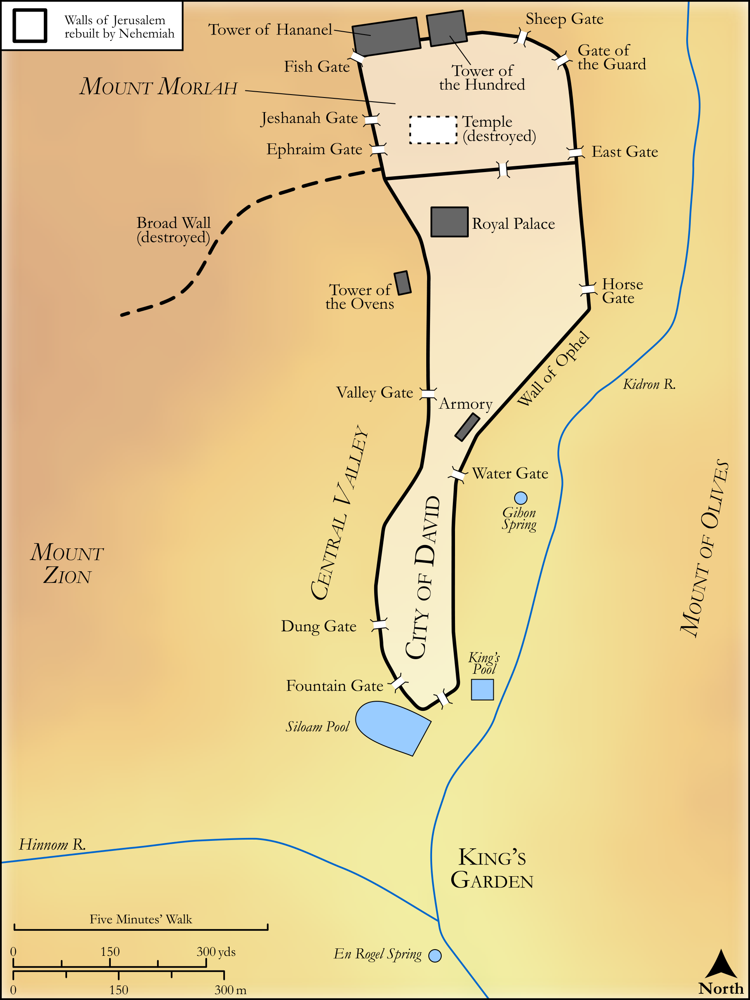

# Biblica Open Bible Maps

## License Information

Biblica Open Bible Maps, © 2023–2025 Biblica, Inc. This work is licensed under Creative Commons Attribution-ShareAlike 4.0 International (<a href="https://creativecommons.org/licenses/by-sa/4.0/">https://creativecommons.org/licenses/by-sa/4.0/</a>). More Information: <a href="https://docs.google.com/document/d/1Pp44yZ0Zdnd59vJHTrt2rPYq0SppfX5rZbPBt6mz37U/edit?tab=t.0#heading=h.oev9aj1ksvk2">https://docs.google.com/document/d/1Pp44yZ0Zdnd59vJHTrt2rPYq0SppfX5rZbPBt6mz37U/edit?tab=t.0#heading=h.oev9aj1ksvk2</a>

--------------------------------

## Historical: City Plan: Jerusalem Rebuilt by Nehemiah (id: OT165)

### Image Content

[link](images/OT165.png)

Original: [Historical: City Plan: Jerusalem Rebuilt by Nehemiah](https://drive.google.com/open?id=1fHG__DjtAeH3xPGO86J_eYNVKFpynz6N&usp=drive_copy)

* **Associated Passages:** Nehemiah 2:1-3:38

* **Associated ACAI Concepts:** Jerusalem (ID: `place:Jerusalem`); LORD (ID: `deity:Lord`); House (ID: `realia:House`); Valley Gate (ID: `place:ValleyGate`); Eliashib (ID: `person:Eliashib.7`); Dung Gate (ID: `place:DungGate`); Mizpah (ID: `place:Mizpah`); Euphrates River (ID: `place:Euphrates`); Tower (ID: `realia:Tower`); Berechiah (ID: `person:Berechiah.5`); Uriah (ID: `person:Uriah.4`); Sheep Gate (ID: `place:SheepGate`); Horonites (ID: `group:Horonites`); Ophel (ID: `place:Ophel`); Azariah (ID: `person:Azariah.17`); Tobiah (ID: `person:Tobiah.2`); Meshullam (ID: `person:Meshullam.12`); Hakkoz (ID: `person:Hakkoz.3`); Fountain Gate (ID: `place:FountainGate`); Sanballat (ID: `person:Sanballat`); Tekoa (ID: `place:Tekoa`); Meremoth (ID: `person:Meremoth`); Keilah (ID: `place:Keilah`); Ammonites (ID: `group:Ammon`); Ammon (ID: `place:Ammon`); Tribe of Judah (ID: `group:Judah`); Judah (ID: `person:Judah.4`); Siloam (ID: `place:Siloam`); David (ID: `person:David`); Meronothites (ID: `group:Meronothite`)
