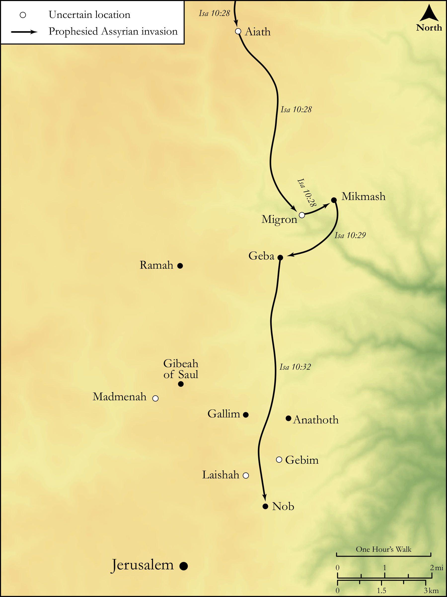

# Biblica Open Bible Maps

## License Information

Biblica Open Bible Maps, © 2023–2025 Biblica, Inc. This work is licensed under Creative Commons Attribution-ShareAlike 4.0 International (<a href="https://creativecommons.org/licenses/by-sa/4.0/">https://creativecommons.org/licenses/by-sa/4.0/</a>). More Information: <a href="https://docs.google.com/document/d/1Pp44yZ0Zdnd59vJHTrt2rPYq0SppfX5rZbPBt6mz37U/edit?tab=t.0#heading=h.oev9aj1ksvk2">https://docs.google.com/document/d/1Pp44yZ0Zdnd59vJHTrt2rPYq0SppfX5rZbPBt6mz37U/edit?tab=t.0#heading=h.oev9aj1ksvk2</a>

--------------------------------

## Wisdom & Prophets: The Prophesied Attack on Jerusalem (id: OT177)

### Image Content

[link](images/OT177.png)

Original: [Wisdom \& Prophets: The Prophesied Attack on Jerusalem](https://drive.google.com/file/d/1RRMCWu80dY4-q0rnYPUDDajenTqDH2rQ/view?usp=drive_link)

* **Associated Passages:** Isaiah 10:1-34

* **Associated ACAI Concepts:** LORD (ID: `deity:Lord`); Jerusalem (ID: `place:Jerusalem`); Israel (ID: `person:Israel`); Assyria (ID: `place:Assyria`); Glory (ID: `keyterm:Glory`); Samaria (ID: `place:Samaria`); Woe (ID: `keyterm:Woe.2`); Rod (ID: `realia:Rod`); Sandalwood (ID: `flora:Sandalwood`); Egypt (ID: `place:Egypt`); Idol (ID: `keyterm:Idol`); Holy (ID: `keyterm:Holy`); Gallim (ID: `place:Gallim`); Nob (ID: `place:Nob`); Visitation (ID: `keyterm:Visitation`); Ai (ID: `place:Ai`); Migron (ID: `place:Migron`); Gebim (ID: `place:Gebim`); Madmenah (ID: `place:Madmenah`); Laishah (ID: `place:Laishah`); Carchemish (ID: `place:Carchemish`); Oreb (ID: `person:Oreb`); Calneh (ID: `place:Calneh`); Staff (ID: `realia:Staff`); Image (ID: `realia:Image`); Mighty (ID: `keyterm:Mighty`); Hamath (ID: `place:Hamath`); Ramah (ID: `place:Ramah.2`); Damascus (ID: `place:Damascus`); Anathoth (ID: `place:Anathoth`); Gibeah (ID: `place:Gibeah.2`); Saul (ID: `person:Saul.2`); Arpad (ID: `place:Arpad`); Midian (ID: `place:Midian`); Lebanon (ID: `place:Lebanon`); Mischief (ID: `keyterm:Mischief`); Truth (ID: `keyterm:Truth`); Strength (ID: `keyterm:Strength`); Geba (ID: `place:Geba`); Assyrians (ID: `group:Assyria`); Fear (ID: `keyterm:Fear`); Perceive (ID: `keyterm:Perceive`); Michmash (ID: `place:Michmash`); Decree (ID: `keyterm:Decree`); Appoint (ID: `keyterm:Appoint`); Mighty One (ID: `keyterm:MightyOne`); Ability (ID: `keyterm:Ability`); Saw (ID: `realia:Saw`); Graven Image (ID: `realia:GravenImage`); Brier (ID: `flora:Brier`); Axe (ID: `realia:Axe`); Yoke (ID: `realia:Yoke`); Whip (ID: `realia:Whip`)
