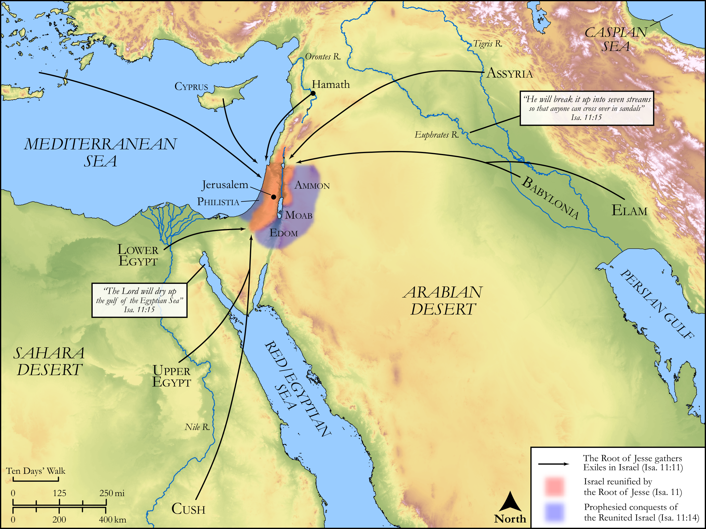

# Biblica Open Bible Maps

## License Information

Biblica Open Bible Maps, © 2023–2025 Biblica, Inc. This work is licensed under Creative Commons Attribution-ShareAlike 4.0 International (<a href="https://creativecommons.org/licenses/by-sa/4.0/">https://creativecommons.org/licenses/by-sa/4.0/</a>). More Information: <a href="https://docs.google.com/document/d/1Pp44yZ0Zdnd59vJHTrt2rPYq0SppfX5rZbPBt6mz37U/edit?tab=t.0#heading=h.oev9aj1ksvk2">https://docs.google.com/document/d/1Pp44yZ0Zdnd59vJHTrt2rPYq0SppfX5rZbPBt6mz37U/edit?tab=t.0#heading=h.oev9aj1ksvk2</a>

--------------------------------

## Wisdom & Prophets: A Shoot from the Stump of Jesse (id: OT178)

### Image Content

[link](images/OT178.png)

Original: [Wisdom \& Prophets: A Shoot from the Stump of Jesse](https://drive.google.com/file/d/1d3MbAxKHXqsV6wgmewzjIQxdTVMgxe6v/view?usp=drive_link)

* **Associated Passages:** Isaiah 11:1-12:6

* **Associated ACAI Concepts:** LORD (ID: `deity:Lord`); Israel (ID: `person:Israel`); Jesse (ID: `person:Jesse`); Egypt (ID: `place:Egypt`); Judah (ID: `person:Judah.4`); Tribe of Judah (ID: `group:Judah`); Salvation (ID: `keyterm:Salvation`); Assyria (ID: `place:Assyria`); Fear (ID: `keyterm:Fear`); Cattle (ID: `fauna:Bull`); Standard (ID: `realia:Standard`); Lion (ID: `fauna:Lion`); Elam (ID: `place:Elam`); Fairness (ID: `keyterm:Fairness`); Sea of Egypt (ID: `place:EgyptSea`); Cush (ID: `place:Cush.2`); Jerusalem (ID: `place:Jerusalem`); Be Zealous (ID: `keyterm:Zealous`); Hamath (ID: `place:Hamath`); Passion (ID: `keyterm:Ardour`); Euphrates River (ID: `place:Euphrates`); Intention (ID: `keyterm:Intention`); Edom (ID: `place:Edom`); Ephraim (ID: `person:Ephraim`); Tribe of Ephraim (ID: `group:Ephraim`); Gentiles (ID: `group:Gentile`); Trust (ID: `keyterm:LeanOn`); Philistines (ID: `group:Philistine`); Understanding (ID: `keyterm:Understanding`); Ammonites (ID: `group:Ammon`); Poor (ID: `keyterm:Poor`); Counsel (ID: `keyterm:Counsel`); Ammon (ID: `place:Ammon`); Glory (ID: `keyterm:Glory`); Philistia (ID: `place:Philistine`); Shinar (ID: `place:Shinar`); Holy (ID: `keyterm:Holy`); Moab (ID: `place:Moab`); Pathros (ID: `place:Pathros`); Ability (ID: `keyterm:Ability`); Cobra (ID: `fauna:Cobra`); Leopard (ID: `fauna:Leopard`); Wolf (ID: `fauna:Wolf`); Molten Image (ID: `realia:MoltenImage`); Sheep (ID: `fauna:Lamb`); Viper (ID: `fauna:Viper`); Bear (ID: `fauna:Bear`); Kid (ID: `fauna:Kid`); Goat (ID: `fauna:Goat`); Belt (ID: `realia:Belt`)
