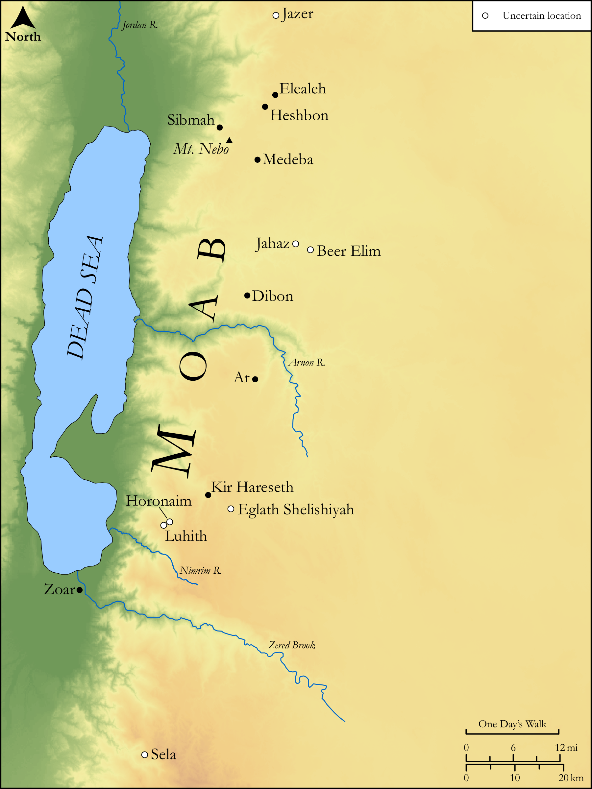

# Biblica Open Bible Maps

## License Information

Biblica Open Bible Maps, © 2023–2025 Biblica, Inc. This work is licensed under Creative Commons Attribution-ShareAlike 4.0 International (<a href="https://creativecommons.org/licenses/by-sa/4.0/">https://creativecommons.org/licenses/by-sa/4.0/</a>). More Information: <a href="https://docs.google.com/document/d/1Pp44yZ0Zdnd59vJHTrt2rPYq0SppfX5rZbPBt6mz37U/edit?tab=t.0#heading=h.oev9aj1ksvk2">https://docs.google.com/document/d/1Pp44yZ0Zdnd59vJHTrt2rPYq0SppfX5rZbPBt6mz37U/edit?tab=t.0#heading=h.oev9aj1ksvk2</a>

--------------------------------

## Wisdom & Prophets: Prophecy Against Moab (id: OT179)

### Image Content

[link](images/OT179.png)

Original: [Wisdom \& Prophets: Prophecy Against Moab](https://drive.google.com/file/d/1BCYR3qc5s-4xoUTH-Jodzv8xpjAK7Eui/view?usp=drive_link)

* **Associated Passages:** Isaiah 15:1-16:14

* **Associated ACAI Concepts:** Moab (ID: `place:Moab`); Vine (ID: `flora:Vine`); Kir (ID: `place:Kir`); Heshbon (ID: `place:Heshbon`); Elealeh (ID: `place:Elealeh`); Sibmah (ID: `place:Sibmah`); LORD (ID: `deity:Lord`); Jazer (ID: `place:Jazer`); Dibon (ID: `place:Dibon`); High Place (ID: `realia:HighPlace`); Stone Pine (ID: `flora:Pine`); Jahaz (ID: `place:Jahaz`); Bajith (ID: `place:Bajith`); Nebo (ID: `place:Nebo`); Horonaim (ID: `place:Horonaim`); Waters of Nimrim (ID: `place:Nimrim`); Dimon (ID: `place:Dibon.3`); Eglaim (ID: `place:Eglaim`); Sela (ID: `place:Sela`); Luhith (ID: `place:Luhith`); Medeba (ID: `place:Medeba`); Brook of the Willows (ID: `place:BrookOfTheWillows`); Zoar (ID: `place:Zoar`); Beer-elim (ID: `place:Beer-elim`); Jerusalem (ID: `place:Jerusalem`); Ar (ID: `place:Ar`); Complete (ID: `keyterm:Complete`); Utterance (ID: `keyterm:Utterance`); Arnon (ID: `place:Arnon`); David (ID: `person:David`); Truth (ID: `keyterm:Truth`); Counsel (ID: `keyterm:Counsel`); Kindness (ID: `keyterm:Kindness`); Glory (ID: `keyterm:Glory`); Sheep (ID: `fauna:Lamb`); Grass (ID: `flora:Grass`); House (ID: `realia:House`); Raisin Cake (ID: `realia:RaisinCake`); Lute (ID: `realia:Lute`); Wine (ID: `realia:Wine`); Poplar (ID: `flora:Poplar`); Winepress (ID: `realia:Winepress`); Sackcloth (ID: `realia:Sackcloth`); Lion (ID: `fauna:Lion`); Willow (ID: `flora:Willow`); Green Vegetation (ID: `flora:GreenVegetation`)
