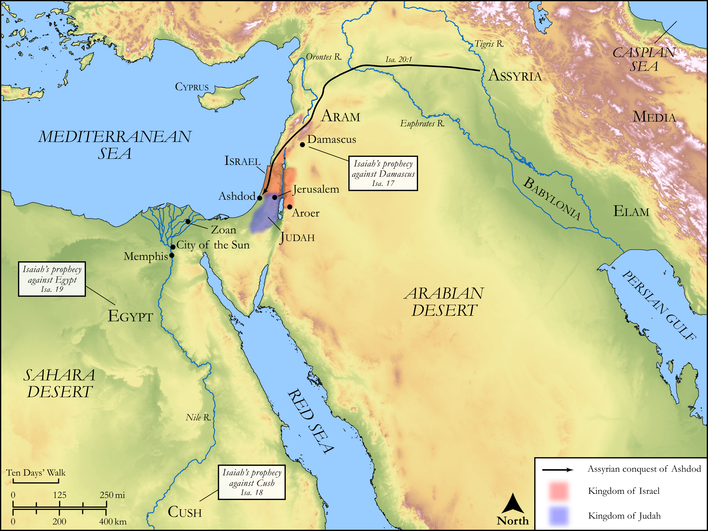

# Biblica Open Bible Maps

## License Information

Biblica Open Bible Maps, © 2023–2025 Biblica, Inc. This work is licensed under Creative Commons Attribution-ShareAlike 4.0 International (<a href="https://creativecommons.org/licenses/by-sa/4.0/">https://creativecommons.org/licenses/by-sa/4.0/</a>). More Information: <a href="https://docs.google.com/document/d/1Pp44yZ0Zdnd59vJHTrt2rPYq0SppfX5rZbPBt6mz37U/edit?tab=t.0#heading=h.oev9aj1ksvk2">https://docs.google.com/document/d/1Pp44yZ0Zdnd59vJHTrt2rPYq0SppfX5rZbPBt6mz37U/edit?tab=t.0#heading=h.oev9aj1ksvk2</a>

--------------------------------

## Wisdom & Prophets: Prophecies Against Damascus, Cush, and Egypt (id: OT180)

### Image Content

[link](images/OT180.png)

Original: [Wisdom \& Prophets: Prophecies Against Damascus, Cush, and Egypt](https://drive.google.com/file/d/1quIB_bje3lnkfz1qq3r7-R5M91RIc07f/view?usp=drive_link)

* **Associated Passages:** Isaiah 17:1-19:25

* **Associated ACAI Concepts:** Egypt (ID: `place:Egypt`); LORD (ID: `deity:Lord`); Israel (ID: `person:Israel`); Assyria (ID: `place:Assyria`); Counsel (ID: `keyterm:Counsel`); Force to Serve (ID: `keyterm:EnticedToServe`); Nile River (ID: `place:Nile`); Damascus (ID: `place:Damascus`); Utterance (ID: `keyterm:Utterance`); Offering (ID: `keyterm:Offering`); Idol (ID: `keyterm:Idol`); Woe (ID: `keyterm:Woe.2`); Zoan (ID: `place:Zoan`); Fear (ID: `keyterm:Fear`); Bless (ID: `keyterm:Bless`); Glory (ID: `keyterm:Glory`); City of Destruction (ID: `place:CityOfDestruction`); Jerusalem (ID: `place:Jerusalem`); Salvation (ID: `keyterm:Salvation`); Pharaoh (ID: `person:Pharaoh.8`); Lot (ID: `keyterm:Lot`); Complete (ID: `keyterm:Complete`); Judah (ID: `person:Judah.4`); Slaughtering (ID: `keyterm:Slaughtering`); Tribe of Judah (ID: `group:Judah`); Asherah (ID: `deity:Asherah`); Ephraim (ID: `person:Ephraim`); Tribe of Ephraim (ID: `group:Ephraim`); Vow (ID: `keyterm:Vow`); Aroer (ID: `place:Aroer`); Palm Branch and Reed (ID: `keyterm:PalmBranchAndReed`); Assyrians (ID: `group:Assyria`); Fool (ID: `keyterm:Fool`); To Cause to Possess (ID: `keyterm:Possess`); Memphis (ID: `place:Memphis`); Necromancer (ID: `keyterm:Spirit`); Holy (ID: `keyterm:Holy`); Swear (ID: `keyterm:Swear`); Cush (ID: `place:Cush.2`); An Angel (ID: `deity:Angel`); Valley of Rephaim (ID: `place:RephaimValley`); Canaan (ID: `place:Canaan`); Image (ID: `realia:Image`); Fortress (ID: `realia:Fortress`); Stone Altar (ID: `realia:StoneAltar`); Temple Altar (ID: `realia:TempleAltar`); Altar (ID: `realia:Altar`); Tabernacle Altar (ID: `realia:TabernacleAltar`); Cattails (ID: `flora:Cattails`); Papyrus (ID: `flora:Papyrus`); Thistle (ID: `flora:Thistle`); Cotton (ID: `flora:Cotton`); Pruning Knife (ID: `realia:PruningKnife`); Harpoon (ID: `realia:Harpoon`); Grain (ID: `flora:Grain`); Rams Horn (ID: `realia:RamsHorn`); Grass (ID: `flora:Grass`); Vulture (ID: `fauna:Vulture`); Reed (ID: `flora:Reed`); Flax (ID: `flora:Flax`); Sacred Pole (ID: `realia:SacredPole`); Date Palm (ID: `flora:DatePalm`); Locust (ID: `fauna:Locust`); Standard (ID: `realia:Standard`); Olive Tree (ID: `flora:OliveTree`); Casting Net (ID: `realia:CastingNet`); Flock (ID: `fauna:Flock`); Goat (ID: `fauna:Goat`); Vine (ID: `flora:Vine`); Barley (ID: `flora:Barley`)
