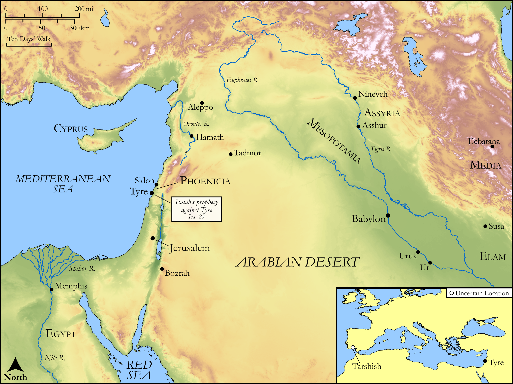

# Biblica Open Bible Maps

## License Information

Biblica Open Bible Maps, © 2023–2025 Biblica, Inc. This work is licensed under Creative Commons Attribution-ShareAlike 4.0 International (<a href="https://creativecommons.org/licenses/by-sa/4.0/">https://creativecommons.org/licenses/by-sa/4.0/</a>). More Information: <a href="https://docs.google.com/document/d/1Pp44yZ0Zdnd59vJHTrt2rPYq0SppfX5rZbPBt6mz37U/edit?tab=t.0#heading=h.oev9aj1ksvk2">https://docs.google.com/document/d/1Pp44yZ0Zdnd59vJHTrt2rPYq0SppfX5rZbPBt6mz37U/edit?tab=t.0#heading=h.oev9aj1ksvk2</a>

--------------------------------

## Wisdom & Prophets: Prophecy Against Tyre (id: OT182)

### Image Content

[link](images/OT182.png)

Original: [Wisdom \& Prophets: Prophecy Against Tyre](https://drive.google.com/file/d/1SMHdk7QaTiZp0kWn-stqKGRm2Qec-yja/view?usp=drive_link)

* **Associated Passages:** Isaiah 23:1-18

* **Associated ACAI Concepts:** Tyre (ID: `place:Tyre`); Tarshish (ID: `place:Tarshish`); LORD (ID: `deity:Lord`); Sidon (ID: `place:Sidon`); Fortress (ID: `realia:Fortress`); Cyprus (ID: `place:Cyprus`); Bring Honor and Glory on Oneself (ID: `keyterm:BringHonorAndGloryOnOneself`); Nile River (ID: `place:Nile`); Ship (ID: `realia:Ship`); Egypt (ID: `place:Egypt`); Chaldea (ID: `place:Chaldea`); Brook of Egypt (ID: `place:BrookOfEgypt`); Utterance (ID: `keyterm:Utterance`); Assyria (ID: `place:Assyria`); Appoint (ID: `keyterm:Appoint`); Chaldeans (ID: `group:Chaldea`); Play the Prostitute (ID: `keyterm:PlayTheProstitute`); To Dishonor (ID: `keyterm:Dishonor`); Canaan (ID: `place:Canaan`); Siege Tower (ID: `realia:SiegeTower`); House (ID: `realia:House`); Coriander (ID: `flora:Coriander`); Lute (ID: `realia:Lute`); Hyena (ID: `fauna:Hyena`); Barley (ID: `flora:Barley`)
