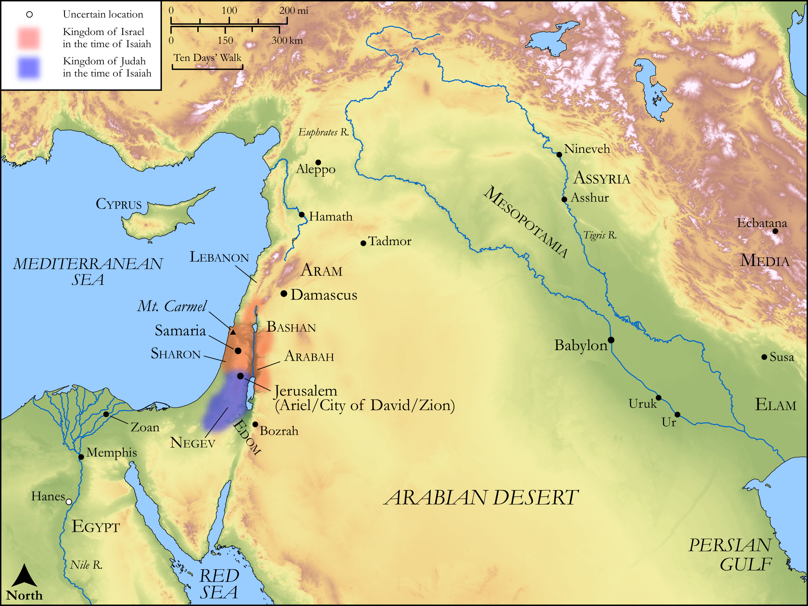

# Biblica Open Bible Maps

## License Information

Biblica Open Bible Maps, © 2023–2025 Biblica, Inc. This work is licensed under Creative Commons Attribution-ShareAlike 4.0 International (<a href="https://creativecommons.org/licenses/by-sa/4.0/">https://creativecommons.org/licenses/by-sa/4.0/</a>). More Information: <a href="https://docs.google.com/document/d/1Pp44yZ0Zdnd59vJHTrt2rPYq0SppfX5rZbPBt6mz37U/edit?tab=t.0#heading=h.oev9aj1ksvk2">https://docs.google.com/document/d/1Pp44yZ0Zdnd59vJHTrt2rPYq0SppfX5rZbPBt6mz37U/edit?tab=t.0#heading=h.oev9aj1ksvk2</a>

--------------------------------

## Wisdom & Prophets: God’s Coming Judgement (id: OT183)

### Image Content

[link](images/OT183.png)

Original: [Wisdom \& Prophets: God’s Coming Judgement](https://drive.google.com/file/d/16aErckFCEnrLsnfcGs6PgsWlrxBUUits/view?usp=drive_link)

* **Associated Passages:** Isaiah 28:1-35:10

* **Associated ACAI Concepts:** LORD (ID: `deity:Lord`); Jerusalem (ID: `place:Jerusalem`); Israel (ID: `person:Israel`); Holy (ID: `keyterm:Holy`); Woe (ID: `keyterm:Woe.2`); Perceive (ID: `keyterm:Perceive`); Trust (ID: `keyterm:LeanOn`); Egypt (ID: `place:Egypt`); Scroll (ID: `realia:Scroll`); Vine (ID: `flora:Vine`); To Be Kindly Disposed (ID: `keyterm:KindlyDisposed`); Safety (ID: `keyterm:Safety`); Covenant (ID: `keyterm:Covenant`); Counsel (ID: `keyterm:Counsel`); Redeem (ID: `keyterm:Redeem`); Fear (ID: `keyterm:Fear`); Peace (ID: `keyterm:IntactState`); Lebanon (ID: `place:Lebanon`); Mischief (ID: `keyterm:Mischief`); Understanding (ID: `keyterm:Understanding`); Sharon Plain (ID: `place:Sharon.2`); Work (ID: `keyterm:Work`); Pharaoh (ID: `person:Pharaoh.8`); Defilement (ID: `keyterm:Defilement`); Dispossess (ID: `keyterm:Dispossess`); Assyria (ID: `place:Assyria`); Word of the Lord (ID: `keyterm:WordOfTheLord`); To Sin (ID: `keyterm:Sin`); An Angel (ID: `deity:Angel`); Refuge (ID: `keyterm:Refuge`)
