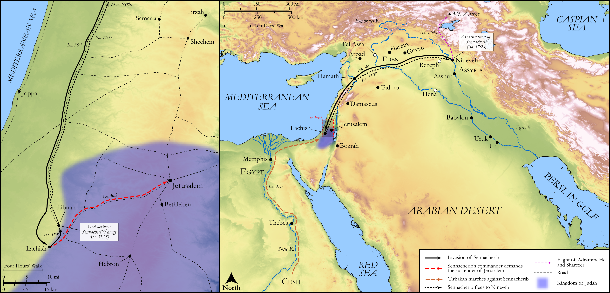

# Biblica Open Bible Maps

## License Information

Biblica Open Bible Maps, © 2023–2025 Biblica, Inc. This work is licensed under Creative Commons Attribution-ShareAlike 4.0 International (<a href="https://creativecommons.org/licenses/by-sa/4.0/">https://creativecommons.org/licenses/by-sa/4.0/</a>). More Information: <a href="https://docs.google.com/document/d/1Pp44yZ0Zdnd59vJHTrt2rPYq0SppfX5rZbPBt6mz37U/edit?tab=t.0#heading=h.oev9aj1ksvk2">https://docs.google.com/document/d/1Pp44yZ0Zdnd59vJHTrt2rPYq0SppfX5rZbPBt6mz37U/edit?tab=t.0#heading=h.oev9aj1ksvk2</a>

--------------------------------

## Wisdom & Prophets: The Defeat of Sennacherib (id: OT184)

### Image Content

[link](images/OT184.png)

Original: [Wisdom \& Prophets: The Defeat of Sennacherib](https://drive.google.com/file/d/1ACwNP9aeZ7OdeFC0IsVQcJCddYzHu0nu/view?usp=drive_link)

* **Associated Passages:** Isaiah 36:1-37:38

* **Associated ACAI Concepts:** LORD (ID: `deity:Lord`); Assyria (ID: `place:Assyria`); Hezekiah (ID: `person:Hezekiah`); Rabshakeh (ID: `person:Rabshakeh`); Trust (ID: `keyterm:LeanOn`); Jerusalem (ID: `place:Jerusalem`); Sennacherib (ID: `person:Sennacherib`); Shebna (ID: `person:Shebna`); Tribe of Judah (ID: `group:Judah`); Judah (ID: `person:Judah.4`); Isaiah (ID: `person:Isaiah`); Eliakim (ID: `person:Eliakim.3`); Joah (ID: `person:Joah`); An Angel (ID: `deity:Angel`); Israel (ID: `person:Israel`); Egypt (ID: `place:Egypt`); Asaph (ID: `person:Asaph`); Sepharvaim (ID: `place:Sepharvaim`); Arpad (ID: `place:Arpad`); Hamath (ID: `place:Hamath`); Amoz (ID: `person:Amoz`); Lachish (ID: `place:Lachish`); Hilkiah (ID: `person:Hilkiah`); House (ID: `realia:House`); Vine (ID: `flora:Vine`); Ivvah (ID: `place:Ivvah`); Sharezer (ID: `person:Sharezer`); Tirhakah (ID: `person:Tirhakah`); Telassar (ID: `place:Telassar`); Esarhaddon (ID: `person:Esarhaddon`)
