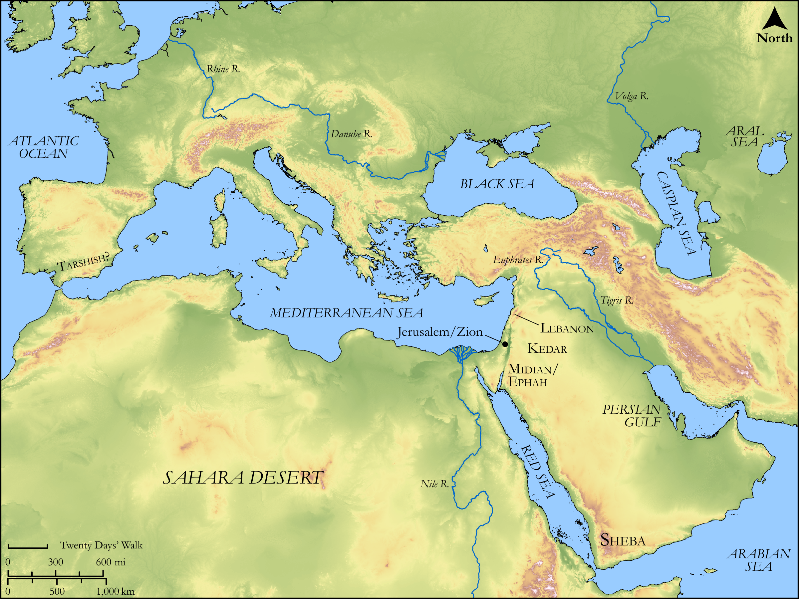

# Biblica Open Bible Maps

## License Information

Biblica Open Bible Maps, © 2023–2025 Biblica, Inc. This work is licensed under Creative Commons Attribution-ShareAlike 4.0 International (<a href="https://creativecommons.org/licenses/by-sa/4.0/">https://creativecommons.org/licenses/by-sa/4.0/</a>). More Information: <a href="https://docs.google.com/document/d/1Pp44yZ0Zdnd59vJHTrt2rPYq0SppfX5rZbPBt6mz37U/edit?tab=t.0#heading=h.oev9aj1ksvk2">https://docs.google.com/document/d/1Pp44yZ0Zdnd59vJHTrt2rPYq0SppfX5rZbPBt6mz37U/edit?tab=t.0#heading=h.oev9aj1ksvk2</a>

--------------------------------

## Wisdom & Prophets: The Glory of Zion (id: OT185)

### Image Content

[link](images/OT185.png)

Original: [Wisdom \& Prophets: The Glory of Zion](https://drive.google.com/file/d/1oWZF0kSMVTMqb6ptKRUrxSF_wM6yR4bH/view?usp=drive_link)

* **Associated Passages:** Isaiah 40:1-44:28

* **Associated ACAI Concepts:** LORD (ID: `deity:Lord`); Israel (ID: `person:Israel`); Fear (ID: `keyterm:Fear`); Holy (ID: `keyterm:Holy`); Strength (ID: `keyterm:Strength`); To Sin (ID: `keyterm:Sin`); Perceive (ID: `keyterm:Perceive`); Jerusalem (ID: `place:Jerusalem`); Graven Image (ID: `realia:GravenImage`); Glory (ID: `keyterm:Glory`); Craftsman (ID: `realia:Craftsman`); Grass (ID: `flora:Grass`); Redeem (ID: `keyterm:Redeem`); Understanding (ID: `keyterm:Understanding`); Bring Honor and Glory on Oneself (ID: `keyterm:BringHonorAndGloryOnOneself`); Rebel (ID: `keyterm:Rebel`); Intention (ID: `keyterm:Intention`); Offering (ID: `keyterm:Offering`); Passion (ID: `keyterm:Ardour`); Instruction (ID: `keyterm:Instruction`); A Disembodied Voice (ID: `deity:Voice`); Have Insight (ID: `keyterm:HaveInsight`); Gentiles (ID: `group:Gentile`); Counsel (ID: `keyterm:Counsel`); Forgive (ID: `keyterm:Forgive`); The Way (ID: `keyterm:TheWay`); An Angel (ID: `deity:Angel`); Slaughtering (ID: `keyterm:Slaughtering`); Tribe of Judah (ID: `group:Judah`); Force to Serve (ID: `keyterm:EnticedToServe`)
