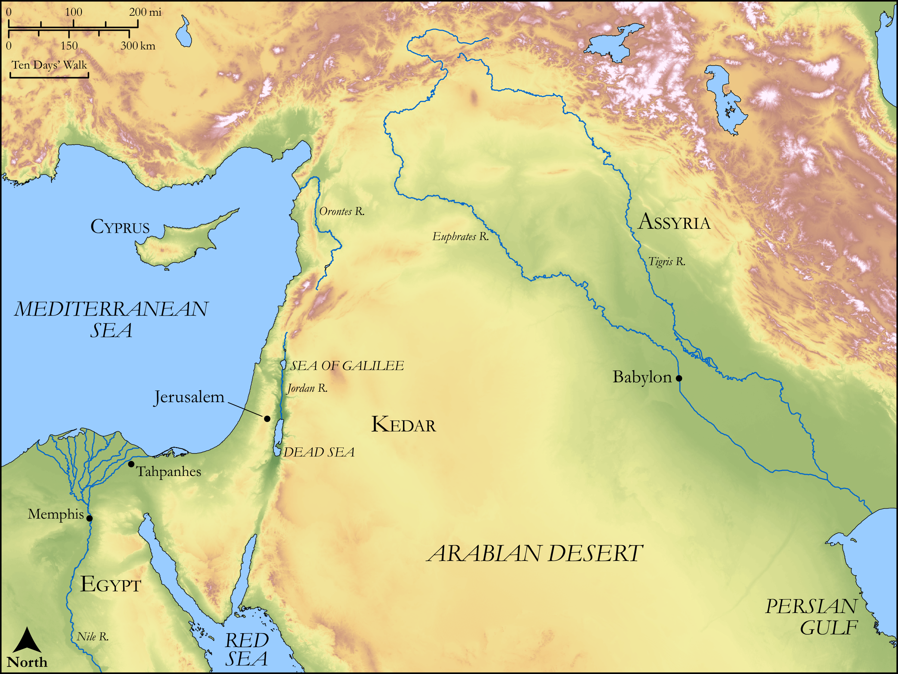

# Biblica Open Bible Maps

## License Information

Biblica Open Bible Maps, © 2023–2025 Biblica, Inc. This work is licensed under Creative Commons Attribution-ShareAlike 4.0 International (<a href="https://creativecommons.org/licenses/by-sa/4.0/">https://creativecommons.org/licenses/by-sa/4.0/</a>). More Information: <a href="https://docs.google.com/document/d/1Pp44yZ0Zdnd59vJHTrt2rPYq0SppfX5rZbPBt6mz37U/edit?tab=t.0#heading=h.oev9aj1ksvk2">https://docs.google.com/document/d/1Pp44yZ0Zdnd59vJHTrt2rPYq0SppfX5rZbPBt6mz37U/edit?tab=t.0#heading=h.oev9aj1ksvk2</a>

--------------------------------

## Wisdom & Prophets: Israel’s Evils (id: OT187)

### Image Content

[link](images/OT187.png)

Original: [Wisdom \& Prophets: Israel’s Evils](https://drive.google.com/file/d/1hWdss48aiiVFc0QD2JiqZM2RtEQtYi2O/view?usp=drive_link)

* **Associated Passages:** Jeremiah 2:1-37

* **Associated ACAI Concepts:** LORD (ID: `deity:Lord`); Israel (ID: `person:Israel`); Egypt (ID: `place:Egypt`); Love (ID: `keyterm:Love`); Word of the Lord (ID: `keyterm:WordOfTheLord`); Defilement (ID: `keyterm:Defilement`); Assyria (ID: `place:Assyria`); Rebel (ID: `keyterm:Rebel`); Baal (ID: `deity:Baal`); Lion (ID: `fauna:Lion`); Jerusalem (ID: `place:Jerusalem`); Tahpanhes (ID: `place:Tahpanhes`); Safety (ID: `keyterm:Safety`); Passion (ID: `keyterm:Ardour`); Be Blameless (ID: `keyterm:Blameless`); Euphrates River (ID: `place:Euphrates`); Judah (ID: `person:Judah.4`); Tribe of Judah (ID: `group:Judah`); Instruction (ID: `keyterm:Instruction`); Truth (ID: `keyterm:Truth`); Perceive (ID: `keyterm:Perceive`); To Cause to Possess (ID: `keyterm:Possess`); To Sin (ID: `keyterm:Sin`); Memphis (ID: `place:Memphis`); Kindness (ID: `keyterm:Kindness`); Speak as a Prophet (ID: `keyterm:Speak`); Glory (ID: `keyterm:Glory`); Exempt (ID: `keyterm:Exempt`); Kedar (ID: `person:Kedar`); Cyprus (ID: `place:Cyprus`); Nile River (ID: `place:Nile`); Defection (ID: `keyterm:Defection`); Wild Donkey (ID: `fauna:WildDonkey`); Soap (ID: `realia:Soap`); Sorghum (ID: `flora:Sorghum`); Hammada (ID: `flora:Soap`); Wheat (ID: `flora:Wheat`); Sheep (ID: `fauna:Lamb`); Image (ID: `realia:Image`); Coriander (ID: `flora:Coriander`); Yoke (ID: `realia:Yoke`); Pit (ID: `realia:Pit`); Camel (ID: `fauna:Camel`); Flock (ID: `fauna:Flock`); Stone Pine (ID: `flora:Pine`); Goat (ID: `fauna:Goat`); Vine (ID: `flora:Vine`); Barley (ID: `flora:Barley`)
