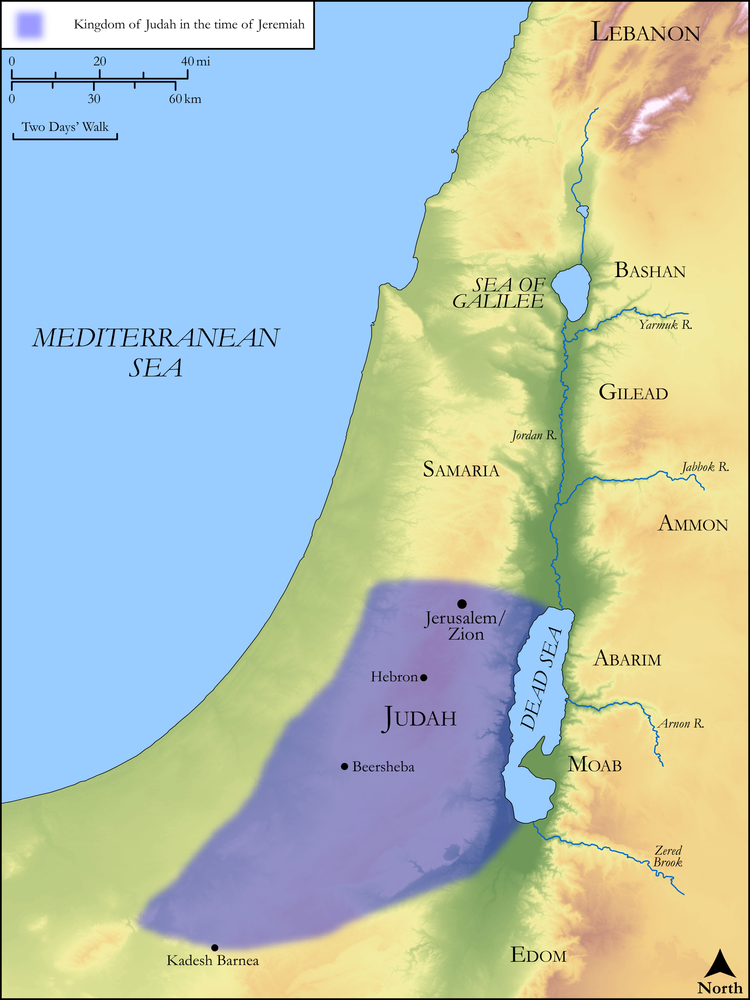

# Biblica Open Bible Maps

## License Information

Biblica Open Bible Maps, © 2023–2025 Biblica, Inc. This work is licensed under Creative Commons Attribution-ShareAlike 4.0 International (<a href="https://creativecommons.org/licenses/by-sa/4.0/">https://creativecommons.org/licenses/by-sa/4.0/</a>). More Information: <a href="https://docs.google.com/document/d/1Pp44yZ0Zdnd59vJHTrt2rPYq0SppfX5rZbPBt6mz37U/edit?tab=t.0#heading=h.oev9aj1ksvk2">https://docs.google.com/document/d/1Pp44yZ0Zdnd59vJHTrt2rPYq0SppfX5rZbPBt6mz37U/edit?tab=t.0#heading=h.oev9aj1ksvk2</a>

--------------------------------

## Wisdom & Prophets: Prophecy Against the Kings of Judah (id: OT189)

### Image Content

[link](images/OT189.png)

Original: [Wisdom \& Prophets: Prophecy Against the Kings of Judah](https://drive.google.com/file/d/1VLwaK41elBDc6HuBfKCZMtmwOfGkywK1/view?usp=drive_link)

* **Associated Passages:** Jeremiah 22:1-30

* **Associated ACAI Concepts:** LORD (ID: `deity:Lord`); Judah (ID: `person:Judah.4`); Tribe of Judah (ID: `group:Judah`); House (ID: `realia:House`); Cedar (ID: `flora:Cedar`); Jehoiachin (ID: `person:Jehoiachin`); Lebanon (ID: `place:Lebanon`); David (ID: `person:David`); Jehoiakim (ID: `person:Jehoiakim`); Love (ID: `keyterm:Love`); Word of the Lord (ID: `keyterm:WordOfTheLord`); Force to Serve (ID: `keyterm:EnticedToServe`); Josiah (ID: `person:Josiah`); Exempt (ID: `keyterm:Exempt`); Alas! (ID: `keyterm:Alas`); Jerusalem (ID: `place:Jerusalem`); Gilead (ID: `place:Gilead`); Bashan (ID: `place:Bashan`); Chaldea (ID: `place:Chaldea`); Babylon (ID: `place:Babylon`); Nebuchadnezzar (ID: `person:Nebuchadnezzar`); Mount Nebo (ID: `place:NeboMount`); Intention (ID: `keyterm:Intention`); Majesty (ID: `keyterm:Majesty`); Woe (ID: `keyterm:Woe.2`); Covenant (ID: `keyterm:Covenant`); To Be Kindly Disposed (ID: `keyterm:KindlyDisposed`); Smear (ID: `keyterm:Smear`); Chaldeans (ID: `group:Chaldea`); Holy (ID: `keyterm:Holy`); Swear (ID: `keyterm:Swear`); Sheep (ID: `fauna:Lamb`); Window (ID: `realia:Window`); Donkey (ID: `fauna:Donkey`); Chariot (ID: `realia:Chariot`); Horse (ID: `fauna:Horse`); Flock (ID: `fauna:Flock`); Goat (ID: `fauna:Goat`)
