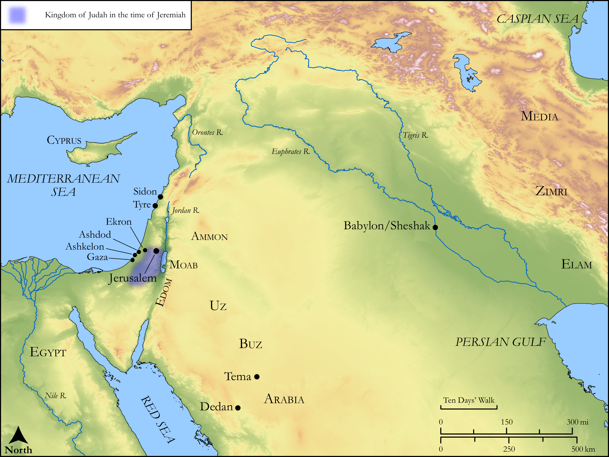

# Biblica Open Bible Maps

## License Information

Biblica Open Bible Maps, © 2023–2025 Biblica, Inc. This work is licensed under Creative Commons Attribution-ShareAlike 4.0 International (<a href="https://creativecommons.org/licenses/by-sa/4.0/">https://creativecommons.org/licenses/by-sa/4.0/</a>). More Information: <a href="https://docs.google.com/document/d/1Pp44yZ0Zdnd59vJHTrt2rPYq0SppfX5rZbPBt6mz37U/edit?tab=t.0#heading=h.oev9aj1ksvk2">https://docs.google.com/document/d/1Pp44yZ0Zdnd59vJHTrt2rPYq0SppfX5rZbPBt6mz37U/edit?tab=t.0#heading=h.oev9aj1ksvk2</a>

--------------------------------

## Wisdom & Prophets: The Cup of God’s Wrath (id: OT190)

### Image Content

[link](images/OT190.png)

Original: [Wisdom \& Prophets: The Cup of God’s Wrath](https://drive.google.com/file/d/10GP1aIMMO_JSlqQAVN1sqa-sPjrO4Elk/view?usp=drive_link)

* **Associated Passages:** Jeremiah 25:1-38

* **Associated ACAI Concepts:** LORD (ID: `deity:Lord`); Babylon (ID: `place:Babylon`); Judah (ID: `person:Judah.4`); Tribe of Judah (ID: `group:Judah`); Force to Serve (ID: `keyterm:EnticedToServe`); Jeremiah (ID: `person:Jeremiah.6`); Sheep (ID: `fauna:Lamb`); Flock (ID: `fauna:Flock`); Goat (ID: `fauna:Goat`); Jerusalem (ID: `place:Jerusalem`); Nebuchadnezzar (ID: `person:Nebuchadnezzar`); Israel (ID: `person:Israel`); Speak as a Prophet (ID: `keyterm:Speak`); Josiah (ID: `person:Josiah`); Tema (ID: `place:Tema`); Buz (ID: `place:Buz`); Uz (ID: `place:Uz`); Zimri (ID: `place:Zimri`); Pharaoh (ID: `person:Pharaoh.10`); Gaza (ID: `place:Gaza`); Egypt (ID: `place:Egypt`); Chaldea (ID: `place:Chaldea`); Ekron (ID: `place:Ekron`); Passion (ID: `keyterm:Ardour`); Ashkelon (ID: `place:Ashkelon`); Be Blameless (ID: `keyterm:Blameless`); Peace (ID: `keyterm:IntactState`); Tyre (ID: `place:Tyre`); Sidon (ID: `place:Sidon`); Arabia (ID: `place:Arabia`); Elam (ID: `place:Elam`); Edom (ID: `place:Edom`); Ashdod (ID: `place:Ashdod`); Amon (ID: `person:Amon.3`); Dedan (ID: `place:Dedan`); Jehoiakim (ID: `person:Jehoiakim`); Media (ID: `place:Media`); Philistines (ID: `group:Philistine`); Word of the Lord (ID: `keyterm:WordOfTheLord`); Ammon (ID: `place:Ammon`); Philistia (ID: `place:Philistine`); Appoint (ID: `keyterm:Appoint`); Chaldeans (ID: `group:Chaldea`); Moab (ID: `place:Moab`); Grass (ID: `flora:Grass`); Lamp (ID: `realia:Lamp`); Wine (ID: `realia:Wine`); Scroll (ID: `realia:Scroll`); Lion (ID: `fauna:Lion`); Vine (ID: `flora:Vine`); Hand-Mill (ID: `realia:Hand-mill`)
