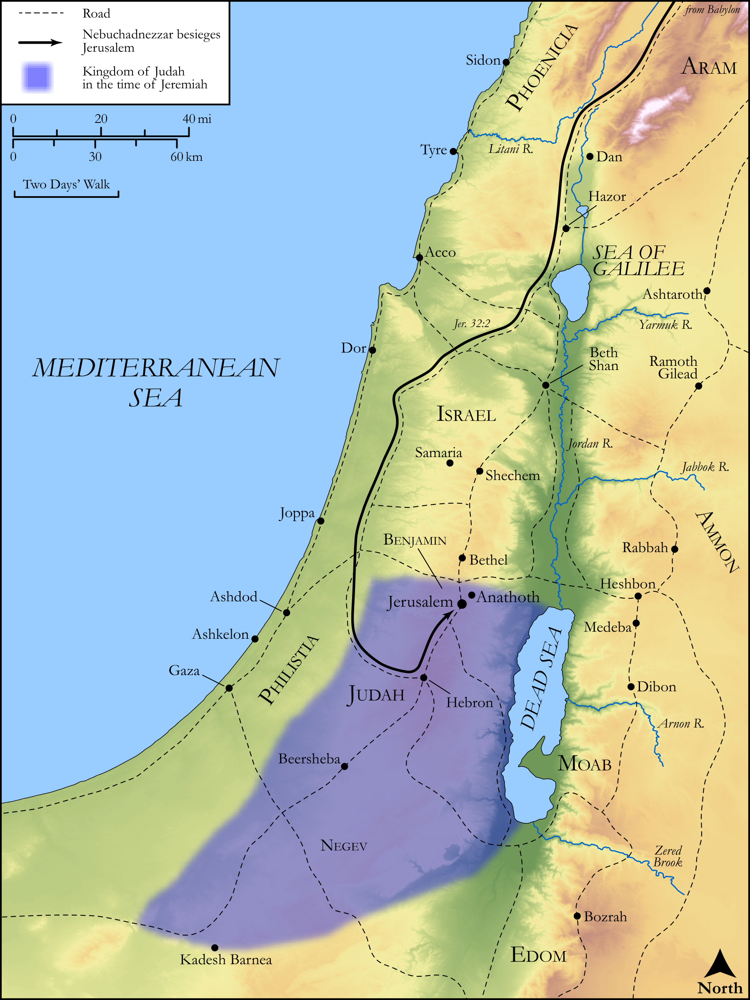

# Biblica Open Bible Maps

## License Information

Biblica Open Bible Maps, © 2023–2025 Biblica, Inc. This work is licensed under Creative Commons Attribution-ShareAlike 4.0 International (<a href="https://creativecommons.org/licenses/by-sa/4.0/">https://creativecommons.org/licenses/by-sa/4.0/</a>). More Information: <a href="https://docs.google.com/document/d/1Pp44yZ0Zdnd59vJHTrt2rPYq0SppfX5rZbPBt6mz37U/edit?tab=t.0#heading=h.oev9aj1ksvk2">https://docs.google.com/document/d/1Pp44yZ0Zdnd59vJHTrt2rPYq0SppfX5rZbPBt6mz37U/edit?tab=t.0#heading=h.oev9aj1ksvk2</a>

--------------------------------

## Wisdom & Prophets: Israel Restored from Desolation (id: OT193)

### Image Content

[link](images/OT193.png)

Original: [Wisdom \& Prophets: Israel Restored from Desolation](https://drive.google.com/file/d/1Ij0AGwbduYheVAL2Y6bXDU5p2HV4WmOW/view?usp=drive_link)

* **Associated Passages:** Jeremiah 32:1-33:26

* **Associated ACAI Concepts:** LORD (ID: `deity:Lord`); Judah (ID: `person:Judah.4`); Tribe of Judah (ID: `group:Judah`); Israel (ID: `person:Israel`); Chaldea (ID: `place:Chaldea`); Chaldeans (ID: `group:Chaldea`); Jeremiah (ID: `person:Jeremiah.6`); Jerusalem (ID: `place:Jerusalem`); Babylon (ID: `place:Babylon`); Word of the Lord (ID: `keyterm:WordOfTheLord`); David (ID: `person:David`); Hanamel (ID: `person:Hanamel`); Scroll (ID: `realia:Scroll`); Zedekiah (ID: `person:Zedekiah.3`); House (ID: `realia:House`); Covenant (ID: `keyterm:Covenant`); Baruch (ID: `person:Baruch.4`); Tribe of Levi (ID: `group:Levi`); Anathoth (ID: `place:Anathoth`); Benjamin (ID: `person:Benjamin`); Tribe of Benjamin (ID: `group:Benjamin`); Levi (ID: `person:Levi.3`); Fear (ID: `keyterm:Fear`); Money (ID: `realia:Money`); Miraculous Sign (ID: `keyterm:MiraculousSign`); Neriah (ID: `person:Neriah`); Safety (ID: `keyterm:Safety`); Egypt (ID: `place:Egypt`); Nebuchadnezzar (ID: `person:Nebuchadnezzar`); Passion (ID: `keyterm:Ardour`)
