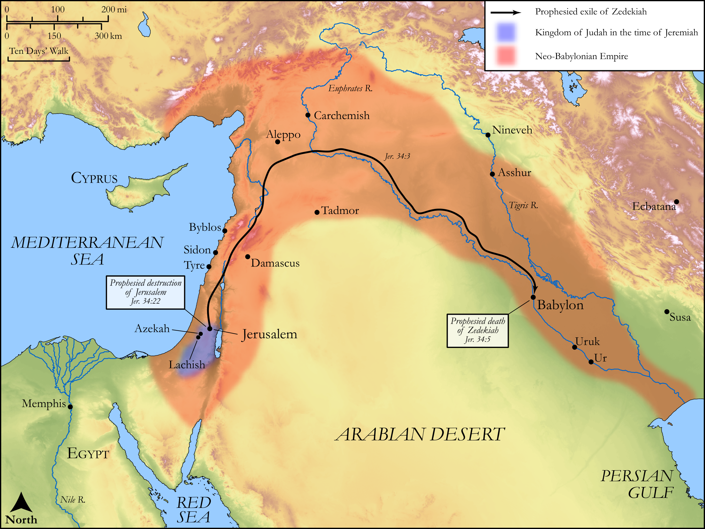

# Biblica Open Bible Maps

## License Information

Biblica Open Bible Maps, © 2023–2025 Biblica, Inc. This work is licensed under Creative Commons Attribution-ShareAlike 4.0 International (<a href="https://creativecommons.org/licenses/by-sa/4.0/">https://creativecommons.org/licenses/by-sa/4.0/</a>). More Information: <a href="https://docs.google.com/document/d/1Pp44yZ0Zdnd59vJHTrt2rPYq0SppfX5rZbPBt6mz37U/edit?tab=t.0#heading=h.oev9aj1ksvk2">https://docs.google.com/document/d/1Pp44yZ0Zdnd59vJHTrt2rPYq0SppfX5rZbPBt6mz37U/edit?tab=t.0#heading=h.oev9aj1ksvk2</a>

--------------------------------

## Wisdom & Prophets: Prophecy to Zedekiah (id: OT194)

### Image Content

[link](images/OT194.png)

Original: [Wisdom \& Prophets: Prophecy to Zedekiah](https://drive.google.com/file/d/1lp6BJcqDVQ0G8AxXJ5ty_EbGoPnI7lDQ/view?usp=drive_link)

* **Associated Passages:** Jeremiah 34:1-22

* **Associated ACAI Concepts:** LORD (ID: `deity:Lord`); Judah (ID: `person:Judah.4`); Tribe of Judah (ID: `group:Judah`); Jerusalem (ID: `place:Jerusalem`); Babylon (ID: `place:Babylon`); Zedekiah (ID: `person:Zedekiah.3`); Covenant (ID: `keyterm:Covenant`); Jeremiah (ID: `person:Jeremiah.6`); Force to Serve (ID: `keyterm:EnticedToServe`); Israel (ID: `person:Israel`); Hebrews (ID: `group:Hebrews`); Word of the Lord (ID: `keyterm:WordOfTheLord`); Molten Image (ID: `realia:MoltenImage`); Cattle (ID: `fauna:Bull`); Alas! (ID: `keyterm:Alas`); Lachish (ID: `place:Lachish`); Jews (ID: `group:Jews`); Azekah (ID: `place:Azekah`); Egypt (ID: `place:Egypt`); Nebuchadnezzar (ID: `person:Nebuchadnezzar`); Peace (ID: `keyterm:IntactState`); To Dishonor (ID: `keyterm:Dishonor`); House (ID: `realia:House`)
