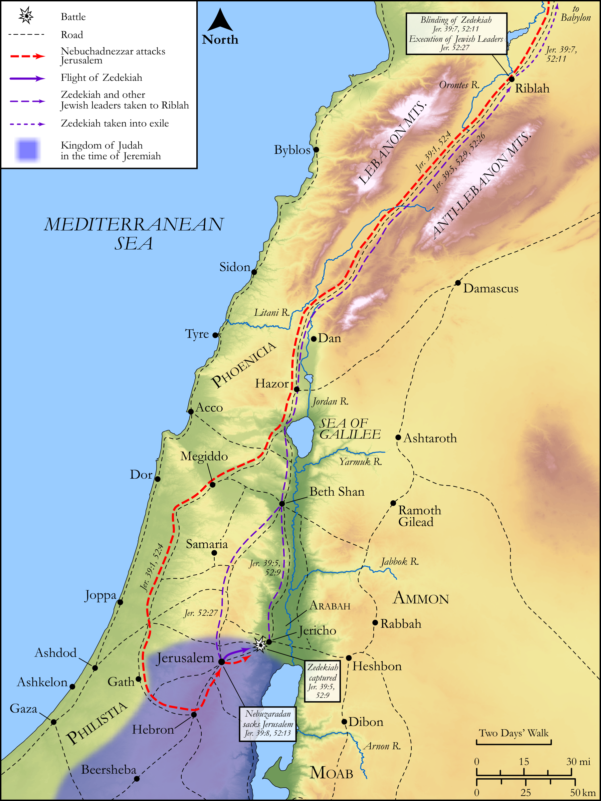

# Biblica Open Bible Maps

## License Information

Biblica Open Bible Maps, © 2023–2025 Biblica, Inc. This work is licensed under Creative Commons Attribution-ShareAlike 4.0 International (<a href="https://creativecommons.org/licenses/by-sa/4.0/">https://creativecommons.org/licenses/by-sa/4.0/</a>). More Information: <a href="https://docs.google.com/document/d/1Pp44yZ0Zdnd59vJHTrt2rPYq0SppfX5rZbPBt6mz37U/edit?tab=t.0#heading=h.oev9aj1ksvk2">https://docs.google.com/document/d/1Pp44yZ0Zdnd59vJHTrt2rPYq0SppfX5rZbPBt6mz37U/edit?tab=t.0#heading=h.oev9aj1ksvk2</a>

--------------------------------

## Wisdom & Prophets: The Fall of Jerusalem and Zedekiah's Capture (id: OT195)

### Image Content

[link](images/OT195.png)

Original: [Wisdom \& Prophets: The Fall of Jerusalem and Zedekiah's Capture](https://drive.google.com/file/d/1bKQ9JQKzdp-cFq5Lyr2i9htdmF1sqq50/view?usp=drive_link)

* **Associated Passages:** Jeremiah 39:1-18

* **Associated ACAI Concepts:** Babylon (ID: `place:Babylon`); Zedekiah (ID: `person:Zedekiah.3`); Nebuzaradan (ID: `person:Nebuzaradan`); LORD (ID: `deity:Lord`); Judah (ID: `person:Judah.4`); Tribe of Judah (ID: `group:Judah`); Nebuchadnezzar (ID: `person:Nebuchadnezzar`); Jeremiah (ID: `person:Jeremiah.6`); Rab-saris (ID: `person:Rab-saris.2`); Nergal-shar-ezer (ID: `person:Nergal-shar-ezer.2`); Rab-mag (ID: `person:Rab-mag`); Jerusalem (ID: `place:Jerusalem`); Chaldea (ID: `place:Chaldea`); Riblah (ID: `place:Riblah.2`); Chaldeans (ID: `group:Chaldea`); Nergal-shar-ezer (ID: `person:Nergal-shar-ezer`); Samgar (ID: `person:Samgar`); Nebu-sar-sekim (ID: `person:Nebu-sar-sekim`); Nebushazban (ID: `person:Nebushazban`); Ebed-melech (ID: `person:Ebed-melech`); Ahikam (ID: `person:Ahikam`); Hamath (ID: `place:Hamath`); Israel (ID: `person:Israel`); Shaphan (ID: `person:Shaphan`); Ethiopians (ID: `group:Ethiopia`); Gedaliah (ID: `person:Gedaliah.2`); Jericho (ID: `place:Jericho`); Trust (ID: `keyterm:LeanOn`); Word of the Lord (ID: `keyterm:WordOfTheLord`); Ethiopia (ID: `place:Ethiopia`); Arabah (ID: `place:Arabah`); House (ID: `realia:House`); Vine (ID: `flora:Vine`)
