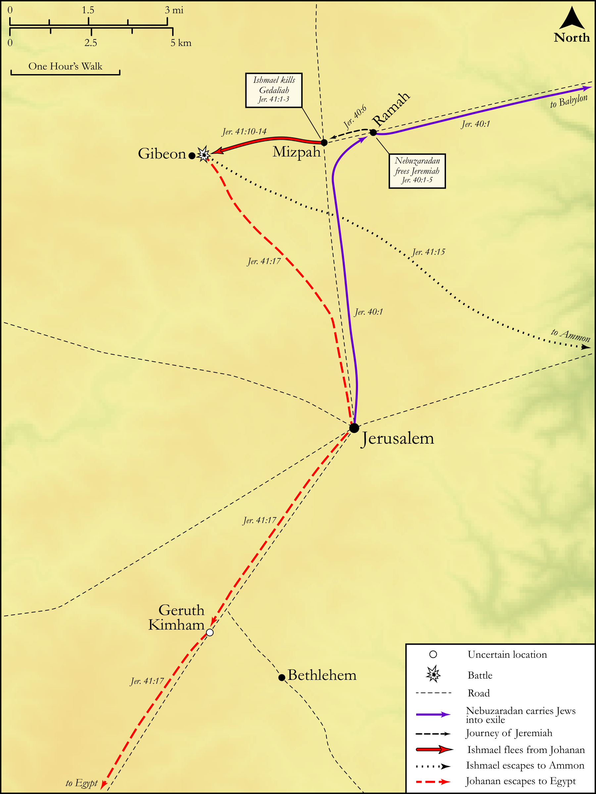

# Biblica Open Bible Maps

## License Information

Biblica Open Bible Maps, © 2023–2025 Biblica, Inc. This work is licensed under Creative Commons Attribution-ShareAlike 4.0 International (<a href="https://creativecommons.org/licenses/by-sa/4.0/">https://creativecommons.org/licenses/by-sa/4.0/</a>). More Information: <a href="https://docs.google.com/document/d/1Pp44yZ0Zdnd59vJHTrt2rPYq0SppfX5rZbPBt6mz37U/edit?tab=t.0#heading=h.oev9aj1ksvk2">https://docs.google.com/document/d/1Pp44yZ0Zdnd59vJHTrt2rPYq0SppfX5rZbPBt6mz37U/edit?tab=t.0#heading=h.oev9aj1ksvk2</a>

--------------------------------

## Wisdom & Prophets: Gedaliah and Ishmael (id: OT196)

### Image Content

[link](images/OT196.png)

Original: [Wisdom \& Prophets: Gedaliah and Ishmael](https://drive.google.com/file/d/1WzkNN25rOr49EPIl3N67WstQrWkb4ryd/view?usp=drive_link)

* **Associated Passages:** Jeremiah 40:1-41:18

* **Associated ACAI Concepts:** Gedaliah (ID: `person:Gedaliah.2`); Ishmael (ID: `person:Ishmael.2`); Nethaniah (ID: `person:Nethaniah`); Ahikam (ID: `person:Ahikam`); Mizpah (ID: `place:Mizpah`); Johanan (ID: `person:Johanan.5`); Kareah (ID: `person:Kareah`); Babylon (ID: `place:Babylon`); Appoint (ID: `keyterm:Appoint`); Judah (ID: `person:Judah.4`); Tribe of Judah (ID: `group:Judah`); Judea (ID: `place:Judea`); Chaldea (ID: `place:Chaldea`); LORD (ID: `deity:Lord`); Shaphan (ID: `person:Shaphan`); Ammonites (ID: `group:Ammon`); Ammon (ID: `place:Ammon`); Chaldeans (ID: `group:Chaldea`); Judeans (ID: `group:Judea`); Jeremiah (ID: `person:Jeremiah.6`); Nebuzaradan (ID: `person:Nebuzaradan`); Gibeon (ID: `place:Gibeon`); Fear (ID: `keyterm:Fear`); Elishama (ID: `person:Elishama.3`); Seraiah (ID: `person:Seraiah.3`); Baalis (ID: `person:Baalis`); Jonathan (ID: `person:Jonathan.13`); Ephai (ID: `person:Ephai`); Tanhumeth (ID: `person:Tanhumeth`); Geruth Chimham (ID: `place:GeruthChimham`); Jezaniah (ID: `person:Jezaniah`); Anointing Oil (ID: `realia:AnointingOil`); Pit (ID: `realia:Pit`); Wine (ID: `realia:Wine`); Olive Oil (ID: `realia:OliveOil`); Vine (ID: `flora:Vine`); Jerusalem (ID: `place:Jerusalem`); Egypt (ID: `place:Egypt`); Ramah (ID: `place:Ramah.2`); Netophathites (ID: `group:Netophah`); Israel (ID: `person:Israel`); Netophah (ID: `place:Netophah`); Bethlehem (ID: `place:Bethlehem`); Offering (ID: `keyterm:Offering`); Edom (ID: `place:Edom`); Baasha (ID: `person:Baasha`); Asa (ID: `person:Asa`); Force to Serve (ID: `keyterm:EnticedToServe`); To Sin (ID: `keyterm:Sin`); Shiloh (ID: `place:Shiloh`); Believe In (ID: `keyterm:BelieveIn`); Swear (ID: `keyterm:Swear`); Moab (ID: `place:Moab`); Maacah (ID: `place:Maacah`); Shechem (ID: `place:Shechem`); Maacathites (ID: `group:Maacah`); Samaria (ID: `place:Samaria`); Wheat (ID: `flora:Wheat`); Frankincense (ID: `flora:Frankincense`); Sword (ID: `realia:Sword`); House (ID: `realia:House`); Barley (ID: `flora:Barley`)
