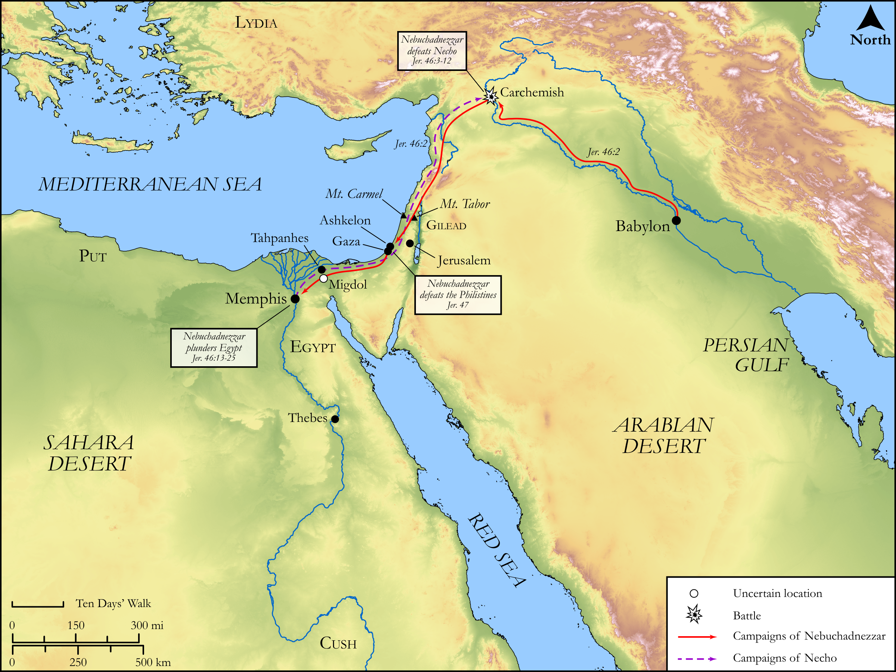

# Biblica Open Bible Maps

## License Information

Biblica Open Bible Maps, © 2023–2025 Biblica, Inc. This work is licensed under Creative Commons Attribution-ShareAlike 4.0 International (<a href="https://creativecommons.org/licenses/by-sa/4.0/">https://creativecommons.org/licenses/by-sa/4.0/</a>). More Information: <a href="https://docs.google.com/document/d/1Pp44yZ0Zdnd59vJHTrt2rPYq0SppfX5rZbPBt6mz37U/edit?tab=t.0#heading=h.oev9aj1ksvk2">https://docs.google.com/document/d/1Pp44yZ0Zdnd59vJHTrt2rPYq0SppfX5rZbPBt6mz37U/edit?tab=t.0#heading=h.oev9aj1ksvk2</a>

--------------------------------

## Wisdom & Prophets: Prophecy Against the Egyptians and Philistines (id: OT198)

### Image Content

[link](images/OT198.png)

Original: [Wisdom \& Prophets: Prophecy Against the Egyptians and Philistines](https://drive.google.com/file/d/1lkvaoTg1Phi0DRyHOtNGRIvm8TTQ2AM0/view?usp=drive_link)

* **Associated Passages:** Jeremiah 46:1-47:7

* **Associated ACAI Concepts:** LORD (ID: `deity:Lord`); Egypt (ID: `place:Egypt`); Neco (ID: `person:Neco`); Babylon (ID: `place:Babylon`); Nebuchadnezzar (ID: `person:Nebuchadnezzar`); Israel (ID: `person:Israel`); Euphrates River (ID: `place:Euphrates`); Jeremiah (ID: `person:Jeremiah.6`); Horse (ID: `fauna:Horse`); Gaza (ID: `place:Gaza`); Ashkelon (ID: `place:Ashkelon`); Philistines (ID: `group:Philistine`); Word of the Lord (ID: `keyterm:WordOfTheLord`); Fear (ID: `keyterm:Fear`); Memphis (ID: `place:Memphis`); Philistia (ID: `place:Philistine`); Nile River (ID: `place:Nile`); Small Shield (ID: `realia:SmallShield`); Thebes (ID: `place:Thebes`); Alas! (ID: `keyterm:Alas`); Pronounce Innocent (ID: `keyterm:PronounceInnocent`); Amon (ID: `deity:Amon`); Carchemish (ID: `place:Carchemish`); Lud (ID: `person:Lud`); Mighty One (ID: `keyterm:MightyOne`); Molten Image (ID: `realia:MoltenImage`); Cattle (ID: `fauna:Bull`); Sword (ID: `realia:Sword`); Chariot (ID: `realia:Chariot`); Mount Tabor (ID: `place:TaborMount`); Tahpanhes (ID: `place:Tahpanhes`); Gilead (ID: `place:Gilead`); Ludim (ID: `group:Ludim`); Crete (ID: `place:Crete`); Tyre (ID: `place:Tyre`); Sidon (ID: `place:Sidon`); Judah (ID: `person:Judah.4`); Slaughtering (ID: `keyterm:Slaughtering`); Visitation (ID: `keyterm:Visitation`); Tribe of Judah (ID: `group:Judah`); Carmel (ID: `place:Carmel`); Gentiles (ID: `group:Gentile`); Put (ID: `place:Put`); Trust (ID: `keyterm:LeanOn`); Jehoiakim (ID: `person:Jehoiakim`); Hophra (ID: `person:Hophra`); Josiah (ID: `person:Josiah`); Appoint (ID: `keyterm:Appoint`); Cush (ID: `place:Cush.2`); Migdol (ID: `place:Migdol`); Gadfly (ID: `fauna:Gadfly`); Animal Pen (ID: `realia:AnimalPen`); Liquidambar (ID: `flora:Liquidambar`); Wagon (ID: `realia:Wagon`); Large Shield (ID: `realia:LargeShield`); Sandalwood (ID: `flora:Sandalwood`); Spear (ID: `realia:Spear`); Sheath (ID: `realia:Sheath`); Axe (ID: `realia:Axe`); Locust (ID: `fauna:Locust`); Bow (ID: `realia:Bow`); Helmet (ID: `realia:Helmet`); Snake (ID: `fauna:Snake`)
