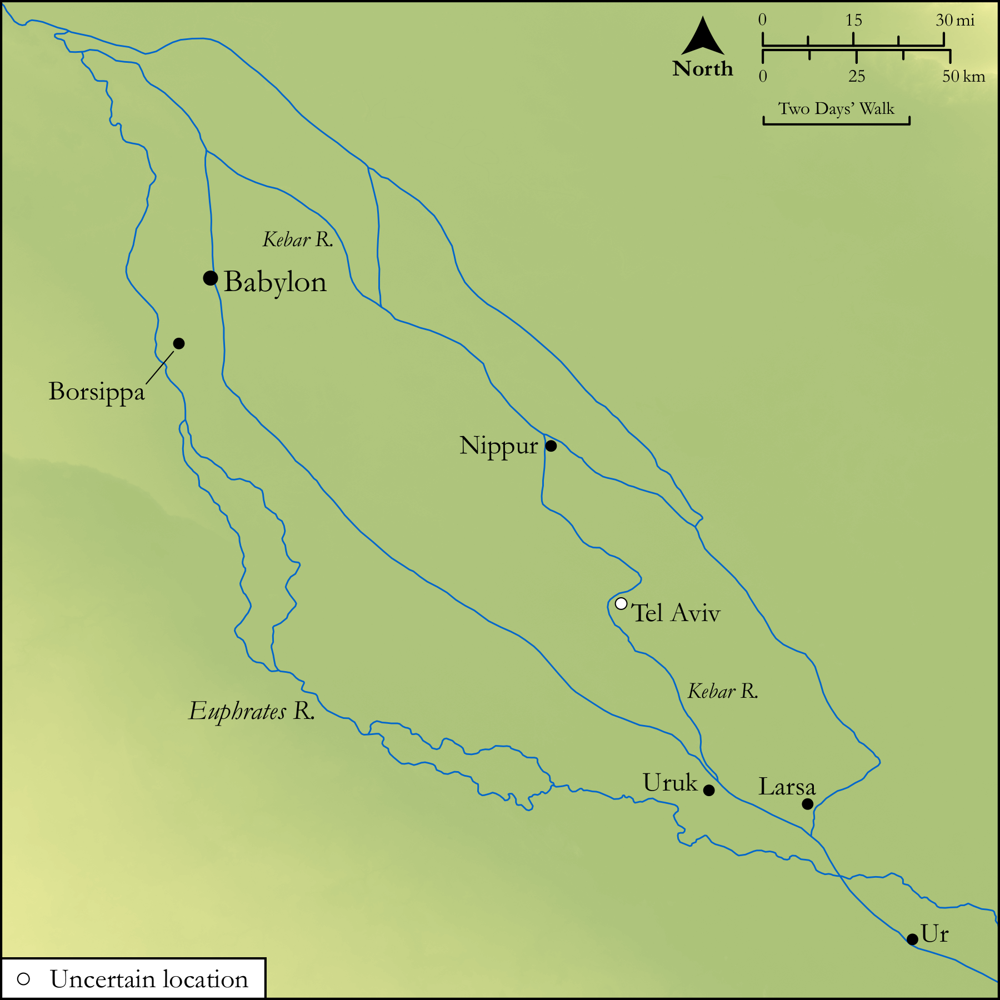

# Biblica Open Bible Maps

## License Information

Biblica Open Bible Maps, © 2023–2025 Biblica, Inc. This work is licensed under Creative Commons Attribution-ShareAlike 4.0 International (<a href="https://creativecommons.org/licenses/by-sa/4.0/">https://creativecommons.org/licenses/by-sa/4.0/</a>). More Information: <a href="https://docs.google.com/document/d/1Pp44yZ0Zdnd59vJHTrt2rPYq0SppfX5rZbPBt6mz37U/edit?tab=t.0#heading=h.oev9aj1ksvk2">https://docs.google.com/document/d/1Pp44yZ0Zdnd59vJHTrt2rPYq0SppfX5rZbPBt6mz37U/edit?tab=t.0#heading=h.oev9aj1ksvk2</a>

--------------------------------

## Wisdom & Prophets: Ezekiel’s Vision by the Kebar (id: OT202)

### Image Content

[link](images/OT202.png)

Original: [Wisdom \& Prophets: Ezekiel’s Vision by the Kebar](https://drive.google.com/file/d/1Rhm-KF_1cqdbwtEDeENa78kdwS5NNyUR/view?usp=drive_link)

* **Associated Passages:** Ezekiel 1:1-3:27

* **Associated ACAI Concepts:** LORD (ID: `deity:Lord`); Israel (ID: `person:Israel`); Kebar (ID: `place:Chebar`); Wagon (ID: `realia:Wagon`); Fear (ID: `keyterm:Fear`); Glory (ID: `keyterm:Glory`); Scroll (ID: `realia:Scroll`); Word of the Lord (ID: `keyterm:WordOfTheLord`); Passion (ID: `keyterm:Ardour`); To Sin (ID: `keyterm:Sin`); Ezekiel (ID: `person:Ezekiel`); Rebel (ID: `keyterm:Rebel`); Tel-abib (ID: `place:Tel-abib`); Vision (ID: `keyterm:Vision`); Buzi (ID: `person:Buzi`); Chaldea (ID: `place:Chaldea`); Lamentation (ID: `keyterm:Lamentation`); Jehoiachin (ID: `person:Jehoiachin`); Bless (ID: `keyterm:Bless`); Chaldeans (ID: `group:Chaldea`); Cattle (ID: `fauna:Bull`); Wheel (ID: `realia:Wheel`); Nettle (ID: `flora:Nettle`); Molten Image (ID: `realia:MoltenImage`); Throne (ID: `realia:Throne`); Brier (ID: `flora:Brier`); Vulture (ID: `fauna:Vulture`); House (ID: `realia:House`); Rope (ID: `realia:Rope`); Scorpion (ID: `fauna:Scorpion`)
