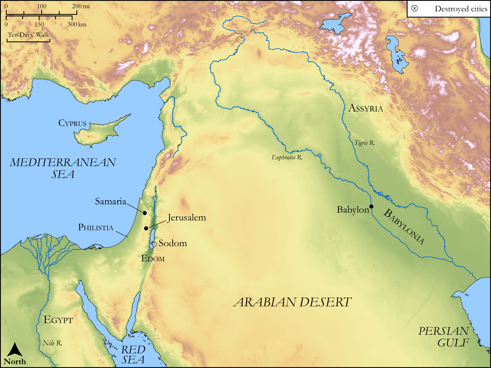

# Biblica Open Bible Maps

## License Information

Biblica Open Bible Maps, © 2023–2025 Biblica, Inc. This work is licensed under Creative Commons Attribution-ShareAlike 4.0 International (<a href="https://creativecommons.org/licenses/by-sa/4.0/">https://creativecommons.org/licenses/by-sa/4.0/</a>). More Information: <a href="https://docs.google.com/document/d/1Pp44yZ0Zdnd59vJHTrt2rPYq0SppfX5rZbPBt6mz37U/edit?tab=t.0#heading=h.oev9aj1ksvk2">https://docs.google.com/document/d/1Pp44yZ0Zdnd59vJHTrt2rPYq0SppfX5rZbPBt6mz37U/edit?tab=t.0#heading=h.oev9aj1ksvk2</a>

--------------------------------

## Wisdom & Prophets: Jerusalem the Adulterous Wife (id: OT203)

### Image Content

[link](images/OT203.png)

Original: [Wisdom \& Prophets: Jerusalem the Adulterous Wife](https://drive.google.com/file/d/1AO3foYpUIHsKuwSrqtYKrt9VEkX0yP8D/view?usp=drive_link)

* **Associated Passages:** Ezekiel 16:1-63

* **Associated ACAI Concepts:** LORD (ID: `deity:Lord`); Fornication (ID: `keyterm:Fornication`); Play the Prostitute (ID: `keyterm:PlayTheProstitute`); Sodom (ID: `place:Sodom`); Covenant (ID: `keyterm:Covenant`); Samaria (ID: `place:Samaria`); High Place (ID: `realia:HighPlace`); Passion (ID: `keyterm:Ardour`); Love (ID: `keyterm:Love`); Anointing Oil (ID: `realia:AnointingOil`); Olive Oil (ID: `realia:OliveOil`); Jerusalem (ID: `place:Jerusalem`); Amorites (ID: `group:Amorites`); Hittites (ID: `group:Hittite`); Be (Or Show Oneself) Just (ID: `keyterm:Just`); Philistines (ID: `group:Philistine`); Word of the Lord (ID: `keyterm:WordOfTheLord`); To Sin (ID: `keyterm:Sin`); Philistia (ID: `place:Philistine`); Heth (ID: `person:Heth`); Canaan (ID: `place:Canaan`); Embroidered Cloth (ID: `realia:EmbroideredCloth`); Silk (ID: `realia:Silk`); Egypt (ID: `place:Egypt`); Chaldea (ID: `place:Chaldea`); Bear the Consequences Of (ID: `keyterm:BearTheConsequencesOf`); Assyria (ID: `place:Assyria`); Pleasing Odor (ID: `keyterm:PleasingOdor`); Trust (ID: `keyterm:LeanOn`); Canaanites (ID: `group:Canaan`)
