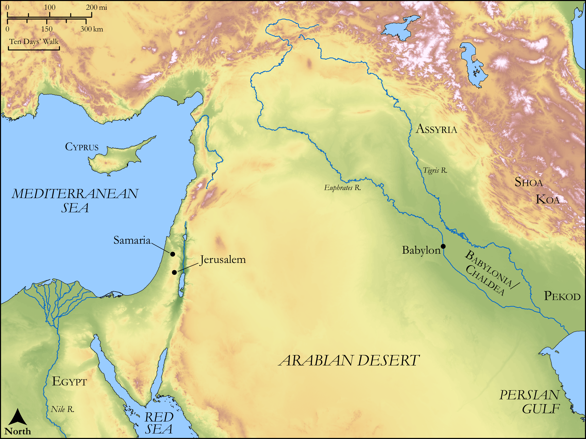

# Biblica Open Bible Maps

## License Information

Biblica Open Bible Maps, © 2023–2025 Biblica, Inc. This work is licensed under Creative Commons Attribution-ShareAlike 4.0 International (<a href="https://creativecommons.org/licenses/by-sa/4.0/">https://creativecommons.org/licenses/by-sa/4.0/</a>). More Information: <a href="https://docs.google.com/document/d/1Pp44yZ0Zdnd59vJHTrt2rPYq0SppfX5rZbPBt6mz37U/edit?tab=t.0#heading=h.oev9aj1ksvk2">https://docs.google.com/document/d/1Pp44yZ0Zdnd59vJHTrt2rPYq0SppfX5rZbPBt6mz37U/edit?tab=t.0#heading=h.oev9aj1ksvk2</a>

--------------------------------

## Wisdom & Prophets: Oholah and Oholibah (id: OT205)

### Image Content

[link](images/OT205.png)

Original: [Wisdom \& Prophets: Oholah and Oholibah](https://drive.google.com/file/d/1o-g7gmgInAzqRzuZlDGjAxK9VFk7njRQ/view?usp=drive_link)

* **Associated Passages:** Ezekiel 23:1-49

* **Associated ACAI Concepts:** Fornication (ID: `keyterm:Fornication`); LORD (ID: `deity:Lord`); Oholibah (ID: `person:Oholibah`); Egypt (ID: `place:Egypt`); Defilement (ID: `keyterm:Defilement`); Assyria (ID: `place:Assyria`); Play the Prostitute (ID: `keyterm:PlayTheProstitute`); Oholah (ID: `person:Oholah`); Image (ID: `realia:Image`); Chaldea (ID: `place:Chaldea`); Assyrians (ID: `group:Assyria`); Babylon (ID: `place:Babylon`); Love (ID: `keyterm:Love`); Horse (ID: `fauna:Horse`); Bear the Consequences Of (ID: `keyterm:BearTheConsequencesOf`); Chaldeans (ID: `group:Chaldea`); An Angel (ID: `deity:Angel`); To Dishonor (ID: `keyterm:Dishonor`); Samaria (ID: `place:Samaria`); Sabeans (ID: `group:Sabean`); Koa (ID: `place:Koa`); Shoa (ID: `place:Shoa`); Jerusalem (ID: `place:Jerusalem`); Sabbath (ID: `keyterm:Sabbath`); Passion (ID: `keyterm:Ardour`); Word of the Lord (ID: `keyterm:WordOfTheLord`); Sheba (ID: `person:Sheba`); To Sin (ID: `keyterm:Sin`); Sword (ID: `realia:Sword`); House (ID: `realia:House`); Bed (ID: `realia:Bed`); Wagon (ID: `realia:Wagon`); Donkey (ID: `fauna:Donkey`); Large Shield (ID: `realia:LargeShield`); Small Shield (ID: `realia:SmallShield`); Anointing Oil (ID: `realia:AnointingOil`); Chariot (ID: `realia:Chariot`); Olive Oil (ID: `realia:OliveOil`); Purple Cloth (ID: `realia:PurpleCloth`); Crown (ID: `realia:Crown`); Helmet (ID: `realia:Helmet`); Belt (ID: `realia:Belt`)
