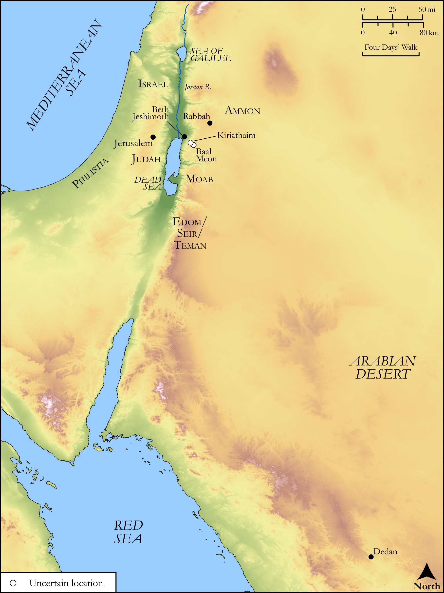

# Biblica Open Bible Maps

## License Information

Biblica Open Bible Maps, © 2023–2025 Biblica, Inc. This work is licensed under Creative Commons Attribution-ShareAlike 4.0 International (<a href="https://creativecommons.org/licenses/by-sa/4.0/">https://creativecommons.org/licenses/by-sa/4.0/</a>). More Information: <a href="https://docs.google.com/document/d/1Pp44yZ0Zdnd59vJHTrt2rPYq0SppfX5rZbPBt6mz37U/edit?tab=t.0#heading=h.oev9aj1ksvk2">https://docs.google.com/document/d/1Pp44yZ0Zdnd59vJHTrt2rPYq0SppfX5rZbPBt6mz37U/edit?tab=t.0#heading=h.oev9aj1ksvk2</a>

--------------------------------

## Wisdom & Prophets: Prophecies Against Ammon, Moab, Edom, and Philistia (id: OT206)

### Image Content

[link](images/OT206.png)

Original: [Wisdom \& Prophets: Prophecies Against Ammon, Moab, Edom, and Philistia](https://drive.google.com/file/d/18PUUYl2Ycei2oPC8LR3ZyO405S_xo2UC/view?usp=drive_link)

* **Associated Passages:** Ezekiel 25:1-17

* **Associated ACAI Concepts:** LORD (ID: `deity:Lord`); Ammon (ID: `place:Ammon`); Israel (ID: `person:Israel`); Judah (ID: `person:Judah.4`); Edom (ID: `place:Edom`); Tribe of Judah (ID: `group:Judah`); Ammonites (ID: `group:Ammon`); Moab (ID: `place:Moab`); Philistines (ID: `group:Philistine`); Philistia (ID: `place:Philistine`); East (ID: `place:East`); Kiriathaim (ID: `place:Kiriathaim`); Dedan (ID: `place:Dedan`); Teman (ID: `place:Teman`); Cherethites (ID: `group:Cherethite`); Word of the Lord (ID: `keyterm:WordOfTheLord`); Speak as a Prophet (ID: `keyterm:Speak`); Baal-meon (ID: `place:Baal-meon`); To Dishonor (ID: `keyterm:Dishonor`); Seir (ID: `place:Seir`); Beth-jeshimoth (ID: `place:Beth-jeshimoth`); Camel (ID: `fauna:Camel`); Flock (ID: `fauna:Flock`); Goat (ID: `fauna:Goat`)
