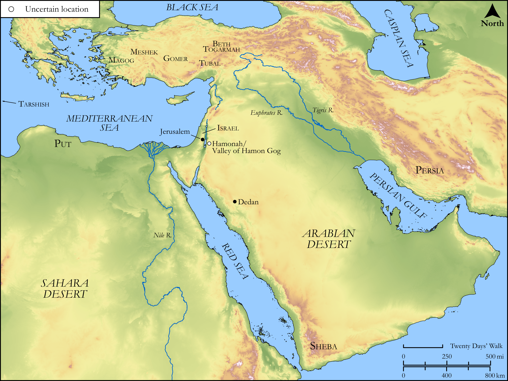

# Biblica Open Bible Maps

## License Information

Biblica Open Bible Maps, © 2023–2025 Biblica, Inc. This work is licensed under Creative Commons Attribution-ShareAlike 4.0 International (<a href="https://creativecommons.org/licenses/by-sa/4.0/">https://creativecommons.org/licenses/by-sa/4.0/</a>). More Information: <a href="https://docs.google.com/document/d/1Pp44yZ0Zdnd59vJHTrt2rPYq0SppfX5rZbPBt6mz37U/edit?tab=t.0#heading=h.oev9aj1ksvk2">https://docs.google.com/document/d/1Pp44yZ0Zdnd59vJHTrt2rPYq0SppfX5rZbPBt6mz37U/edit?tab=t.0#heading=h.oev9aj1ksvk2</a>

--------------------------------

## Wisdom & Prophets: Prophecies Against Gog (id: OT209)

### Image Content

[link](images/OT209.png)

Original: [Wisdom \& Prophets: Prophecies Against Gog](https://drive.google.com/open?id=1ti_ecYgbuajrnRvl8_Zg6IAwSg0FntBf&usp=drive_copy)

* **Associated Passages:** Ezekiel 38:1-39:29

* **Associated ACAI Concepts:** LORD (ID: `deity:Lord`); Israel (ID: `person:Israel`); Gog (ID: `place:Gog`); Safety (ID: `keyterm:Safety`); Speak as a Prophet (ID: `keyterm:Speak`); Holy (ID: `keyterm:Holy`); Tubal (ID: `place:Tubal`); Meshech (ID: `place:Meshech`); Pure (ID: `keyterm:Pure`); Magog (ID: `place:Magog`); Valley of Hamon-gog (ID: `place:Hamon-gogValley`); Passion (ID: `keyterm:Ardour`); Slaughtering (ID: `keyterm:Slaughtering`); Arrow (ID: `keyterm:Arrow`); Be Unfaithful (ID: `keyterm:Unfaithful`); Small Shield (ID: `realia:SmallShield`); Horse (ID: `fauna:Horse`); Gomer (ID: `person:Gomer`); Hamonah (ID: `place:Hamonah`); Beth-togarmah (ID: `place:Beth-togarmah`); Valley of the Travelers (ID: `place:TravelersValley`); Arrow (ID: `realia:Arrow`); Weapons (ID: `realia:Weapons`); Be Zealous (ID: `keyterm:Zealous`); Sheba (ID: `place:Sheba.2`); Bashan (ID: `place:Bashan`); Persia (ID: `place:Persia`); Defilement (ID: `keyterm:Defilement`); Bring Honor and Glory on Oneself (ID: `keyterm:BringHonorAndGloryOnOneself`); Tarshish (ID: `place:Tarshish`)
