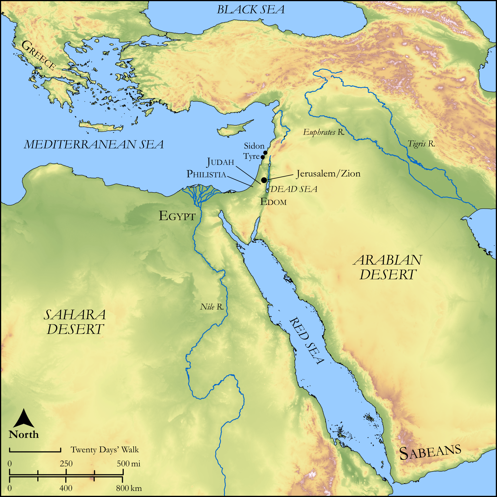

# Biblica Open Bible Maps

## License Information

Biblica Open Bible Maps, © 2023–2025 Biblica, Inc. This work is licensed under Creative Commons Attribution-ShareAlike 4.0 International (<a href="https://creativecommons.org/licenses/by-sa/4.0/">https://creativecommons.org/licenses/by-sa/4.0/</a>). More Information: <a href="https://docs.google.com/document/d/1Pp44yZ0Zdnd59vJHTrt2rPYq0SppfX5rZbPBt6mz37U/edit?tab=t.0#heading=h.oev9aj1ksvk2">https://docs.google.com/document/d/1Pp44yZ0Zdnd59vJHTrt2rPYq0SppfX5rZbPBt6mz37U/edit?tab=t.0#heading=h.oev9aj1ksvk2</a>

--------------------------------

## Wisdom & Prophets: Joel (id: OT215)

### Image Content

[link](images/OT215.png)

Original: [Wisdom \& Prophets: Joel](https://drive.google.com/open?id=1dQ59h43iQU0CbKFAIEM7z3QGhEofllr-&usp=drive_copy)

* **Associated Passages:** Joel 1:1-4:21

* **Associated ACAI Concepts:** LORD (ID: `deity:Lord`); Jerusalem (ID: `place:Jerusalem`); Tribe of Judah (ID: `group:Judah`); Judah (ID: `person:Judah.4`); Vine (ID: `flora:Vine`); House (ID: `realia:House`); Holy (ID: `keyterm:Holy`); Fear (ID: `keyterm:Fear`); Wine (ID: `realia:Wine`); Israel (ID: `person:Israel`); Offering (ID: `keyterm:Offering`); Must (ID: `realia:Must`); Kidron (ID: `place:Kidron`); To Cause to Possess (ID: `keyterm:Possess`); Grain (ID: `flora:Grain`); Mule (ID: `fauna:Mule`); Olive Oil (ID: `realia:OliveOil`); Fig (ID: `flora:Fig`); Anointing Oil (ID: `realia:AnointingOil`); Olive Tree (ID: `flora:OliveTree`); Valley of Shittim (ID: `place:ShittimValley`); Joel (ID: `person:Joel.14`); Sabeans (ID: `group:Sabean`); Greeks (ID: `group:Greek`); Pethuel (ID: `person:Pethuel`); Tyre (ID: `place:Tyre`); Generous (ID: `keyterm:Generous`); Gentiles (ID: `group:Gentile`); Word of the Lord (ID: `keyterm:WordOfTheLord`); Speak as a Prophet (ID: `keyterm:Speak`)
