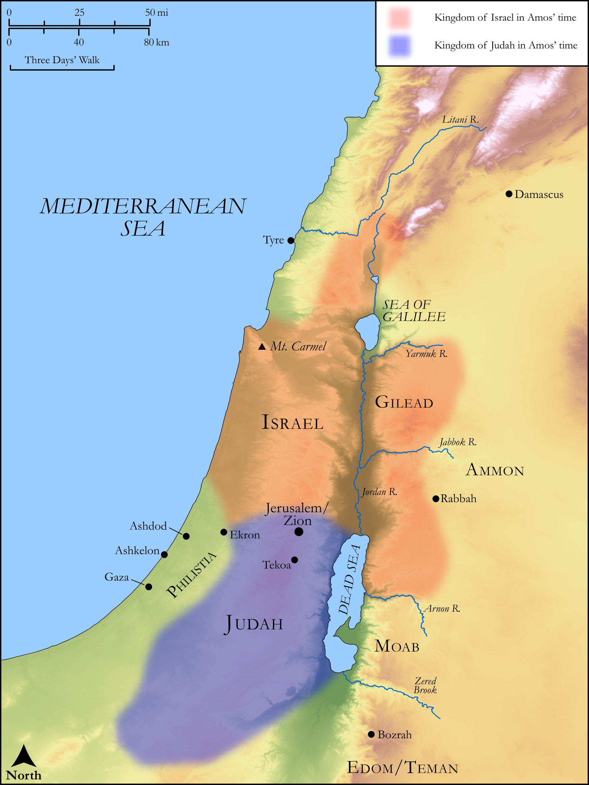

# Biblica Open Bible Maps

## License Information

Biblica Open Bible Maps, © 2023–2025 Biblica, Inc. This work is licensed under Creative Commons Attribution-ShareAlike 4.0 International (<a href="https://creativecommons.org/licenses/by-sa/4.0/">https://creativecommons.org/licenses/by-sa/4.0/</a>). More Information: <a href="https://docs.google.com/document/d/1Pp44yZ0Zdnd59vJHTrt2rPYq0SppfX5rZbPBt6mz37U/edit?tab=t.0#heading=h.oev9aj1ksvk2">https://docs.google.com/document/d/1Pp44yZ0Zdnd59vJHTrt2rPYq0SppfX5rZbPBt6mz37U/edit?tab=t.0#heading=h.oev9aj1ksvk2</a>

--------------------------------

## Wisdom & Prophets: Prophecies Against Foreign Nations (id: OT216)

### Image Content

[link](images/OT216.png)

Original: [Wisdom \& Prophets: Prophecies Against Foreign Nations](https://drive.google.com/open?id=1FCu-xMn-WSmaOAir6XN9ZEI4WkYBkILv&usp=drive_copy)

* **Associated Passages:** Amos 1:1-2:16

* **Associated ACAI Concepts:** LORD (ID: `deity:Lord`); Rebel (ID: `keyterm:Rebel`); Edom (ID: `place:Edom`); Israel (ID: `person:Israel`); Judah (ID: `person:Judah.4`); Tribe of Judah (ID: `group:Judah`); Jerusalem (ID: `place:Jerusalem`); Gaza (ID: `place:Gaza`); Gilead (ID: `place:Gilead`); Nazirites (ID: `group:Nazirite`); Amorites (ID: `group:Amorites`); Damascus (ID: `place:Damascus`); Tyre (ID: `place:Tyre`); Ammon (ID: `place:Ammon`); Moab (ID: `place:Moab`); Have a Vision (ID: `keyterm:HaveAVision`); Beth-eden (ID: `place:Beth-eden`); Valley of Aven (ID: `place:AvenValley`); Kir (ID: `place:Kir`); Tekoa (ID: `place:Tekoa`); Amos (ID: `person:Amos.3`); Hazael (ID: `person:Hazael`); Staff (ID: `realia:Staff`); Rod (ID: `realia:Rod`); House (ID: `realia:House`); Wine (ID: `realia:Wine`); Vine (ID: `flora:Vine`); Egypt (ID: `place:Egypt`); Ekron (ID: `place:Ekron`); Ben-hadad (ID: `person:Ben-hadad.3`); Ashkelon (ID: `place:Ashkelon`); Kiriathaim (ID: `place:Kiriathaim`); Dispossess (ID: `keyterm:Dispossess`); Uzziah (ID: `person:Uzziah`); Bozrah (ID: `place:Bozrah.2`); Instruction (ID: `keyterm:Instruction`); Ashdod (ID: `place:Ashdod`); Carmel (ID: `place:Carmel`); Covenant (ID: `keyterm:Covenant`); Philistines (ID: `group:Philistine`); Strength (ID: `keyterm:Strength`); Teman (ID: `place:Teman`); Ammonites (ID: `group:Ammon`); Poor (ID: `keyterm:Poor`); Jeroboam (ID: `person:Jeroboam.2`); Speak as a Prophet (ID: `keyterm:Speak`); Philistia (ID: `place:Philistine`); Decree (ID: `keyterm:Decree`); To Dishonor (ID: `keyterm:Dishonor`); Joash (ID: `person:Joash.4`); Sheep (ID: `fauna:Lamb`); Grain (ID: `flora:Grain`); Rams Horn (ID: `realia:RamsHorn`); Wagon (ID: `realia:Wagon`); Stone Altar (ID: `realia:StoneAltar`); Temple Altar (ID: `realia:TempleAltar`); Cedar (ID: `flora:Cedar`); Altar (ID: `realia:Altar`); Threshing-Sledge (ID: `realia:Threshing-sledge`); Sheaf (ID: `realia:Sheaf`); Bow (ID: `realia:Bow`); Horse (ID: `fauna:Horse`); Money (ID: `realia:Money`); Flock (ID: `fauna:Flock`); Tabernacle Altar (ID: `realia:TabernacleAltar`); Oak (ID: `flora:Oak`); Goat (ID: `fauna:Goat`)
