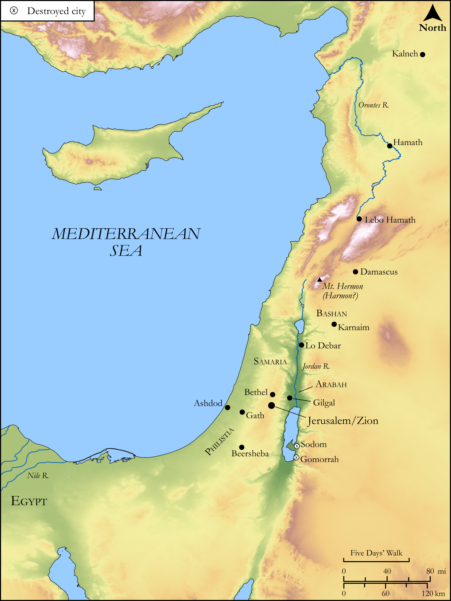

# Biblica Open Bible Maps

## License Information

Biblica Open Bible Maps, © 2023–2025 Biblica, Inc. This work is licensed under Creative Commons Attribution-ShareAlike 4.0 International (<a href="https://creativecommons.org/licenses/by-sa/4.0/">https://creativecommons.org/licenses/by-sa/4.0/</a>). More Information: <a href="https://docs.google.com/document/d/1Pp44yZ0Zdnd59vJHTrt2rPYq0SppfX5rZbPBt6mz37U/edit?tab=t.0#heading=h.oev9aj1ksvk2">https://docs.google.com/document/d/1Pp44yZ0Zdnd59vJHTrt2rPYq0SppfX5rZbPBt6mz37U/edit?tab=t.0#heading=h.oev9aj1ksvk2</a>

--------------------------------

## Wisdom & Prophets: Warning to Israel (id: OT217)

### Image Content

[link](images/OT217.png)

Original: [Wisdom \& Prophets: Warning to Israel](https://drive.google.com/open?id=12XhvUc5yXju8E_sL7KR5q-jahRQ69nTy&usp=drive_copy)

* **Associated Passages:** Amos 3:1-6:14

* **Associated ACAI Concepts:** LORD (ID: `deity:Lord`); Israel (ID: `person:Israel`); House (ID: `realia:House`); Bethel (ID: `place:Bethel`); Samaria (ID: `place:Samaria`); Rebel (ID: `keyterm:Rebel`); Egypt (ID: `place:Egypt`); Offering (ID: `keyterm:Offering`); Joseph (ID: `person:Joseph.10`); Lion (ID: `fauna:Lion`); Vine (ID: `flora:Vine`); Woe (ID: `keyterm:Woe.2`); Hamath (ID: `place:Hamath`); Slaughtering (ID: `keyterm:Slaughtering`); Appoint (ID: `keyterm:Appoint`); Love (ID: `keyterm:Love`); Swear (ID: `keyterm:Swear`); Gilgal (ID: `place:Gilgal.2`); Cattle (ID: `fauna:Bull`); Harmon (ID: `place:Harmon`); Lamentation (ID: `keyterm:Lamentation`); Brook of the Arabah (ID: `place:BrookOfTheArabah`); Calneh (ID: `place:Calneh`); Sikkuth (ID: `deity:Sikkuth`); Lo-debar (ID: `place:Lo-debar`); Kiyyun (ID: `deity:Kiyyun`); Damascus (ID: `place:Damascus`); Sodom (ID: `place:Sodom`); Complete (ID: `keyterm:Complete`); Beersheba (ID: `place:Beersheba`)
