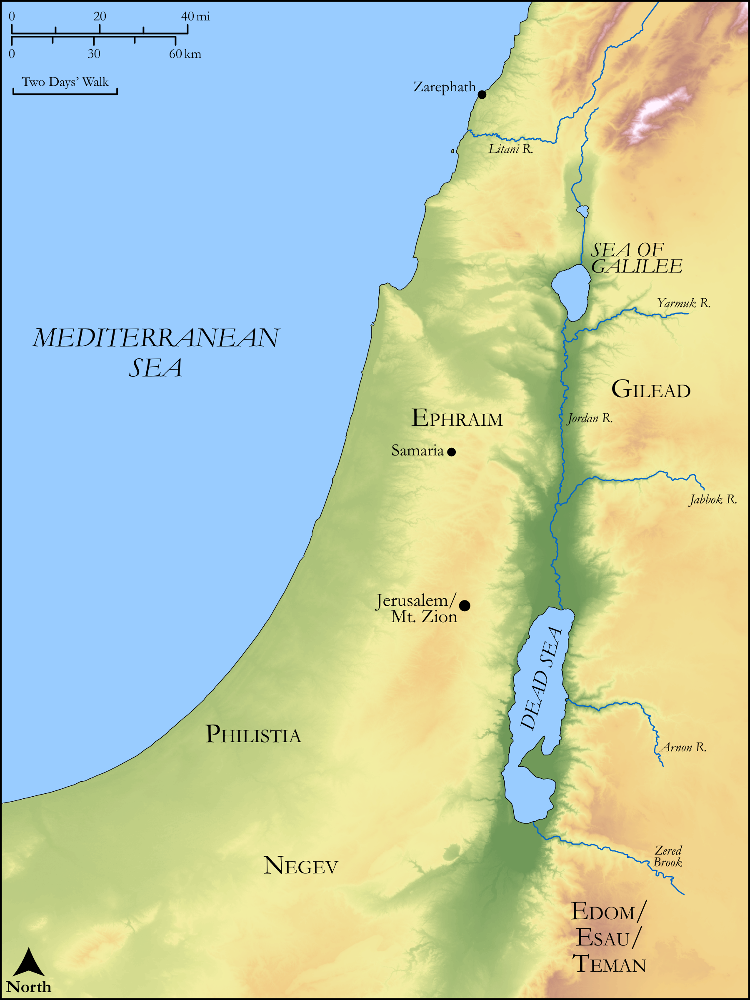

# Biblica Open Bible Maps

## License Information

Biblica Open Bible Maps, © 2023–2025 Biblica, Inc. This work is licensed under Creative Commons Attribution-ShareAlike 4.0 International (<a href="https://creativecommons.org/licenses/by-sa/4.0/">https://creativecommons.org/licenses/by-sa/4.0/</a>). More Information: <a href="https://docs.google.com/document/d/1Pp44yZ0Zdnd59vJHTrt2rPYq0SppfX5rZbPBt6mz37U/edit?tab=t.0#heading=h.oev9aj1ksvk2">https://docs.google.com/document/d/1Pp44yZ0Zdnd59vJHTrt2rPYq0SppfX5rZbPBt6mz37U/edit?tab=t.0#heading=h.oev9aj1ksvk2</a>

--------------------------------

## Wisdom & Prophets: Prophecy Against Edom (id: OT218)

### Image Content

[link](images/OT218.png)

Original: [Wisdom \& Prophets: Prophecy Against Edom](https://drive.google.com/open?id=12RB7qDcAOzWVhWY1PrpNNGkBu49gO0gD&usp=drive_copy)

* **Associated Passages:** Obadiah 1:1-21

* **Associated ACAI Concepts:** LORD (ID: `deity:Lord`); Jerusalem (ID: `place:Jerusalem`); Israel (ID: `person:Israel`); Edom (ID: `place:Edom`); Mount Esau (ID: `place:EsauMount`); Dispossess (ID: `keyterm:Dispossess`); Edomites (ID: `group:Edom`); Negev (ID: `place:Negeb`); Understanding (ID: `keyterm:Understanding`); Obadiah (ID: `person:Obadiah.12`); Gilead (ID: `place:Gilead`); Peace (ID: `keyterm:IntactState`); Lot (ID: `keyterm:Lot`); Judah (ID: `person:Judah.4`); Zarephath (ID: `place:Zarephath`); Tribe of Judah (ID: `group:Judah`); Benjamin (ID: `person:Benjamin`); Ephraim (ID: `person:Ephraim`); Tribe of Ephraim (ID: `group:Ephraim`); Joseph (ID: `person:Joseph.10`); Tribe of Benjamin (ID: `group:Benjamin`); Covenant (ID: `keyterm:Covenant`); Canaanites (ID: `group:Canaan`); Sardis (ID: `place:Sardis`); Philistines (ID: `group:Philistine`); Shephelah (ID: `place:Shephelah`); Teman (ID: `place:Teman`); Philistia (ID: `place:Philistine`); Canaan (ID: `place:Canaan`); Samaria (ID: `place:Samaria`); Vulture (ID: `fauna:Vulture`); Trap (ID: `realia:Trap`)
