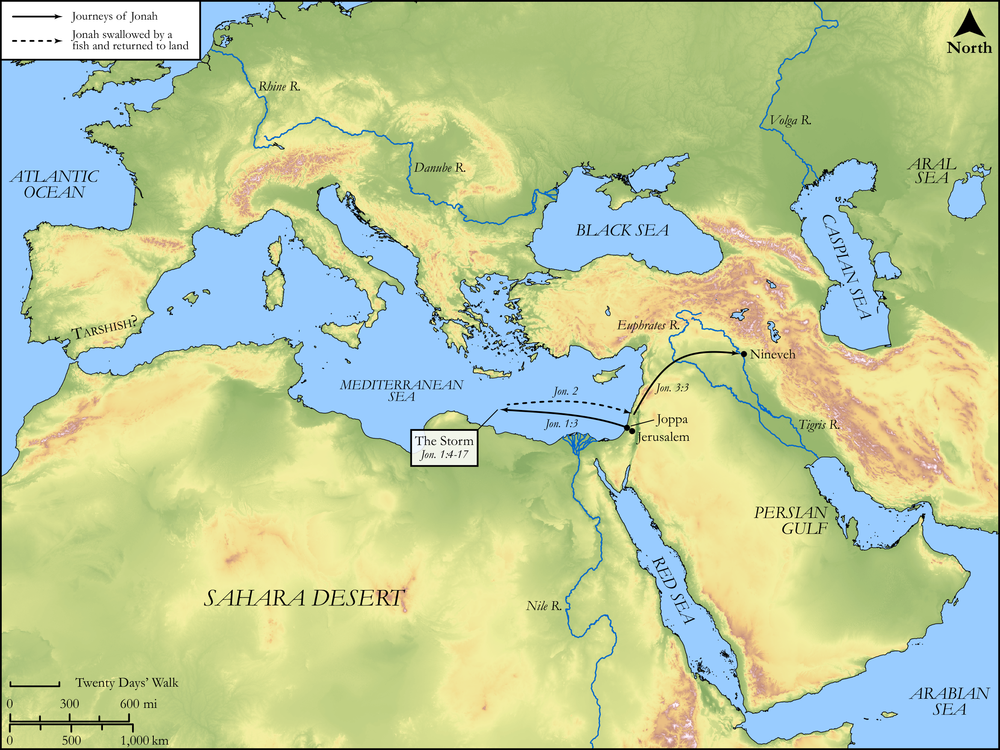

# Biblica Open Bible Maps

## License Information

Biblica Open Bible Maps, © 2023–2025 Biblica, Inc. This work is licensed under Creative Commons Attribution-ShareAlike 4.0 International (<a href="https://creativecommons.org/licenses/by-sa/4.0/">https://creativecommons.org/licenses/by-sa/4.0/</a>). More Information: <a href="https://docs.google.com/document/d/1Pp44yZ0Zdnd59vJHTrt2rPYq0SppfX5rZbPBt6mz37U/edit?tab=t.0#heading=h.oev9aj1ksvk2">https://docs.google.com/document/d/1Pp44yZ0Zdnd59vJHTrt2rPYq0SppfX5rZbPBt6mz37U/edit?tab=t.0#heading=h.oev9aj1ksvk2</a>

--------------------------------

## Wisdom & Prophets: The Journeys of Jonah (id: OT219)

### Image Content

[link](images/OT219.png)

Original: [Wisdom \& Prophets: The Journeys of Jonah](https://drive.google.com/open?id=1P3T6xGgggLboTwJpP7EHHUYQC73_4L38&usp=drive_copy)

* **Associated Passages:** Jonah 1:1-3:10

* **Associated ACAI Concepts:** LORD (ID: `deity:Lord`); Jonah (ID: `person:Jonah.2`); Nineveh (ID: `place:Nineveh`); Word of the Lord (ID: `keyterm:WordOfTheLord`); Fear (ID: `keyterm:Fear`); Fish (ID: `fauna:Fish`); Sackcloth (ID: `realia:Sackcloth`); Ship (ID: `realia:Ship`); Vow (ID: `keyterm:Vow`); Hell (ID: `place:Hell`); Amittai (ID: `person:Amittai`); Joppa (ID: `place:Joppa`); Cattle (ID: `fauna:Bull`); Lot (ID: `keyterm:Lot`); Slaughtering (ID: `keyterm:Slaughtering`); Salvation (ID: `keyterm:Salvation`); Hebrews (ID: `group:Hebrews`); Tarshish (ID: `place:Tarshish`); Praise (ID: `keyterm:Praise`); Kindness (ID: `keyterm:Kindness`); Exempt (ID: `keyterm:Exempt`); Believe In (ID: `keyterm:BelieveIn`); Throne (ID: `realia:Throne`); Cattails (ID: `flora:Cattails`); Clothing (ID: `realia:Clothing`); Flock (ID: `fauna:Flock`); Goat (ID: `fauna:Goat`)
