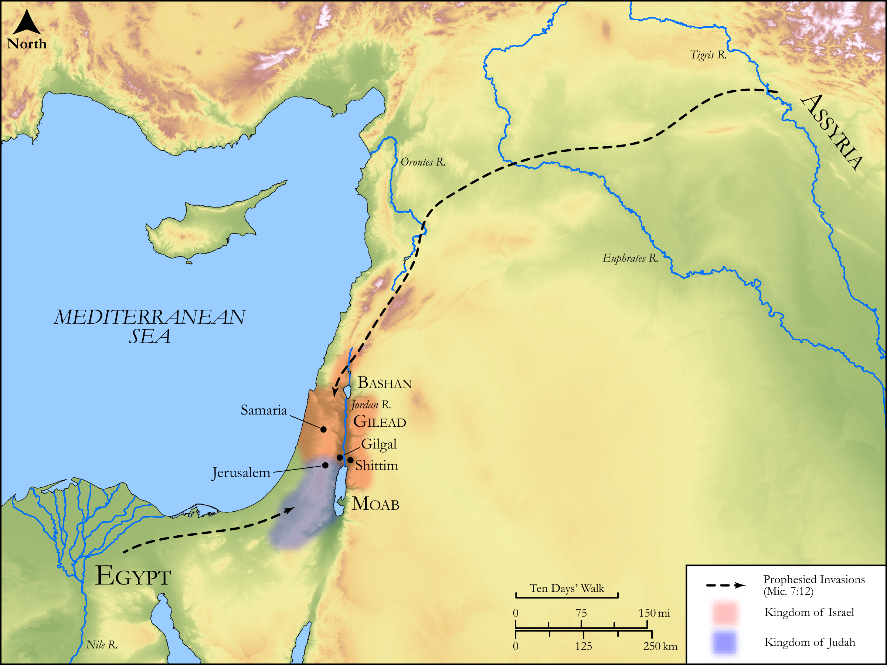

# Biblica Open Bible Maps

## License Information

Biblica Open Bible Maps, © 2023–2025 Biblica, Inc. This work is licensed under Creative Commons Attribution-ShareAlike 4.0 International (<a href="https://creativecommons.org/licenses/by-sa/4.0/">https://creativecommons.org/licenses/by-sa/4.0/</a>). More Information: <a href="https://docs.google.com/document/d/1Pp44yZ0Zdnd59vJHTrt2rPYq0SppfX5rZbPBt6mz37U/edit?tab=t.0#heading=h.oev9aj1ksvk2">https://docs.google.com/document/d/1Pp44yZ0Zdnd59vJHTrt2rPYq0SppfX5rZbPBt6mz37U/edit?tab=t.0#heading=h.oev9aj1ksvk2</a>

--------------------------------

## Wisdom & Prophets: God’s Controversy with Israel (id: OT221)

### Image Content

[link](images/OT221.png)

Original: [Wisdom \& Prophets: God’s Controversy with Israel](https://drive.google.com/open?id=1mw8eskM3gm8825duM9o7qEMZ8lWkowNf&usp=drive_copy)

* **Associated Passages:** Micah 6:1-7:20

* **Associated ACAI Concepts:** LORD (ID: `deity:Lord`); To Sin (ID: `keyterm:Sin`); Egypt (ID: `place:Egypt`); Kindness (ID: `keyterm:Kindness`); Deceit (ID: `keyterm:Deceit`); Israel (ID: `person:Israel`); Passion (ID: `keyterm:Ardour`); Rebel (ID: `keyterm:Rebel`); To Cause to Possess (ID: `keyterm:Possess`); Sheep (ID: `fauna:Lamb`); Anointing Oil (ID: `realia:AnointingOil`); Olive Oil (ID: `realia:OliveOil`); Vine (ID: `flora:Vine`); Gilead (ID: `place:Gilead`); Balak (ID: `person:Balak`); Aaron (ID: `person:Aaron`); Bashan (ID: `place:Bashan`); Balaam (ID: `person:Balaam`); Beor (ID: `person:Beor.2`); Ahab (ID: `person:Ahab`); Euphrates River (ID: `place:Euphrates`); Sound Wisdom (ID: `keyterm:SoundWisdom`); Abraham (ID: `person:Abraham`); Offering (ID: `keyterm:Offering`); Visitation (ID: `keyterm:Visitation`); Salvation (ID: `keyterm:Salvation`); Love (ID: `keyterm:Love`); Assyria (ID: `place:Assyria`); Redeem (ID: `keyterm:Redeem`); Trust (ID: `keyterm:LeanOn`); Truth (ID: `keyterm:Truth`); Loyal Person (ID: `keyterm:LoyalPerson`); Miriam (ID: `person:Miriam`); Fear (ID: `keyterm:Fear`); Moses (ID: `person:Moses`); Forgive (ID: `keyterm:Forgive`); Decree (ID: `keyterm:Decree`); Believe In (ID: `keyterm:BelieveIn`); Swear (ID: `keyterm:Swear`); Moab (ID: `place:Moab`); Shittim (ID: `place:Shittim`); Omri (ID: `person:Omri`); Gilgal (ID: `place:Gilgal.2`); Net (ID: `realia:Net`); Balance (ID: `realia:Balance`); Molten Image (ID: `realia:MoltenImage`); Staff (ID: `realia:Staff`); Ephah (ID: `realia:Ephah`); Rod (ID: `realia:Rod`); Mule (ID: `fauna:Mule`); Dragnet (ID: `realia:Dragnet`); Sandalwood (ID: `flora:Sandalwood`); Cattle (ID: `fauna:Bull`); Thorn Hedge (ID: `realia:ThornHedge`); Brier (ID: `flora:Brier`); Fig (ID: `flora:Fig`); Snake (ID: `fauna:Snake`); House (ID: `realia:House`); Bag (ID: `realia:Bag`); Wine (ID: `realia:Wine`); Olive Tree (ID: `flora:OliveTree`); Flock (ID: `fauna:Flock`); Foundation (ID: `realia:Foundation`); Goat (ID: `fauna:Goat`); Must (ID: `realia:Must`); Barley (ID: `flora:Barley`)
