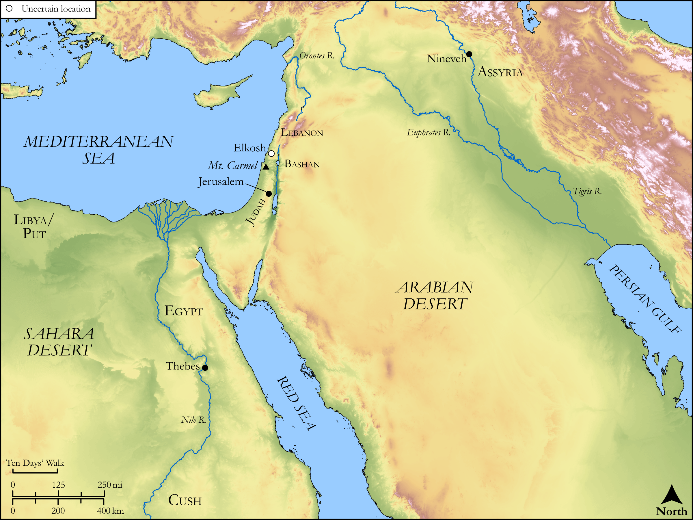

# Biblica Open Bible Maps

## License Information

Biblica Open Bible Maps, © 2023–2025 Biblica, Inc. This work is licensed under Creative Commons Attribution-ShareAlike 4.0 International (<a href="https://creativecommons.org/licenses/by-sa/4.0/">https://creativecommons.org/licenses/by-sa/4.0/</a>). More Information: <a href="https://docs.google.com/document/d/1Pp44yZ0Zdnd59vJHTrt2rPYq0SppfX5rZbPBt6mz37U/edit?tab=t.0#heading=h.oev9aj1ksvk2">https://docs.google.com/document/d/1Pp44yZ0Zdnd59vJHTrt2rPYq0SppfX5rZbPBt6mz37U/edit?tab=t.0#heading=h.oev9aj1ksvk2</a>

--------------------------------

## Wisdom & Prophets: Prophecy Against Nineveh (id: OT222)

### Image Content

[link](images/OT222.png)

Original: [Wisdom \& Prophets: Prophecy Against Nineveh](https://drive.google.com/open?id=1URvSinz-UlYglEYASXXnBRYFL4idtX0V&usp=drive_copy)

* **Associated Passages:** Nahum 1:1-3:19

* **Associated ACAI Concepts:** LORD (ID: `deity:Lord`); Nineveh (ID: `place:Nineveh`); Chariot (ID: `realia:Chariot`); Strength (ID: `keyterm:Strength`); Wickedness (ID: `keyterm:Wickedness`); Locust (ID: `fauna:Locust`); Lion (ID: `fauna:Lion`); Thebes (ID: `place:Thebes`); Amon (ID: `deity:Amon`); Nahum (ID: `person:Nahum.2`); Elkosh (ID: `place:Elkosh`); Egypt (ID: `place:Egypt`); Bashan (ID: `place:Bashan`); Incantations (ID: `keyterm:Incantations`); Israel (ID: `person:Israel`); Peace (ID: `keyterm:IntactState`); Lot (ID: `keyterm:Lot`); Utterance (ID: `keyterm:Utterance`); Judah (ID: `person:Judah.4`); Tribe of Judah (ID: `group:Judah`); Lebanon (ID: `place:Lebanon`); Assyria (ID: `place:Assyria`); Vow (ID: `keyterm:Vow`); Carmel (ID: `place:Carmel`); Put (ID: `place:Put`); Woe (ID: `keyterm:Woe.2`); Pronounce Innocent (ID: `keyterm:PronounceInnocent`); Under Siege (ID: `keyterm:StateOfBeingUnderSiege`); Zealous (ID: `keyterm:Zealous.3`); Libya (ID: `place:Libya`); Detested Thing (ID: `keyterm:DetestedThing`); Seek Refugue (ID: `keyterm:SeekfindRefuge`); Glory (ID: `keyterm:Glory`); The Way (ID: `keyterm:TheWay`); Cush (ID: `place:Cush.2`); An Angel (ID: `deity:Angel`); Bring Honor and Glory on Oneself (ID: `keyterm:BringHonorAndGloryOnOneself`); Nile River (ID: `place:Nile`); Fortress (ID: `realia:Fortress`); Flock (ID: `fauna:Flock`); Goat (ID: `fauna:Goat`); Brick Mold (ID: `realia:BrickMold`); Protective Shield (ID: `realia:ProtectiveShield`); Molten Image (ID: `realia:MoltenImage`); Strong Drink (ID: `realia:StrongDrink`); Cypress (ID: `flora:Cypress`); Sheep (ID: `fauna:Lamb`); Phoenician Juniper (ID: `flora:JuniperTree`); Dove (ID: `fauna:Dove`); Wagon (ID: `realia:Wagon`); Fir (ID: `flora:Fir`); Graven Image (ID: `realia:GravenImage`); Grass (ID: `flora:Grass`); Spear (ID: `realia:Spear`); Dyed Cloth (ID: `realia:DyedCloth`); Sword (ID: `realia:Sword`); Brier (ID: `flora:Brier`); Grecian Juniper (ID: `flora:Juniper`); Small Shield (ID: `realia:SmallShield`); Fig (ID: `flora:Fig`); House (ID: `realia:House`); Yoke (ID: `realia:Yoke`); Scroll (ID: `realia:Scroll`); Horse (ID: `fauna:Horse`); Whip (ID: `realia:Whip`); Train (ID: `realia:Train`); Money (ID: `realia:Money`); Fortification (ID: `realia:Fortification`)
