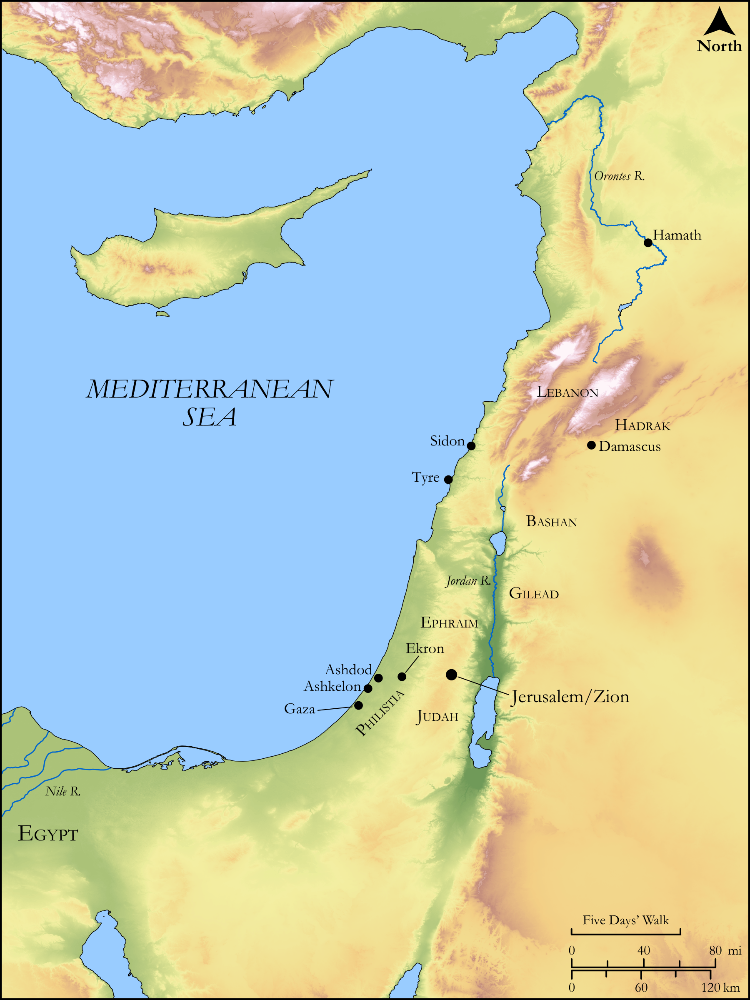

# Biblica Open Bible Maps

## License Information

Biblica Open Bible Maps, © 2023–2025 Biblica, Inc. This work is licensed under Creative Commons Attribution-ShareAlike 4.0 International (<a href="https://creativecommons.org/licenses/by-sa/4.0/">https://creativecommons.org/licenses/by-sa/4.0/</a>). More Information: <a href="https://docs.google.com/document/d/1Pp44yZ0Zdnd59vJHTrt2rPYq0SppfX5rZbPBt6mz37U/edit?tab=t.0#heading=h.oev9aj1ksvk2">https://docs.google.com/document/d/1Pp44yZ0Zdnd59vJHTrt2rPYq0SppfX5rZbPBt6mz37U/edit?tab=t.0#heading=h.oev9aj1ksvk2</a>

--------------------------------

## Wisdom & Prophets: Prophecies Against Foreign Nations (id: OT224)

### Image Content

[link](images/OT224.png)

Original: [Wisdom \& Prophets: Prophecies Against Foreign Nations](https://drive.google.com/open?id=1IX38kIqzmgZIGAMtacD1UxdL-I9WVXwX&usp=drive_copy)

* **Associated Passages:** Zechariah 9:1-11:17

* **Associated ACAI Concepts:** LORD (ID: `deity:Lord`); Flock (ID: `fauna:Flock`); Goat (ID: `fauna:Goat`); Tribe of Judah (ID: `group:Judah`); Judah (ID: `person:Judah.4`); Sheep (ID: `fauna:Lamb`); Tribe of Ephraim (ID: `group:Ephraim`); Jerusalem (ID: `place:Jerusalem`); Ephraim (ID: `person:Ephraim`); Bow (ID: `realia:Bow`); Tyre (ID: `place:Tyre`); Assyria (ID: `place:Assyria`); Covenant (ID: `keyterm:Covenant`); Word of the Lord (ID: `keyterm:WordOfTheLord`); Israel (ID: `person:Israel`); Egypt (ID: `place:Egypt`); Ekron (ID: `place:Ekron`); Appoint (ID: `keyterm:Appoint`); Lebanon (ID: `place:Lebanon`); Rod (ID: `realia:Rod`); Staff (ID: `realia:Staff`); Horse (ID: `fauna:Horse`); Vine (ID: `flora:Vine`); Money (ID: `realia:Money`); Teraphim (ID: `deity:Teraphim`); Hadrach (ID: `place:Hadrach`); Cedar (ID: `flora:Cedar`); Foolish (ID: `keyterm:Foolish`); Hamath (ID: `place:Hamath`); Practice Divination (ID: `keyterm:PracticeDivination`); Damascus (ID: `place:Damascus`); Dispossess (ID: `keyterm:Dispossess`); Hope (ID: `keyterm:Hope`); Gilead (ID: `place:Gilead`); Ashkelon (ID: `place:Ashkelon`); Philistines (ID: `group:Philistine`); Philistia (ID: `place:Philistine`); Nile River (ID: `place:Nile`); Jordan River (ID: `place:Jordan`); Greece (ID: `place:Greece`); Mighty (ID: `keyterm:Mighty`); Bashan (ID: `place:Bashan`); Ashdod (ID: `place:Ashdod`); Joseph (ID: `person:Joseph.10`); Redeem (ID: `keyterm:Redeem`); Jebusites (ID: `group:Jebusites`); Fear (ID: `keyterm:Fear`); Bless (ID: `keyterm:Bless`); Arrow (ID: `keyterm:Arrow`); Gaza (ID: `place:Gaza`); Have a Vision (ID: `keyterm:HaveAVision`); Peace (ID: `keyterm:IntactState`); Euphrates River (ID: `place:Euphrates`); Sidon (ID: `place:Sidon`); Utterance (ID: `keyterm:Utterance`); Majesty (ID: `keyterm:Majesty`); Woe (ID: `keyterm:Woe.2`); Mischief (ID: `keyterm:Mischief`); Detested Thing (ID: `keyterm:DetestedThing`); Sword (ID: `realia:Sword`); House (ID: `realia:House`); Wine (ID: `realia:Wine`); Donkey (ID: `fauna:Donkey`); Fir (ID: `flora:Fir`); Chariot (ID: `realia:Chariot`); Tabernacle Altar (ID: `realia:TabernacleAltar`); Household Idols (ID: `realia:HouseholdIdols`); Sling (ID: `realia:Sling`); Grain (ID: `flora:Grain`); Grass (ID: `flora:Grass`); Temple Altar (ID: `realia:TempleAltar`); Pit (ID: `realia:Pit`); Lion (ID: `fauna:Lion`); Cypress (ID: `flora:Cypress`); Peg (ID: `realia:Peg.2`); Sandalwood (ID: `flora:Sandalwood`); Stone Altar (ID: `realia:StoneAltar`); Altar (ID: `realia:Altar`); Crown (ID: `realia:Crown`); Rams Horn (ID: `realia:RamsHorn`); Grecian Juniper (ID: `flora:Juniper`); Peg (ID: `realia:Peg`); Oak (ID: `flora:Oak`); Fortification (ID: `realia:Fortification`); Must (ID: `realia:Must`)
