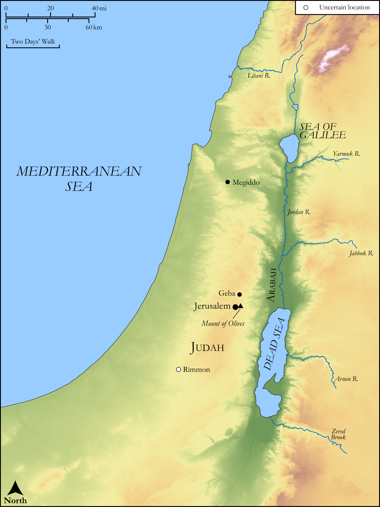

# Biblica Open Bible Maps

## License Information

Biblica Open Bible Maps, © 2023–2025 Biblica, Inc. This work is licensed under Creative Commons Attribution-ShareAlike 4.0 International (<a href="https://creativecommons.org/licenses/by-sa/4.0/">https://creativecommons.org/licenses/by-sa/4.0/</a>). More Information: <a href="https://docs.google.com/document/d/1Pp44yZ0Zdnd59vJHTrt2rPYq0SppfX5rZbPBt6mz37U/edit?tab=t.0#heading=h.oev9aj1ksvk2">https://docs.google.com/document/d/1Pp44yZ0Zdnd59vJHTrt2rPYq0SppfX5rZbPBt6mz37U/edit?tab=t.0#heading=h.oev9aj1ksvk2</a>

--------------------------------

## Wisdom & Prophets: The Coming Day of the Lord (id: OT225)

### Image Content

[link](images/OT225.png)

Original: [Wisdom \& Prophets: The Coming Day of the Lord](https://drive.google.com/open?id=1OB3NM-kvXkgM3ZshRRUjbCiCBFd8b1JP&usp=drive_copy)

* **Associated Passages:** Zechariah 12:1-14:21

* **Associated ACAI Concepts:** LORD (ID: `deity:Lord`); Jerusalem (ID: `place:Jerusalem`); Judah (ID: `person:Judah.4`); Tribe of Judah (ID: `group:Judah`); David (ID: `person:David`); Feast of Tabernacles (ID: `keyterm:FeastOfTabernacles`); House (ID: `realia:House`); Plague (ID: `keyterm:Blow`); Horse (ID: `fauna:Horse`); Egypt (ID: `place:Egypt`); Speak as a Prophet (ID: `keyterm:Speak`); Azal (ID: `place:Azal`); Tower of Hananel (ID: `place:TowerOfHananel`); Shimeites (ID: `group:Shimei`); Hadad-rimmon (ID: `place:Hadad-rimmon`); Mount of Olives (ID: `place:OlivesMount`); Shimei (ID: `person:Shimei.4`); Benjamin Gate (ID: `place:BenjaminGate`); Cooking Pot (ID: `realia:CookingPot`); Money (ID: `realia:Money`); Punishment (ID: `keyterm:Punishment`); Corner Gate (ID: `place:CornerGate`); Safety (ID: `keyterm:Safety`); Something Devoted to God (ID: `keyterm:SomethingDevotedToGod`); Tribe of Levi (ID: `group:Levi`); Israel (ID: `person:Israel`); Defilement (ID: `keyterm:Defilement`); Favor (ID: `keyterm:Favor`); Uzziah (ID: `person:Uzziah`); Utterance (ID: `keyterm:Utterance`); Love (ID: `keyterm:Love`); Nathan (ID: `person:Nathan`); Levi (ID: `person:Levi.3`); Under Siege (ID: `keyterm:StateOfBeingUnderSiege`); Megiddo (ID: `place:Megiddo`); Word of the Lord (ID: `keyterm:WordOfTheLord`); Geba (ID: `place:Geba`); Force to Serve (ID: `keyterm:EnticedToServe`); To Sin (ID: `keyterm:Sin`); Plea for Mercy (ID: `keyterm:Supplication`); Arabah (ID: `place:Arabah`); Holy (ID: `keyterm:Holy`); An Angel (ID: `deity:Angel`); Ain (ID: `place:Ain`); Sheep (ID: `fauna:Lamb`); Mule (ID: `fauna:Mule`); Image (ID: `realia:Image`); Donkey (ID: `fauna:Donkey`); Cattle (ID: `fauna:Bull`); Sword (ID: `realia:Sword`); Temple Altar (ID: `realia:TempleAltar`); Stone Altar (ID: `realia:StoneAltar`); Altar (ID: `realia:Altar`); Bowl (ID: `realia:Bowl`); Sheaf (ID: `realia:Sheaf`); Clothing (ID: `realia:Clothing`); Camel (ID: `fauna:Camel`); Olive Tree (ID: `flora:OliveTree`); Winepress (ID: `realia:Winepress`); Flock (ID: `fauna:Flock`); Tabernacle Altar (ID: `realia:TabernacleAltar`); Goat (ID: `fauna:Goat`)
