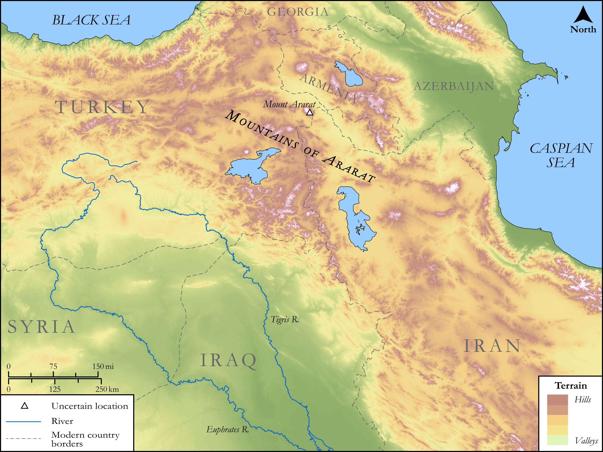

# Biblica Open Bible Maps

## License Information

Biblica Open Bible Maps, © 2023–2025 Biblica, Inc. This work is licensed under Creative Commons Attribution-ShareAlike 4.0 International (<a href="https://creativecommons.org/licenses/by-sa/4.0/">https://creativecommons.org/licenses/by-sa/4.0/</a>). More Information: <a href="https://docs.google.com/document/d/1Pp44yZ0Zdnd59vJHTrt2rPYq0SppfX5rZbPBt6mz37U/edit?tab=t.0#heading=h.oev9aj1ksvk2">https://docs.google.com/document/d/1Pp44yZ0Zdnd59vJHTrt2rPYq0SppfX5rZbPBt6mz37U/edit?tab=t.0#heading=h.oev9aj1ksvk2</a>

--------------------------------

## SRV Genesis: Gen. 6:9–22, Gen. 8:1–18 (id: OT252)

### Image Content

[link](images/OT252.png)

Original: [SRV Genesis: Gen. 6:9\-22, Gen. 8:1\-18](https://drive.google.com/open?id=1M99BOzFLusNZUwTK7xaAj0Owkmc-8Yj-&usp=drive_copy)

* **Associated Passages:** Genesis 6:1-22

* **Associated ACAI Concepts:** LORD (ID: `deity:Lord`); Noah (ID: `person:Noah`); Ship (ID: `realia:Ship`); Cubit (ID: `realia:Cubit`); Lizard (ID: `fauna:Lizard`); Monitor (ID: `fauna:Iguana`); Chameleon (ID: `fauna:Chameleon`); Nephilim (ID: `group:Nephilim`); Favor (ID: `keyterm:Favor`); Complete (ID: `keyterm:Complete`); Destroy (ID: `keyterm:Destroy`); Kind (ID: `keyterm:Kind.2`); Covenant (ID: `keyterm:Covenant`); Shem (ID: `person:Shem`); Japheth (ID: `person:Japheth`); Ham (ID: `person:Ham`); Cypress (ID: `flora:Cypress`); Dove (ID: `fauna:Dove`); Bear (ID: `fauna:Bear`); Lion (ID: `fauna:Lion`)
