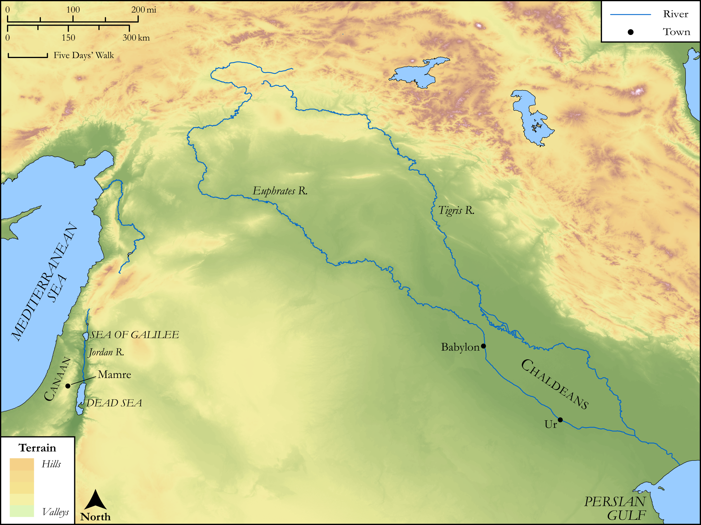

# Biblica Open Bible Maps

## License Information

Biblica Open Bible Maps, © 2023–2025 Biblica, Inc. This work is licensed under Creative Commons Attribution-ShareAlike 4.0 International (<a href="https://creativecommons.org/licenses/by-sa/4.0/">https://creativecommons.org/licenses/by-sa/4.0/</a>). More Information: <a href="https://docs.google.com/document/d/1Pp44yZ0Zdnd59vJHTrt2rPYq0SppfX5rZbPBt6mz37U/edit?tab=t.0#heading=h.oev9aj1ksvk2">https://docs.google.com/document/d/1Pp44yZ0Zdnd59vJHTrt2rPYq0SppfX5rZbPBt6mz37U/edit?tab=t.0#heading=h.oev9aj1ksvk2</a>

--------------------------------

## SRV Genesis: Gen. 11:27–32, Gen. 15:1–20 (id: OT257)

### Image Content

[link](images/OT257.png)

Original: [SRV Genesis: Gen. 11:27\-32, Gen. 15:1\-20](https://drive.google.com/open?id=1NYzEf66xNkifm0VFkkDk-tto4B4N0feK&usp=drive_copy)

* **Associated Passages:** Genesis 11:1-32

* **Associated ACAI Concepts:** Terah (ID: `person:Terah`); Haran (ID: `person:Haran`); Reu (ID: `person:Reu`); Peleg (ID: `person:Peleg`); Shelah (ID: `person:Shelah.2`); Nahor (ID: `person:Nahor`); Abraham (ID: `person:Abraham`); Serug (ID: `person:Serug`); Arpachshad (ID: `person:Arpachshad`); LORD (ID: `deity:Lord`); Eber (ID: `person:Eber`); Sarah (ID: `person:Sarah`); Nahor (ID: `person:Nahor.2`); Ur (ID: `place:Ur`); Chaldea (ID: `place:Chaldea`); Lot (ID: `person:Lot`); Haran (ID: `place:Haran`); Chaldeans (ID: `group:Chaldea`); Shem (ID: `person:Shem`); Milcah (ID: `person:Milcah`); Iscah (ID: `person:Iscah`); Shinar (ID: `place:Shinar`); Canaan (ID: `place:Canaan`); Tower (ID: `realia:Tower`); Babylon (ID: `place:Babylon`); Brick (ID: `realia:Brick`)
